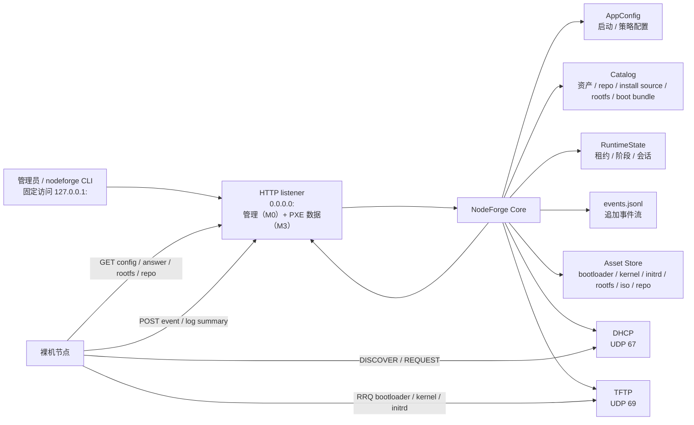
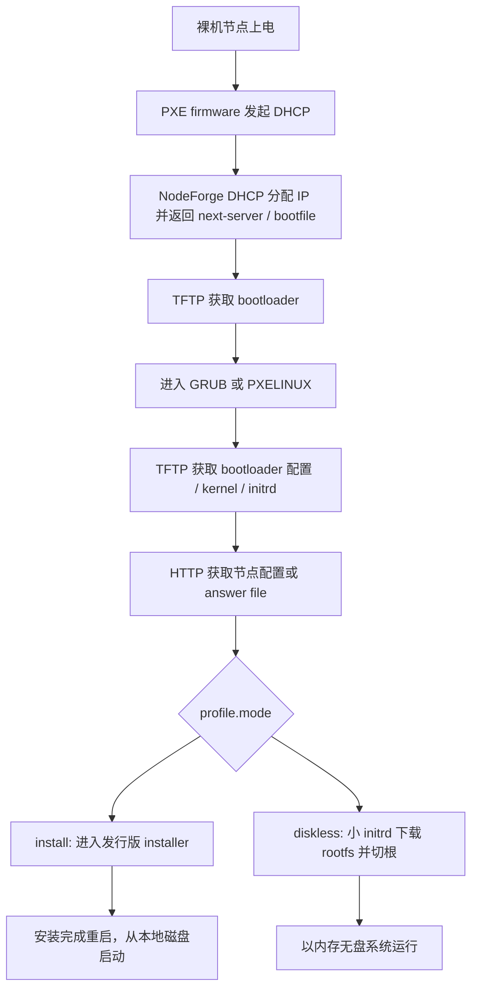
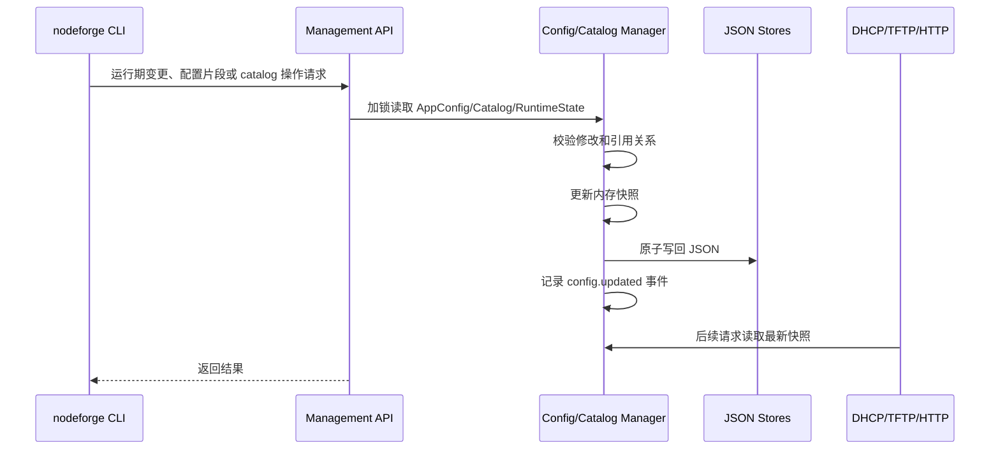

# NodeForge PXE 特化版概要设计

NodeForge 是一个面向小型 Linux 集群和实验室环境的轻量级 OS Provisioning 平台。当前阶段聚焦 PXE provisioning：用 Zig 实现内置 DHCP/TFTP/HTTP 服务，完成裸机节点发现、标准 PXE 引导、无人值守自动安装、内存无盘启动、rootfs/安装源/镜像分发和基础状态观测。

本文是概要设计收敛版，重点回答：

- NodeForge 第一阶段做什么，不做什么。
- 支持哪些发行版、启动方式和部署链路。
- DHCP/TFTP/HTTP、profile、asset、runtime state 如何协作。
- 自动安装和内存无盘启动如何闭环。
- CLI、输出格式、配置、事件和验收标准如何对齐。
- 哪些点已经决策，哪些点仍需详细设计验证。

具体 Zig API、报文编码细节、模板语法、文件锁、脚本执行沙箱等内容进入后续详细设计。

建议阅读顺序：

1. 第 1-3 章确认范围、支持矩阵和功能闭环。
2. 第 4-6 章理解架构、对象关系和协议服务。
3. 第 7-8 章理解自动安装与无盘两条主链路。
4. 第 9-14 章查看配置、CLI、实现、测试和目录约定。
5. 第 15-19 章查看实施阶段、验收标准、风险和最终决策。

## 1. 设计收敛结论

多轮讨论后的核心收敛如下：

| 主题 | 收敛结论 |
| --- | --- |
| 产品形态 | 单机单进程 PXE Boot Provisioning appliance，不做完整集群管理平台 |
| 内置服务 | Zig 实现 DHCP/TFTP/HTTP，HTTP 只保留一个 listener；管理路由接受所有可达连接，CLI 固定通过 `127.0.0.1` 管理同机服务 |
| PXE 链路 | MVP 支持 UEFI x86_64 和 UEFI aarch64；当前先在 Rocky Linux 9.7 ARM 环境开发验证，生产验收优先 x86_64；BIOS x86 后续补齐 |
| 发行版范围 | 只适配 Ubuntu Server 22.04 及之后版本和 RHEL 系；RHEL/CentOS 系优先 Rocky Linux，再兼容 RHEL、Alma、Fedora |
| 安装机制 | Ubuntu Server 使用 autoinstall / cloud-init NoCloud-Net；RHEL 系使用 kickstart，优先 Rocky Linux |
| 无盘机制 | 优先 `squashfs_overlay`，保留 `ram_rootfs` 作为轻量救援/测试模式 |
| 启动三件套 | diskless 的 kernel、小 initrd、rootfs 作为同一 boot bundle 管理，并校验 `distro`、`version`、`arch`、`kernel_release` |
| 基础数据关联 | 发行版、版本、架构、repo/mirror、install source、kernel、initrd、rootfs 和 boot bundle 必须有显式关系，不让 profile 直接散落引用裸路径 |
| 小 initrd | 只承载早期联网、下载配置、下载/校验 rootfs、挂载、切根、事件上报等通用能力 |
| overlay tmpfs | 大小限制是 diskless profile 配置项，例如 `overlay.tmpfs_size = "50%"` |
| 节点差异化 | profile 提供部署默认值，node 提供身份、IP、hostname、网络和模板变量等覆盖；IP 本身不触发部署动作 |
| 未知节点默认行为 | 默认进入等待/观察态；可显式配置安全 discovery 或临时无盘；未知节点永远不能直接自动安装 |
| CLI | M0 只提供状态、健康检查和本地 config/catalog 工具；M1+ 按对象来源和生命周期加入 daemon 驱动的导入/构建/发布、运行期高频、批量和观测 CLI/API；使用成熟 CLI 解析库并支持分级帮助 |
| 输出 | 默认面向人类阅读，分组和表格化；机器消费显式使用 `--output json` |

## 2. 定位、边界与支持矩阵

### 2.1 项目定位

NodeForge 第一阶段是 PXE Boot Provisioning appliance，而不是完整集群管理平台。

核心目标：

- 在独立 PXE 管理网段或 PXE VLAN 中为裸机节点提供 DHCP 地址分配和 PXE 启动入口。
- 通过 TFTP 分发 bootloader、bootloader 配置、kernel 和 initrd。
- M0 通过唯一 HTTP listener 提供健康检查和管理接口；M3 在同一 listener 分发无人值守安装配置、rootfs、ISO、repo、系统镜像和节点事件。
- 支持两条一等公民路径：
  - PXE 无人值守自动安装到本地磁盘。
  - 小 initrd + HTTP rootfs 的内存无盘启动。
- 提供 `nodeforge` CLI 查看和修改节点、profile、资产、租约、启动阶段、日志、事件和配置；MVP 命令面优先少而清晰。
- 以单机单进程为初始形态，使用内存结构体 + JSON/JSONL 文件作为配置和运行态存储。

### 2.2 当前版本明确不做

- 不接管企业网络中的全部 DHCP 地址分配。
- 不实现通用 DHCP 服务器的完整企业能力，例如 DHCPv6、DDNS、failover、多租户策略。NodeForge 是 DHCP 服务器，不是 relay agent；跨网段场景由网络基础设施（路由器/交换机的 IP Helper 或 `dhcrelay`）完成 relay 转发，NodeForge 仅作为服务器端按 RFC 2131 标准正确处理经 relay 转发的报文（解析 `giaddr` 定位 subnet、回复发到 `giaddr:67`），这是任何合规 DHCP 服务器的基本能力，不作为独立功能特性。
- 不把 TFTP 暴露为通用文件服务器；协议层可以较完整实现，产品默认只读并限制在 PXE 启动资产。
- 不依赖 dnsmasq、tftpd 或外部 DHCP/TFTP 作为运行时核心。
- 不做 Kubernetes、Slurm、Ansible 这类集群编排系统。
- 不在初始版本引入数据库。
- 不实现通用仓库管理平台；只读发布已导入 ISO 中的有效仓库和用户显式添加的额外仓库。
- 不要求用户手写 `dhcpd.conf`、`dnsmasq.conf` 或传统 `tftpd` 配置。
- 不为 Debian、openSUSE/SLES、Arch 或桌面发行版设计专门路径。

### 2.3 支持矩阵

| 维度 | MVP | 后续可选 | 非目标 |
| --- | --- | --- | --- |
| PXE firmware | UEFI x86_64、UEFI aarch64 | BIOS x86 | iPXE 作为默认依赖 |
| Bootloader | `grubx64.efi`、`grubaa64.efi` | `pxelinux.0` | 自定义私有 bootloader |
| DHCP 模式 | Authoritative PXE DHCP | Proxy DHCP | 企业级通用 DHCP |
| 安装发行版 | Rocky Linux 9.7、Ubuntu Server 22.04 LTS，均支持 aarch64/x86_64 资产模型 | Ubuntu 后续 LTS、RHEL/Alma/Fedora | Debian/openSUSE/Arch |
| 无盘 rootfs | Ubuntu Server 或 Rocky Linux 优先的 RHEL 系 rootfs | 多版本能力表 | 桌面发行版无盘 |
| rootfs 模式 | `squashfs_overlay` | `ram_rootfs`、持久化 overlay | NFS root 作为 MVP 依赖 |
| 架构 | x86_64、aarch64；当前 ARM 开发验证，x86_64 生产优先 | aarch64 生产真机增强 | 其他架构 |

### 2.4 核心原则

- **标准 PXE 优先**：MVP 使用标准 PXE，不依赖 iPXE。
- **协议标准兼容**：DHCP/TFTP 报文必须符合标准协议，能被标准 PXE firmware、GRUB、PXELINUX、普通 TFTP client 和 Wireshark/tcpdump 识别。
- **协议通用，策略特化**：DHCP/TFTP 的 packet、option、状态机按通用协议设计；是否响应、返回什么 bootfile、允许读哪些文件由 NodeForge PXE 策略决定。
- **大文件走 HTTP**：TFTP 只发启动小文件；rootfs、ISO、repo、安装源和大镜像统一走 HTTP。
- **配置结构化**：不直接编辑 DHCP/TFTP 专用配置文件。NodeForge 把启动配置、策略配置、资产目录和运行态分开管理：`config.json` 表达站点级启动配置和少量策略默认值；导入、构建、发布得到的 repository、install source、rootfs、initrd、boot bundle 等进入 NodeForge 管理的 catalog；运行态进入 runtime/events。`nodeforged` 是 catalog 的唯一 writer。
- **启动加载与在线更新分层**：M0 中，`nodeforged` 启动时读取并校验 `config.json`，形成内存配置快照；站点结构性配置修改后重启生效，`config import` 只是离线原子写入。M1+ 才引入 DHCP discovery 策略和 catalog 变更的在线 API，由 `nodeforged` 原子更新内存快照并持久化。
- **端口固定**：DHCP 固定监听 `UDP 67`，TFTP 固定监听 `UDP 69`。这两个端口是源码常量，不提供配置项、CLI 参数或运行时覆盖参数。
- **发现安全**：未知节点身份可以从租约池获得临时 IP，并按 `dhcp.discovery.default_action` 进入等待、discovery 或显式允许的临时无盘；未知节点不能执行自动安装。MVP 以 MAC 为主要身份，保留 DHCP client id 和 SN 作为辅助信息。
- **HTTP 单监听简化**：MVP 只启动一个 HTTP listener，固定绑定 `0.0.0.0:<http.port>`。M0 先提供健康检查和管理 API，M3 的 PXE 数据 API 将复用同一 HTTP 实现、连接循环和路由入口。`server.server_ip` 表示 PXE 服务网对外地址，用于生成裸机可访问 URL、DHCP next-server、TFTP/HTTP 广告地址；它不作为 M0 HTTP bind 地址。`server.bind_interface` 可选，用于表达 HTTP/DHCP/TFTP 共同归属的服务网卡；CLI 管理客户端写死访问 `127.0.0.1:<http.port>`，不做远程管理发现和多管理端点配置。
- **管理端口约定**：MVP 不引入独立 `management_port`。管理路由和 PXE HTTP 数据路由共用 `server.http_port`，默认 `8080`。listener 绑定所有 IPv4 接口，管理路由不检查 peer 来源，因此接受所有能到达该端口的连接。`nodeforge` CLI 固定连接 `127.0.0.1:<http.port>` 且不提供远程 endpoint，只支持管理同机 `nodeforged`。端口冲突时修改 `config.json` 后重启服务。
- **配置与 CLI 分工**：M0 不把所有配置字段拆成参数：server IP、端口、资产根目录等启动配置走 `config.json`；CLI 只做 status/check、config/catalog 校验与导出、离线 config import。M1+ 再为 ISO/repo/rootfs/initrd/boot bundle 提供由 daemon 写入 catalog 的导入/构建/发布命令，并为节点认领、批量导入、运行期策略、事件和日志加入 CLI/API。
- **CLI 使用成熟库**：命令解析、帮助信息、参数类型、默认值和错误提示使用固定版本的开源 CLI 库。MVP 固定使用支持 Zig 0.16.0 的 `zli v5.1.2`；命令、子命令、flag、位置参数和说明只在命令树中声明一次，解析与分级帮助从同一份声明生成。zli 只承载 CLI 语法和展示，不承载复杂业务配置模型。
- **CLI 帮助可达**：顶层、每个资源命令和每个子命令都必须支持 `-h/--help`，显示用途、参数和默认值；长示例保留在 README 和运维文档，不塞进帮助页。
- **日志与排障**：M0 服务日志默认使用 `logging.level = "info"` 输出 stderr/journal；配置可设为 `debug`，`nodeforged -d/--debug` 可仅覆盖本次启动。CLI 叶子命令的 `-d/--debug` 在简短错误后显示内部原因。服务日志、业务事件和 CLI 错误分别输出，且任何等级都不得记录密码、token、完整请求体或节点上传的大日志。
- **输出可读优先**：面向人的默认输出必须分组、对齐、标注状态和时间；机器消费使用显式 `--output json`。

## 2.5 M0 实现状态

M0 项目骨架阶段已完成，并在 Rocky 9.7 aarch64 环境完成实机验证。

### 核心模块
- **配置管理**: `config/load.zig`、`config/validate.zig`、`config/store.zig` 支持配置的加载、校验和原子保存
- **目录管理**: `catalog/store.zig` 实现资产目录的管理和追踪，`catalog.zig` 提供配置与 catalog 的只读查询函数
- **HTTP 服务**: `http/server.zig` 通过 Zap/facil.io 提供单监听器 HTTP 服务和路由管理
- **管理接口**: `http/server.zig` 实现管理路由，`http/management.zig` 定义 CLI 的本机访问约定
- **状态管理**: `state/runtime.zig`、`state/events.zig` 提供运行态和事件持久化基础类型；M0 HTTP 服务尚未产生 DHCP/TFTP/节点业务事件
- **错误处理**: `observe/error.zig` 提供统一的错误响应格式
- **服务日志**: `observe/log.zig` 提供 info/debug 等级的服务日志门面
- **预检机制**: `preflight.zig` 实现唯一 HTTP 端口的可用性检查

### 代码质量
- 核心领域模型、对外入口和错误/日志协议均有文档注释；具体模块职责和公开接口见详细设计第 3 节
- 遵循统一的错误处理模式
- 实现了完整的配置和目录校验逻辑
- HTTP 请求处理确保内存安全

### 关键实现
- Zap/facil.io 接管 HTTP 报文解析、连接生命周期和 worker 调度；NodeForge 只维护业务路由
- preflight 先识别活跃 listener、再允许 `SO_REUSEADDR` 快速重启，避免重复监听与重启窗口冲突
- catalog 已填写的 SHA-256 字段会执行格式校验

### 已验证能力
- `nodeforged --check-config` 配置校验通过
- `nodeforge status` 状态查询功能正常
- `nodeforge config validate` 配置验证功能正常
- `nodeforge check` 服务健康检查功能正常
- Rocky Linux 9.7 aarch64 远程环境部署验证通过
- systemd 服务启动、停止、重启功能正常
- HTTP 管理接口和 API 路由响应正常

### M0 CLI 边界

M0 只交付以下可执行命令：`status`、`check`、`config validate/export/import`、
`catalog validate/export`。其中 `status` 和 `check` 固定调用本机管理 API；config/catalog
命令直接操作本地 JSON 文件：`config import` 只校验 source config 自身后原子覆盖目标文件；
`config validate` 与 `catalog validate` 才校验 config/catalog 关系。import 不会热加载，必须重启
`nodeforged`。M0 不实现 DHCP/TFTP/资产/节点/rootfs/initrd/provision 的 CLI，也不实现
catalog 写入或运行期配置更新 API；这些能力按 M1+ 对应阶段设计和实现。

M0 参数规则是命令局部而非 persistent/global：`nodeforge` 根命令只有 `-v/--version`，
`-h/--help` 可用于每一级；叶子命令按实际需要提供 `-c/--config`、`-C/--catalog`、
`-o/--output`、`-d/--debug`。`nodeforged` 没有子命令，因此其根参数为
`-v/-c/-C/-d/-k/-K`（version/config/catalog/debug/check/check-config）。

## 4. 功能对齐矩阵（M1+ 路线图）

下表描述完整 provisioning 产品闭环，不是 M0 已实现能力。M0 当前代码边界以 2.5 节为准；
各行能力在第 15 节的阶段路线图中按 M1-M7 交付。

| 能力 | 配置对象 | 运行态对象 | 主要命令 | MVP 验收点 |
| --- | --- | --- | --- | --- |
| TFTP 启动资产 | `tftp`、`asset` | `tftp_session` | `tftp show`、`tftp session list` | 节点能拉取 bootloader、配置、kernel、initrd |
| DHCP 地址分配 | `dhcp`、`node`、`policy` | `lease`、`unknown_client` | `dhcp network update`、`dhcp pool update`、`runtime leases list` | 未知节点可获临时 lease，已登记节点拿正确 IP |
| PXE 启动入口 | `node`、`profile`、`asset` | `node_status`、`event` | `node status`、`asset list` | DHCP 返回正确 `next-server` 和 `bootfile` |
| HTTP 配置和资产 | `http`、`asset`、`profile` | `event` | `asset import`、`runtime events tail` | initrd/installer 能获取配置并上报事件 |
| 基础数据关系 | `distro`、`repository`、`install_source`、`asset`、`rootfs`、`boot_bundle` | `event` | `distro show`、`repository validate`、`install-source validate`、`boot-bundle show` | 能展开 OS 版本、repo、kernel、initrd、rootfs 的引用关系 |
| 自动安装 | `profile.install` | `node_status`、`event` | `install render`、`install status` | Ubuntu Server autoinstall 跑通，Rocky Linux 9.x kickstart 模板可渲染 |
| 本地启动盘配置 | `profile.install.storage`、`profile.install.bootloader` | `node_status`、`event` | `install render`、`install status` | 可选择安装目标盘，创建 EFI/BIOS 引导分区并安装 bootloader |
| 无盘启动 | `profile.diskless`、`boot_bundle` | `node_status`、`event` | `diskless status`、`diskless overlay update` | 小 initrd 下载 rootfs 并切换到目标 rootfs |
| boot bundle 校验 | `asset`、`rootfs`、`profile` | `event` | `rootfs validate`、`initrd validate` | kernel/initrd/rootfs 的版本、架构、kernel ABI 一致 |
| 补充包和后处理 | `provisioning_bundle` | `node_status`、`event` | `provision bundle show/plan`、`provision status` | Kickstart、autoinstall、rootfs build、diskless 共用强类型步骤和清晰输出 |
| 配置与目录持久化 | `config.json`、`catalog.json` | `runtime.json`、`events.jsonl` | `config validate/export/apply`、`asset/install-source/rootfs/initrd/boot-bundle import/build/publish` | 启动配置可重启加载；导入/构建/发布请求由 `nodeforged` 原子写入 catalog 并更新内存视图 |
| 观测输出 | 无 | `node_status`、`event` | `node status`、`logs tail` | 输出分组、表格化，错误有摘要和下一步建议 |

## 5. 总体架构与数据流

### 5.1 单进程架构



初始实现为单进程多服务：

```text
nodeforged
  ├─ config manager
  ├─ catalog manager
  ├─ local management API
  ├─ DHCP UDP loop
  ├─ TFTP dispatcher
  ├─ HTTP server
  ├─ runtime state manager
  └─ event writer
```

服务之间共享内存配置，不通过生成传统 DHCP/TFTP 配置文件来驱动。

### 5.2 标准 PXE 引导链



bootfile 选择：

| 架构 | PXE arch option | bootfile | 阶段 |
| --- | --- | --- | --- |
| UEFI x86_64 | `7` / `9` | `grubx64.efi` | MVP |
| UEFI aarch64 | `11` | `grubaa64.efi` | MVP |
| BIOS x86 | `0` | `pxelinux.0` | 后续补齐 |

### 5.3 initrd 类型边界

文档中必须区分两类 initrd：

| 类型 | 用途 | 来源 | NodeForge 职责 |
| --- | --- | --- | --- |
| installer initrd | 自动安装进入发行版安装器 | Ubuntu Server / RHEL 系安装介质 | 分发、传入 answer URL、接收 hook/日志事件 |
| NodeForge 小 initrd | 无盘启动早期用户态 | NodeForge 构建 | 联网、拉取 boot config、下载/校验 rootfs、挂载、切根、上报事件 |

自动安装不要求把 NodeForge 逻辑塞进发行版 installer initrd。安装阶段状态可以通过 answer file hook、late command、post install 或 firstboot 上报。无盘启动则要求 NodeForge 小 initrd 具备完整早期启动逻辑。

### 5.4 kernel cmdline 规则

NodeForge 自有参数使用 `nodeforge.*` 前缀。cmdline 中只保留启动早期必须知道的稳定入口，复杂配置通过 HTTP boot config 获取。

```text
install:
nodeforge.mode=install nodeforge.node_id={{node_id}} nodeforge.config_url={{config_url}} nodeforge.event_url={{event_url}}

diskless:
nodeforge.mode=diskless nodeforge.node_id={{node_id}} nodeforge.config_url={{config_url}} nodeforge.event_url={{event_url}}
```

发行版安装参数由 adapter 追加，例如：

- Ubuntu Server：`autoinstall ds=nocloud-net;s={{answer_base_url}}/`
- RHEL 系：`inst.ks={{kickstart_url}} inst.repo={{repo_url}}`

## 6. 核心对象模型

NodeForge 的对象模型保持简单：配置对象描述“应该怎样”，运行态对象描述“现在怎样”。

本章描述 M1-M7 的目标模型。M0 当前代码只实现其中的最小子集；准确的 M0 字段、直接
`install_source`/`boot_bundle` 引用方式和校验范围以详细设计第 5 节为准，不能把本章的 DHCP、
TFTP、hooks、network override 或 provisioning 字段当作 M0 已支持的配置。

### 6.1 配置对象

| 对象 | 作用 |
| --- | --- |
| `server` | 服务名、绑定网卡、服务 IP、HTTP 端口、管理接口 |
| `dhcp` | PXE 子网、租约池、网关、DNS、租约时间、发现策略 |
| `tftp` | TFTP asset root、传输参数、只读访问策略 |
| `http` | HTTP asset root、Range、manifest、状态上报入口 |
| `node` | 节点身份、MAC/client id、静态 IP、架构、profile、标签、模板变量、带外管理 |
| `distro` | 操作系统族、版本、架构、安装 adapter、包管理器和支持矩阵 |
| `repository` | apt/yum/dnf 源、mirror、GPG key、组件/仓库名，绑定到 distro/version/arch |
| `install_source` | ISO、HTTP install tree、image 或 repo 安装入口，包含 installer kernel/initrd 关系 |
| `profile` | 启动/安装/无盘策略，按 `mode` 区分 `discovery`、`install`、`diskless` |
| `asset` | bootloader、kernel、initrd、rootfs、ISO、repo snapshot、script 等物理文件元信息 |
| `boot_bundle` | diskless 的 kernel、小 initrd、rootfs 一致性发布组合 |
| `rootfs` | rootfs 工作目录、构建规格、发布物、校验和版本 |
| `provisioning_bundle` | 自动安装、rootfs 构建和无盘启动共用的补充包、文件及后处理步骤 |
| `policy` | 未知节点发现、拒绝列表、安全默认值 |

概要结构：

```zig
const AppConfig = struct {
    server: ServerConfig,
    dhcp: DhcpConfig,
    tftp: TftpConfig,
    http: HttpConfig,
    logging: LoggingConfig,
    nodes: []NodeConfig,
    distros: []DistroConfig,
    profiles: []ProfileConfig,
    provisioning_bundles: []ProvisioningBundle,
    policy: PolicyConfig,
};

const Catalog = struct {
    assets: []AssetConfig,
    repositories: []RepositoryConfig,
    install_sources: []InstallSourceConfig,
    rootfs: []RootfsConfig,
    boot_bundles: []BootBundleConfig,
};

// nodes 暂时保留在 AppConfig，因为它表达管理员确认后的节点身份、
// IP/profile 绑定和部署意图；asset/repository/install source/rootfs/
// boot bundle 这类由扫描、导入、构建、发布得到的对象放入 Catalog。

const NodeConfig = struct {
    id: []const u8,
    mac: ?MacAddress,
    client_id: ?[]const u8,
    serial_number: ?[]const u8,
    ip: ?Ipv4Address,
    arch: Arch,
    profile: []const u8,
    hostname: ?[]const u8,
    role: ?[]const u8,
    tags: [][]const u8,
    vars: JsonObject,
    overrides: NodeOverrideConfig,
    oob: ?OutOfBandConfig,
};

const NodeOverrideConfig = struct {
    network: ?NodeNetworkOverride,
    install_vars: JsonObject,
    diskless: ?NodeDisklessOverride,
};

const NodeNetworkOverride = struct {
    mode: NetworkMode,
    interface: ?[]const u8,
    address: ?Ipv4Address,
    prefix_len: ?u8,
    netmask: ?Ipv4Address,
    gateway: ?Ipv4Address,
    dns: []Ipv4Address,
    search_domains: [][]const u8,
};

const NetworkMode = enum {
    inherit,
    dhcp,
    static,
};

const NodeDisklessOverride = struct {
    overlay_tmpfs_size: ?SizeExpr,
    debug: bool,
};

const OutOfBandConfig = struct {
    ipmi: ?IpmiConfig,
};

const IpmiConfig = struct {
    address: ?Ipv4Address,
    netmask: ?Ipv4Address,
    gateway: ?Ipv4Address,
    username: ?[]const u8,
    password: ?[]const u8,
};

const DistroConfig = struct {
    name: []const u8,
    family: DistroFamily,
    versions: []DistroVersionConfig,
};

const DistroVersionConfig = struct {
    version: []const u8,
    archs: []Arch,
    install_adapter: InstallAdapter,
    package_manager: PackageManager,
};

const RepositoryConfig = struct {
    name: []const u8,
    distro: []const u8,
    version: []const u8,
    arch: Arch,
    manager: PackageManager,
    base_url: []const u8,
    suites: [][]const u8,
    components: [][]const u8,
    repo_ids: [][]const u8,
    gpg_check: bool,
    gpg_key: ?AssetRef,
    roles: []RepositoryRole,
};

const InstallSourceConfig = struct {
    name: []const u8,
    distro: []const u8,
    version: []const u8,
    arch: Arch,
    kind: InstallSourceKind,
    source: AssetOrRepositoryRef,
    installer_kernel: AssetRef,
    installer_initrd: AssetRef,
    repositories: []RepositoryRef,
};

const ProfileMode = enum {
    discovery,
    install,
    diskless,
};

const ProfileConfig = struct {
    name: []const u8,
    mode: ProfileMode,
    distro: []const u8,
    version: []const u8,
    arch: Arch,
    boot: BootConfig,
    boot_source: BootSourceRef,
    cmdline_template: []const u8,
    safety: ProfileSafetyConfig,
    install: ?InstallConfig,
    diskless: ?DisklessConfig,
};

const BootSourceRef = union(enum) {
    install_source: []const u8,
    boot_bundle: []const u8,
};

const ProfileSafetyConfig = struct {
    safe_for_unknown: bool,
    destructive: bool,
    persistent_writes: bool,
};
```

`ProvisioningBundle` 的最小强类型步骤模型在 `DETAILED_DESIGN.md` 3.5 定义，概要设计只保留对象关系，不重复维护第二份字段定义。

`profile.mode` 决定运行路径，`install` 和 `diskless` 是 mode-specific 子配置。不要把 `install_profile`、`diskless_profile`、`initrd_profile` 拆成互相独立的一堆顶层表。

### 5.2 运行态对象

| 对象 | 作用 |
| --- | --- |
| `lease` | DHCP 租约、续租、释放、DECLINE、过期回收 |
| `unknown_client` | 未显式认领的节点自动获取租约后的运行态观察记录 |
| `node_facts` | discovery/initrd 回传的 SN、BMC 网络和 IPMI 账号观察数据，待管理员确认后可写入 node |
| `node_status` | 节点当前 PXE/安装/无盘阶段和最近错误 |
| `tftp_session` | 当前 TFTP 传输会话、block、重试、结果 |
| `event` | DHCP/TFTP/HTTP/install/diskless/config 事件流 |

运行态不是管理员长期配置，不应混进 profile JSON。`RuntimeState` 可落盘为 `runtime.json`，用于重启后恢复租约、未知客户端观察记录和 `node_facts`；事件使用 `events.jsonl` 追加写。

### 5.3 Node 字段语义

Node 描述“这一台机器是谁，以及它相对 profile 有哪些安全差异”。常见字段语义如下：

| 字段 | 含义 | 典型用途 |
| --- | --- | --- |
| `id` | NodeForge 内部节点名 | `node-01`、`gpu-01`，用于 CLI 和 API |
| `mac` | 网卡 MAC 地址 | MVP 最主要的 PXE 身份匹配字段 |
| `client_id` | DHCP option 61 client identifier | 某些 PXE/OS DHCP 客户端会提供，比 MAC 更稳定或更符合站点策略 |
| `serial_number` | 机器序列号 SN | discovery/initrd 可回传，作为资产识别辅助信息 |
| `ip` | 节点静态保留地址 | DHCP 给已认领节点返回固定 IP |
| `role` | 单值角色 | `compute`、`storage`、`login` 等，用于模板和筛选 |
| `tags` | 多值标签 | `rack:r1`、`env:lab`、`gpu`，用于分组、查询、批量操作和策略筛选 |
| `vars` | 节点模板变量 | 渲染 answer/rootfs firstboot 配置，例如 `rack_id`、`cluster_id` |
| `overrides` | 受控覆盖项 | 只允许覆盖 profile 声明可覆盖的系统内网络、安装变量、diskless overlay 等 |
| `oob` | 可选带外管理配置 | IPMI BMC 地址、掩码、网关、用户名、临时密码或凭据引用 |

`client_id` 不是 NodeForge 自己发明的业务 ID，而是 DHCP 协议中的客户端标识。它可以和 MAC 一起作为节点认领和匹配依据。MVP 主要使用 MAC，`serial_number` 作为资产辅助信息，不引入复杂的多身份匹配规则。

`tags` 只做分类和选择，不应直接改变安装行为。真正会影响部署内容的值应进入 `vars` 或 `overrides`，并由 profile 模板或校验规则显式引用。

`vars` 和 `overrides` 的边界：

- `vars` 是模板输入，只能被 answer/rootfs/firstboot 模板读取；它本身不改变 NodeForge 决策。
- `overrides` 是 NodeForge 认识并校验的覆盖项，例如静态网络、安装模板变量、diskless overlay size。
- 破坏性行为不能通过 `vars` 或 `overrides` 临时打开；擦盘、分区、bootloader 安装仍必须来自 install profile。

`overrides.network` 表达的是安装后系统内或无盘系统内的网络配置覆盖，不等同于 `node.ip`。`node.ip` 是 DHCP 侧给 PXE 阶段使用的保留地址；`overrides.network` 用来渲染 autoinstall/kickstart 或无盘 firstboot 网络配置。`dns`、`gateway`、`search_domains` 都是可选字段。`mode = static` 时必须提供 `address`，并提供 `prefix_len` 或 `netmask` 之一；`mode = dhcp` 时不需要 address/prefix/gateway/dns；`mode = inherit` 表示继承 profile 或 DHCP 结果。

结构体中的 `dns: []Ipv4Address` 和 `search_domains: [][]const u8` 使用空列表表示未配置，不代表必填。渲染安装配置时，空列表应继承 profile、DHCP 或发行版默认行为。

`oob` 是可选能力，不是 PXE MVP 的硬依赖。当前只预留 IPMI，不引入 Redfish。BMC 地址、掩码、网关、IPMI 用户名和密码均直接配置和保存；密码使用普通明文字符串，不引入 SecretRef、加密存储、temporary 标记或轮换流程。

discovery 环境或小 initrd 可以回传少量 `node_facts`：机器 SN、BMC 地址、BMC 掩码、BMC 网关、IPMI 用户名和 IPMI 密码。NodeForge 可以把这些信息展示为“建议回填”，由管理员确认后写入 `node.serial_number` 或 `node.oob.ipmi`。不要扩展成完整硬件资产采集系统。

### 5.4 Profile 职责

Profile 描述“一类节点如何启动和部署”，node 描述“这一台机器是谁”。

公共字段：

- `mode`：`discovery`、`install`、`diskless`。
- `distro` / `version` / `arch`：发行版、版本、架构。
- `boot`：不同架构对应 bootloader，例如 UEFI x86_64 使用 `grubx64.efi`。
- `boot_source`：安装场景只引用 `install_source`，无盘场景只引用 `boot_bundle`。
- `cmdline_template`：kernel cmdline 模板。
- `safety`：是否允许未知节点使用、是否破坏性、是否写持久状态。

`install` 子配置描述：

- answer 模板、分区、软件包、网络、用户、文件覆盖、脚本 hook。安装源由 `profile.boot_source.install_source` 引用。

`diskless` 子配置描述：

- rootfs mode、overlay 大小、持久化策略、节点配置注入方式。kernel、小 initrd、rootfs 发布组合由 `profile.boot_source.boot_bundle` 引用。

节点可以覆盖 profile 的少量变量，例如 hostname、静态 IP、DNS/gateway、标签、角色、模板变量，以及 profile 明确允许的运行参数覆盖。破坏性行为仍由 install profile 明确声明，不能由节点变量、IP 租约或未知节点策略临时拼出来。

### 5.5 节点参数覆盖与未知节点默认行为

NodeForge 支持“每个节点单独配置部署参数”，但边界应按职责拆开：

| 层级 | 作用 | 示例 |
| --- | --- | --- |
| profile | 一类节点的部署默认值和能力边界 | Ubuntu 22.04 autoinstall、Rocky 9 kickstart、Ubuntu diskless rootfs |
| node | 单台机器的身份、网络和安全覆盖项 | identity、固定 IP、hostname、role、tags、template vars |
| node override | profile 允许覆盖的运行值 | 静态网络、安装模板变量、diskless overlay size 上限内覆盖、debug flag |
| discovery policy | 未录入节点的默认处置 | wait、discovery、diskless、deny |

设计上不建议“按 IP 单独配置完整部署参数”。IP 可以作为节点保留地址、临时租约或模板变量，但 IP 本身不能代表硬件身份，也不能单独触发擦盘安装。真正的部署决策必须落到“显式认领的 node + profile + node override”。

节点覆盖规则：

- profile 给出默认安装/无盘策略；node 只覆盖这台机器的差异。
- hostname、静态 IP、DNS、gateway、role、tags、answer/rootfs 模板变量属于安全覆盖。
- install 的擦盘、分区、bootloader 安装、安装源必须由 install profile 声明；node 可以提供目标磁盘选择变量，但必须是 profile 模板明确引用并通过校验的字段。
- diskless 的 `overlay.tmpfs_size` 可以有 profile 默认值；如允许节点覆盖，覆盖值必须在 profile 或全局策略允许范围内。
- 未知节点获得的临时 IP 只用于发现和观察，不会自动生成持久 node 配置。

未知节点默认动作由 `dhcp.discovery.default_action` 决定：

| `default_action` | 未知节点是否允许 | 行为 |
| --- | --- | --- |
| `wait` | 允许，推荐默认 | 分配临时 lease、记录 `unknown_client`、等待管理员认领；若配置了只读 discovery profile，可显示等待/诊断界面 |
| `discovery` | 允许 | 启动非破坏性 discovery profile，用于采集硬件信息和显示注册信息 |
| `diskless` | 显式允许后才可用 | 启动标记为 safe/ephemeral 的 diskless profile，不擦盘、不写持久状态、不执行危险 hook |
| `deny` | 允许 | 不给未知节点提供 PXE 启动入口；可按策略不响应或只记录事件 |
| `install` | 禁止 | 配置校验必须拒绝，未知节点不能直接自动安装 |

如果没有配置任何未知节点默认策略，NodeForge 应退化为 `wait`：记录未知身份和临时租约，等待管理员把 MAC/client id 等身份认领为具体 node，并绑定 profile。

safe/ephemeral profile 至少需要满足：`safety.safe_for_unknown = true`、`safety.destructive = false`、`safety.persistent_writes = false`，并且 hooks 不包含擦盘、格式化、固件修改或持久化凭据写入等危险动作。

### 5.6 基础数据关系、命名规则与 boot bundle

基础数据分两层：

| 层级 | 负责内容 | 不负责内容 |
| --- | --- | --- |
| `asset` | 物理文件路径、大小、SHA256、类型、来源 | 不表达“这套系统如何启动” |
| `distro` | 发行版支持矩阵、安装 adapter、包管理器 | 不保存具体文件路径 |
| `repository` | apt/yum/dnf 源、mirror、GPG key、组件/仓库名 | 不决定节点安装到哪里 |
| `install_source` | 安装介质或安装树，以及 installer kernel/initrd | 不表达磁盘分区和用户配置 |
| `rootfs` | 无盘 rootfs 构建规格和发布物 | 不单独决定启动 kernel |
| `boot_bundle` | diskless kernel、小 initrd、rootfs、repo 关系和一致性 | 不保存节点个性化参数 |
| `profile` | 引用上述语义对象，叠加部署策略 | 不直接散落引用一堆裸路径 |

ISO 导入规则保持简单且不做错误假设：

- ISO 解包到 NodeForge 管理的版本目录，提取 installer kernel/initrd，并通过 HTTP 只读发布。
- Rocky/RHEL 系 DVD ISO 只有在 `.treeinfo` 和 `repodata/repomd.xml` 有效时才自动建立 yum/dnf repository。
- Ubuntu Server ISO 始终可作为 installer media；只有 `dists/`、`pool/` 和 apt 元数据完整时才自动建立 apt repository，否则必须配置外部 mirror。
- NodeForge 不重建发行版仓库元数据；只发布已经有效的仓库内容或管理员明确提供的额外源。

查看配置时，NodeForge 不应只返回 kernel/initrd 路径，而应能展开关系：

```text
profile ubuntu-22.04-diskless
  distro        ubuntu 22.04 x86_64
  boot source   boot_bundle ubuntu-22.04-x86_64-5.15.0-xx-diskless-20260706
  kernel        asset kernel/ubuntu/22.04/x86_64/5.15.0-xx/vmlinuz sha256:...
  initrd        asset initrd/ubuntu/22.04/x86_64/5.15.0-xx/initrd-nodeforge.img sha256:...
  rootfs        rootfs ubuntu-22.04-x86_64-5.15.0-xx-diskless-20260706.squashfs sha256:...
  repo          apt ubuntu-22.04-main http://mirror.example/ubuntu
```

推荐命名规则：

| 对象 | 推荐命名 |
| --- | --- |
| distro version | `<distro>-<version>-<arch>`，例如 `ubuntu-22.04-x86_64` |
| install source | `<distro>-<version>-<arch>-<source-kind>`，例如 `ubuntu-22.04-x86_64-live-server` |
| repository | `<distro>-<version>-<arch>-<role>`，例如 `rocky-9.7-aarch64-baseos` |
| kernel asset | `kernel/<distro>/<version>/<arch>/<kernel_release>/vmlinuz` |
| installer initrd asset | `install/<distro>/<version>/<arch>/initrd` |
| NodeForge 小 initrd asset | `initrd/<distro>/<version>/<arch>/<kernel_release>/initrd-nodeforge.img` |
| rootfs artifact | `<distro>-<version>-<arch>-<kernel_release>-diskless-<build_id>.squashfs` |
| boot bundle | `<distro>-<version>-<arch>-<kernel_release>-diskless-<build_id>` |

kernel 文件名可以在 bundle 内简化为 `vmlinuz`，但元数据必须保存真实 `kernel_release`。`kernel_release` 应来自 `uname -r`、`/lib/modules/<kernel_release>` 目录名，或构建过程对 kernel 包的解析结果。对普通发行版内核，它通常对应源系统 `/boot/vmlinuz-<kernel_release>` 和 `/boot/initramfs-<kernel_release>.img`、`/boot/initrd.img-<kernel_release>` 这类文件；NodeForge 导入后会复制到 asset store，并以 manifest 中的 `kernel_release`、SHA256 和能力声明为准，不依赖运行时继续读取原始 `/boot` 路径。

需要区分两类 initrd：

- installer initrd：来自 ISO 或安装树，只负责进入发行版安装器。
- NodeForge 小 initrd：由 NodeForge 为 diskless 构建，必须匹配 diskless kernel 的 `kernel_release`，并包含早期网络、HTTP、校验、squashfs/overlayfs 等能力。

diskless 的 kernel、小 initrd 和 rootfs 应作为同一个启动发布组合管理。它们不要求来自同一个文件包，但必须满足：

- `distro`、`version`、`arch` 一致，例如同为 `ubuntu` / `22.04` / `x86_64`。
- rootfs 内的 `/lib/modules/<kernel-release>/` 必须匹配实际启动的 kernel release。
- 小 initrd 必须由同一个 kernel release 对应的模块集合生成，或只使用编进 kernel 的早期驱动。
- initrd 里下载 rootfs 前必须用到的网卡驱动、firmware 和文件系统能力，必须与这个 kernel ABI 兼容。
- asset manifest 记录 `distro`、`version`、`arch`、`kernel_release`、`sha256`、`size`、构建时间和构建来源。

boot bundle 目录可以采用：

```text
ubuntu-22.04-x86_64-5.15.0-xx/
  vmlinuz
  initrd-nodeforge.img
  rootfs.squashfs
  manifest.json
```

manifest 示例：

```json
{
  "name": "ubuntu-22.04-x86_64-5.15.0-xx-diskless-20260706",
  "distro": "ubuntu",
  "version": "22.04",
  "arch": "x86_64",
  "kernel_release": "5.15.0-xx-generic",
  "kernel": {
    "asset": "ubuntu-22.04-x86_64-5.15.0-xx-kernel",
    "path": "bundles/ubuntu-22.04-x86_64-5.15.0-xx/vmlinuz",
    "sha256": "..."
  },
  "initrd": {
    "asset": "ubuntu-22.04-x86_64-5.15.0-xx-nodeforge-initrd",
    "path": "bundles/ubuntu-22.04-x86_64-5.15.0-xx/initrd-nodeforge.img",
    "sha256": "..."
  },
  "rootfs": {
    "asset": "ubuntu-22.04-x86_64-5.15.0-xx-rootfs-20260706",
    "path": "bundles/ubuntu-22.04-x86_64-5.15.0-xx/rootfs.squashfs",
    "sha256": "...",
    "size": 0
  },
  "repositories": ["ubuntu-22.04-x86_64-main"],
  "build_id": "20260706"
}
```

## 7. 内置服务设计

### 7.1 TFTP：协议尽量完整，产品只读特化

TFTP 协议层可以较完整实现，但产品策略默认只开放 PXE 启动小文件读路径。

实现目标：

- 监听固定 `UDP 69`。
- 支持 `RRQ`、`DATA`、`ACK`、`ERROR`。
- 明确拒绝 `WRQ`，不实现上传路径。
- 只支持 PXE 所需的 `octet`，不实现 `netascii`。
- 支持 option 协商：`blksize`、`timeout`、`tsize`。
- 路径沙箱，禁止目录穿越，只允许读取 asset manifest 中允许的启动资产。

PXE 路径中 TFTP 只发送：

- `grubx64.efi`
- `grubaa64.efi`
- `pxelinux.0`
- GRUB/PXELINUX 配置
- kernel
- installer initrd 或 NodeForge 小 initrd

TFTP 不发送 rootfs、ISO、repo 或大镜像。这些必须走 HTTP。

### 6.2 DHCP：PXE 特化但具备基础地址管理

NodeForge DHCP 不是“只返回 bootfile”的半成品。MVP 使用 authoritative 模式：在绑定的 PXE 管理网段内，提供标准 DHCP 地址分配、基础网络配置、租约生命周期和 PXE 启动入口。

实现目标：

- 监听固定 `UDP 67`。
- 处理 `DISCOVER`、`REQUEST`、`RELEASE`、`DECLINE`。
- 支持租约池、静态保留、续租、释放、过期回收、DECLINE 冲突隔离。
- 按 RFC 2131 标准处理 `giaddr`：当报文经由外部 relay agent（路由器 IP Helper 或 `dhcrelay`）转发到达时，`giaddr` 非零，服务器基于 `giaddr` 或 option 82 中的 RFC 3527 Link Selection 子选项定位目标 subnet；回复报文发送到 `giaddr:67` 而非广播。这是标准 DHCP 服务器行为，不作为独立功能特性。NodeForge 自身不实现 relay agent。
- 支持服务器端地址冲突检测（Ping Probe）：在发送 DHCPOFFER 前对候选 IP 发送 ICMP Echo Request，超时内未收到回复才正式分配；收到回复则标记该 IP 为 abandoned 并尝试下一个候选。参考 ISC DHCP `do_ping_check`/`lease_pinged`/`abandon_lease` 实现。
- 支持未知节点身份：从地址池分配临时租约，记录为 `unknown_client`，并按 `dhcp.discovery.default_action` 决定等待、discovery、显式安全无盘或拒绝。discovery 策略支持运行期在线切换。
- 返回基础网络选项：subnet mask、router、DNS、lease time。
- 返回 PXE 启动选项：`next-server`、`bootfile`，必要时处理 option 60/93/97。
- 把租约变化、未知客户端观察记录和 PXE 事件写入运行态和 JSONL 事件。

`vendor/dhcp` 中的 ISC DHCP 代码作为协议行为参考和重构基础：

- 基于 ISC DHCP 的成熟实现重构 DHCP 服务器核心逻辑，包括 BOOTP/DHCP 报文编解码、option 解析、lease 状态机、`giaddr` 处理和冲突检测。
- 不直接链接 ISC DHCP 的 C 代码作为运行时依赖；Zig 实现放在 `src/dhcp/`。
- 参考的关键实现模式：
  - `locate_network()`（`server/dhcp.c`）：基于 `giaddr` 或 RFC 3527 Link Selection 子选项定位 subnet。
  - `do_relay4()`（`relay/dhcrelay.c`）：relay agent 的 `giaddr` 设置和跨网段转发逻辑，仅用于理解 relay agent 产生的报文格式和 `giaddr` 语义，NodeForge 不实现此逻辑。
  - `do_ping_check()`/`lease_pinged()`/`abandon_lease()`（`server/dhcpd.c`、`server/mdb.c`）：服务器端 ICMP 冲突检测和 lease abandon 流程。
  - `bootp()`（`server/bootp.c`）：BOOTREPLY 发送逻辑，`giaddr` 非零时发送到 relay agent。
- fixture 和测试沉淀参考结论，包括去标识化的真实 DHCPv4 fixture 和期望解析结果。

响应决策：

```text
收到 DHCP 请求
  -> 如果 MAC/client id 已绑定 node：
       使用节点绑定 IP、profile、node override 和对应 bootfile
  -> 如果节点身份未绑定：
       从 DHCP pool 自动分配临时 lease
       记录 unknown_client，供 CLI 查看
       按 dhcp.discovery.default_action 决定：
         wait: 不执行部署，必要时返回只读 discovery/等待界面
         discovery: 返回非破坏性 discovery profile
         diskless: 仅在 allow_unknown_diskless=true 且 profile safety 满足 safe/ephemeral 时返回无盘 bootfile
         deny: 不提供 PXE bootfile 或按策略拒绝
         install: 配置非法，启动前校验拒绝
```

### 6.3 HTTP：主要数据通道

HTTP 是 NodeForge 的主要数据通道，负责 TFTP 之后的所有大内容和状态交互。

职责：

- 分发安装 answer file、节点配置、rootfs、ISO、repo、系统镜像。
- 接收 initrd、installer hook、agent 的状态事件和日志摘要。
- 提供本机健康检查和运行态摘要。

建议路由：

| 路由 | 方法 | 用途 |
| --- | --- | --- |
| `/healthz` | GET | 健康检查 |
| `/boot/config/:node_id` | GET | bootloader、installer 或小 initrd 使用的启动配置 |
| `/api/v1/nodes/:id/config` | GET | 节点安装或无盘启动配置 |
| `/api/v1/nodes/:id/answer` | GET | 渲染后的 autoinstall 或 kickstart 配置 |
| `/api/v1/nodes/:id/events` | POST | 节点阶段事件上报 |
| `/api/v1/nodes/:id/logs` | POST | 可选，上传关键日志摘要 |
| `/rootfs/:name` | GET | 分发无盘 rootfs |
| `/images/:name` | GET | 分发 ISO 或系统镜像 |
| `/repos/:name/*` | GET | 分发安装源或软件仓库 |
| `/api/v1/management/runtime` | GET | 本机 CLI 使用的运行态摘要 |

大文件分发要求：

- `Content-Length`。
- `Range` 请求。
- SHA256 manifest。
- 可选 `ETag`。
- 并发连接上限作为内部常量；MVP 不设计限速策略。

MVP 不再拆分 management listener 和 PXE listener。管理路由与 M3 PXE 数据路由逻辑分区，但共享同一个 HTTP listener。M0 当前只注册 `/healthz` 和管理路由；M3 才在同一 socket 提供裸机可通过 `server.server_ip` 访问的数据路由。本 listener 固定绑定 `0.0.0.0:<http.port>`；`server.server_ip` 表示 PXE 服务网对外地址，用于生成裸机可访问 URL、DHCP next-server、TFTP/HTTP 广告地址，不作为 M0 HTTP bind 地址。服务端不按 peer 地址过滤管理请求，所有能到达该 listener 的 IPv4 客户端都可直接调用管理路由；`nodeforge` CLI 则固定连接 `127.0.0.1:<http.port>`，不提供远程 endpoint，只支持管理同机 `nodeforged`。这样可以减少 socket 生命周期、端口自检、路由注册和 CLI 连接配置的复杂度，前期把精力集中在 provisioning 主链路。

HTTP 服务器基于 Zap/facil.io 的固定提交实现。Zap 负责 HTTP 报文解析、连接生命周期和并发调度，并提供静态文件/Range 所需的库能力；M0 尚未注册静态资产或 Range 路由，M3 再将这些能力接入 NodeForge 路由。NodeForge 当前只维护业务路由、管理 API 和统一错误信封。已评估的纯 Zig `http.zig`（karlseguin）在 Zig 0.16 上尚未充分测试且不承诺完整 HTTP/1.1 合规，因此不作为本 MVP 的直接依赖。

## 8. 核心能力 A：PXE 无人值守自动安装

### 7.1 安装流程

```text
PXE 启动
  -> DHCP 获取 IP / bootfile
  -> TFTP 获取 bootloader / kernel / installer initrd
  -> installer 通过 HTTP 获取 answer file
  -> 获取安装源或系统镜像
  -> 分区 / 格式化 / 安装系统 / 写入基础配置
  -> 执行 post-install / firstboot
  -> 上报事件
  -> 重启进入本地磁盘系统
```

### 7.2 install profile 需要表达什么

| 类别 | 需要表达的内容 |
| --- | --- |
| 安装入口 | distro、version、arch、installer、`boot_source.install_source`、cmdline |
| 磁盘与分区 | 目标磁盘、是否擦盘、GPT/MBR、UEFI/BIOS boot 分区、根分区、swap、文件系统、mount point、LVM/RAID 预留 |
| 启动盘与引导 | boot disk、boot mode、ESP/BIOS boot 分区、`/boot`、bootloader 安装目标、安装后本地磁盘启动策略 |
| 安装源 | ISO、HTTP repo、mirror、image、本地缓存、repo 优先级 |
| 软件 | 包组、基础包、额外包、排除包、弱依赖策略、更新仓库 |
| 网络 | 安装阶段 DHCP/静态 IP、hostname、DNS、gateway、route、bond/VLAN 预留 |
| 用户与访问 | 初始用户、SSH authorized_keys、sudo、密码策略、是否禁用密码登录 |
| 文件覆盖 | 写入 `/etc` 文件、模板变量、systemd unit、证书、软件源配置 |
| 脚本 hook | pre-install、post-install、firstboot、failure hook；支持内联脚本或引用 HTTP asset |
| 安全输入 | token、临时凭据；MVP 不引入 secret store，密码直接明文配置 |

系统用户密码直接以明文配置和存储，例如 `111111` 或 `asdf1234`。发行版 adapter 在渲染 answer file 时按安装器要求临时生成 hash；MVP 不设计额外密码状态或 secret 管理。

未显式认领的节点默认不能使用会擦盘的 install profile。必须先由管理员把发现到的节点身份认领为 node，并绑定 IP/profile。这个身份 MVP 以 MAC 为主，可用 DHCP client id 和 SN 辅助确认。这样做的原因是 PXE 管理网段里可能临时接入未知服务器、虚拟机或误插设备，默认自动擦盘安装风险太高。

### 7.3 启动盘与引导配置

PXE 自动安装必须具备本地启动盘配置能力。这里的“配置启动盘”指的是：在目标机器本地磁盘上创建可启动系统，而不是保证修改服务器固件的全局 boot order。

install profile 需要明确：

- `storage.boot_disk`：系统安装完成后应从哪块本地磁盘启动，例如 `/dev/sda`、`/dev/nvme0n1`，或通过稳定 ID 选择。
- `storage.boot_mode`：`uefi`、`bios` 或 `auto`。MVP 默认跟随 PXE 启动模式，优先 UEFI。
- `storage.partition_table`：UEFI 推荐 GPT；BIOS 可以使用 MBR 或 GPT + BIOS boot 分区。
- UEFI 场景：创建 ESP，挂载到 `/boot/efi`，安装 `grub-efi` 或发行版默认 UEFI bootloader。
- BIOS 场景：创建 BIOS boot 分区或 MBR boot code，安装 BIOS GRUB。
- `/boot`：是否单独分区由 profile 声明；MVP 可以默认不单独分区。
- `bootloader.install`：是否安装 bootloader；自动安装 profile 默认必须为 `true`。
- `bootloader.target`：bootloader 安装目标，通常为 `storage.boot_disk`。

NodeForge 可以通过 autoinstall/kickstart 渲染本地磁盘、分区和 bootloader 配置。它不应该假设所有服务器都能从操作系统安装器中可靠修改 BMC/BIOS/UEFI 的启动顺序。安装后“下一次从本地盘启动”可以采用以下策略：

- 首选：安装器按发行版标准安装 UEFI/BIOS bootloader，重启后由固件现有启动顺序进入本地盘。
- 可选增强：post-install 中使用 `efibootmgr` 调整 UEFI BootNext/BootOrder。已在 Rocky 9.7 aarch64 VMware EFI 虚拟机上验证：`efibootmgr -o` 修改 BootOrder 后重启持久化正常；`efibootmgr --bootnext` 设置一次性启动项有效；`efibootmgr -c`/`-B` 可创建/删除启动项（需有效 EFI 文件路径）。不同厂商固件对 BootOrder 修改的兼容性可能存在差异，MVP 默认 `set_firmware_boot_order = false` 避免阻塞自动安装。
- 可选增强：通过 IPMI 设置下一次启动设备，但这属于带外管理能力，不进入 MVP。

### 7.4 发行版 adapter

| 系统族 | 支持发行版 | 机制 | NodeForge 输出 |
| --- | --- | --- | --- |
| Ubuntu Server | Ubuntu Server 22.04 LTS 优先；之后的 LTS 按版本增加能力表 | autoinstall / cloud-init NoCloud-Net | `user-data` / `meta-data` |
| RHEL / CentOS 系 | Rocky Linux 优先，MVP 以 Rocky Linux 9.x 为主；后续兼容 RHEL / Alma / Fedora | kickstart | `ks.cfg` |

通用字段映射：

| 通用字段 | Ubuntu Server autoinstall | RHEL 系 kickstart |
| --- | --- | --- |
| 分区 | `storage.config` | `clearpart` / `part` / `logvol` |
| 软件包 | `packages` | `%packages` |
| 用户/SSH | `identity` / `ssh` | `user` / `sshkey` |
| post-install | `late-commands` | `%post` |
| 安装源 | nocloud/repo URL | `inst.repo` / `url` |

install profile 中的 `packages` 只表示安装器原生基础包选择；额外 repository 包、tar.bz2、文件更新和脚本统一进入 provisioning bundle，避免同一个包在安装模板和后处理里重复声明。

MVP 首先在当前 Rocky Linux 9.7 aarch64 环境跑通 kickstart，再跑通 Ubuntu Server 22.04 LTS autoinstall；随后以 x86_64 完成首个生产验收。RHEL、Alma、Fedora 复用 Rocky 优先的 kickstart adapter。

Ubuntu Server 自动安装策略：

- 使用 Ubuntu Installer/Subiquity 的 `autoinstall`，不使用 Debian Installer 的 preseed。
- NodeForge 通过 HTTP 提供 cloud-init NoCloud-Net 数据源：`user-data` 和 `meta-data`。
- PXE 侧加载 Ubuntu live-server ISO 中的 kernel/initrd，cmdline 追加 `autoinstall ds=nocloud-net;s={{answer_base_url}}/`。
- `user-data` 中写入 `autoinstall: { version: 1, ... }`，由 NodeForge adapter 渲染 storage、identity、ssh、packages、late-commands 等字段。
- NodeForge 只支持 Ubuntu Server 22.04 LTS 及之后版本；不为 20.04 或更早版本做兼容。

NodeForge Ubuntu 版本支持分层：

| 层级 | 版本 | 策略 |
| --- | --- | --- |
| MVP 必测 | Ubuntu Server 22.04 LTS aarch64、x86_64 | ARM 开发闭环与 x86_64 生产闭环 |
| 后续目标 | Ubuntu Server 22.04 之后的 LTS | 按实际版本增加 installer/schema fixture |
| 非目标 | Ubuntu Server 20.04 LTS 及更早版本 | 不进入 NodeForge 支持矩阵，不实现 d-i/preseed |

RHEL / CentOS 系支持优先级：

| 层级 | 发行版 | 策略 |
| --- | --- | --- |
| MVP 模板优先 | Rocky Linux 9.x | kickstart adapter 和验证 fixture 优先覆盖；当前开发验证环境为 Rocky Linux 9.7 ARM VM |
| 兼容目标 | RHEL 9.x、AlmaLinux 9.x | 复用 Rocky Linux 9.x kickstart 模型，按差异补版本能力表 |
| 后续增强 | Fedora Server | 仅作为后续兼容增强，不作为生产初期目标 |

架构支持策略：

| 层级 | 架构 | 策略 |
| --- | --- | --- |
| MVP 支持 | x86_64、aarch64 / ARM64 | 协议、模型、bootloader 选择和资产命名从一开始同时支持 |
| 当前开发验证 | aarch64 / ARM64 | macOS 宿主机上的 Rocky Linux 9.7 ARM VM 优先验证构建和启动流程 |
| 生产初期优先 | x86_64 | 补齐 QEMU/真机 PXE、性能和发行版资产矩阵后优先验收 |

### 7.5 安装阶段状态

```text
pxe_seen
  -> bootfile_sent
  -> installer_started
  -> install_config_fetched
  -> install_started
  -> install_partitioning
  -> install_packages
  -> install_bootloader
  -> install_post
  -> install_rebooting
  -> installed
```

失败时进入 `failed`，记录 `stage`、`reason`、`last_event_at`、最近日志摘要、answer URL、install source 和 profile。

## 9. 核心能力 B：内存无盘系统

### 8.1 无盘启动流程

```text
PXE
  -> DHCP 获取 IP / bootfile
  -> TFTP 获取 bootloader / kernel / NodeForge 小 initrd
  -> 小 initrd 解析 nodeforge.* cmdline
  -> 小 initrd 通过 HTTP 获取 boot config
  -> HTTP 下载 rootfs
  -> 校验 SHA256
  -> 按 rootfs_mode 准备最终根文件系统
  -> switch_root / pivot_root
  -> rootfs 中的 /sbin/init 接管系统
```

### 8.2 小 initrd、rootfs、diskless profile 的关系

| 概念 | 作用 | 生命周期 |
| --- | --- | --- |
| 小 initrd | 早期用户态，负责联网、下载配置、下载 rootfs、校验、挂载、切根、上报事件 | kernel 启动后短暂存在，切根后不再是系统主体 |
| rootfs | 节点最终运行的完整 Linux 用户态系统 | 节点运行期的 `/` |
| `profile.diskless` | 把节点、boot bundle、rootfs_mode 和运行参数绑定起来 | `profile.mode = diskless` 时的子配置 |

rootfs 不包含小 initrd，小 initrd 也不应该包含完整 rootfs。把完整 rootfs 塞进 initrd 会变成“大 initrd”，会带来内存占用高、更新粗、调试困难等问题。

### 8.3 rootfs 运行方式

| 维度 | `ram_rootfs` | `squashfs_overlay` |
| --- | --- | --- |
| 基本形态 | rootfs 整体下载并解包/挂载到内存 | squashfs 只读 lowerdir + tmpfs upperdir |
| rootfs 格式 | tar/cpio/ext4 image 等 | `.squashfs` |
| 内存占用 | 高，需要完整 rootfs 和运行写入空间 | 较低，基础系统压缩保存，写入进入 tmpfs |
| 写入行为 | 写入内存 rootfs | 写入 tmpfs upperdir，重启丢失 |
| 更新方式 | 替换整个 rootfs | 替换 squashfs，适合版本化 |
| 适用场景 | 救援系统、小工具系统、测试 | 标准无盘节点、批量工作节点 |

MVP 优先实现 `squashfs_overlay`，保留 `ram_rootfs` 作为轻量模式。

### 8.4 squashfs + tmpfs overlay

`squashfs_overlay` 的最终根文件系统由两层合成：

```text
merged = lower(rootfs.squashfs, read-only) + upper(tmpfs, writable)
```

initrd 中的典型目录关系：

```text
/run/nodeforge/
  rootfs.squashfs
  lower/
  overlay/
    upper/
    work/
    merged/
```

挂载逻辑：

1. 下载 `rootfs.squashfs` 到 initrd 可访问的位置。
2. 校验 SHA256。
3. loop 挂载 squashfs 到 `lower/`。
4. 挂载 tmpfs，创建 `upper/`、`work/`、`merged/`。
5. 以 `lowerdir=lower,upperdir=upper,workdir=work` 挂载 overlay。
6. 准备 `/proc`、`/sys`、`/dev`、`/run`。
7. `switch_root` 到 `merged/`，执行 `/sbin/init`。

overlay tmpfs 大小限制必须是配置项：

```json
{
  "diskless": {
    "overlay": {
      "tmpfs_size": "50%",
      "tmpfs_mode": "0755",
      "high_write_paths": ["/var/log", "/tmp"]
    }
  }
}
```

`tmpfs_size` 支持百分比和明确容量，例如 `50%`、`8g`、`4096m`。配置校验必须拒绝空值、负值、无法解析的单位和明显危险的超大配置。小 initrd 从 HTTP boot config 读取该值，并转换成 `mount -t tmpfs -o size=...` 需要的参数。

### 8.5 rootfs 制作与定制

rootfs 是完整 Linux 根文件系统目录树，不是 initrd，也不是 ISO。

| 概念 | 形态 | 用途 |
| --- | --- | --- |
| rootfs 工作目录 | 可写目录树，例如 `work/rootfs/ubuntu-22.04/` | 本地安装软件、驱动、firmware、配置 |
| rootfs 发布物 | 只读版本化资产，例如 `ubuntu-22.04-x86_64-5.15.0-xx-diskless-20260706.squashfs` | HTTP 分发给无盘节点 |

rootfs 定制能力：

- 基础系统：发行版、版本、架构、基础包集合。
- 软件：额外包、包组、本地包、软件源、包缓存。
- 驱动：内核模块、`/lib/modules/<kernel-release>/`、firmware、`depmod`。
- 服务：systemd unit、SSH、nodeforge-agent、监控 agent。
- 文件覆盖：`/etc` 配置、证书、repo 配置、模板。
- 后处理脚本：`post_build` 用于清理、调整服务、安装驱动。
- 启动脚本：firstboot/boot hook 用于生成节点唯一状态。
- 清理：machine-id、SSH host key、日志、缓存、临时文件。

rootfs 可以通过 Ubuntu Server 的 `debootstrap/mmdebstrap`、cloud image 展开，或 RHEL 系的 `dnf --installroot`、安装树/镜像展开生成。NodeForge CLI 后续可以封装常见流程，但底层仍应尊重发行版工具。

### 8.6 小 initrd 制作要求

小 initrd 统一使用目标发行版的 `dracut` 定制构建。构建环境必须与 rootfs 同发行版、同版本、同架构、同 kernel release；NodeForge 提供 `95nodeforge` dracut module 和稳定的 build/validate 命令。initrd 必备能力：

- 早期网络：DHCP；静态 IP、VLAN、bonding 作为后续增强或详细设计确认项。
- HTTP 下载：支持超时、重试、错误码。
- 校验：SHA256 或等价能力。
- 文件系统：squashfs、loop、overlayfs、tmpfs。
- 工具：mount、mkdir、switch_root 或 pivot_root。
- 驱动：下载 rootfs 前必须用到的网卡驱动和 firmware。
- 事件上报：下载开始/完成、校验失败、挂载失败、切根成功。
- 调试：失败后进入 debug shell 或明确输出错误。

小 initrd 的变量面要尽量小，只接受以下稳定输入：

- kernel cmdline 中的 `nodeforge.mode`、`nodeforge.node_id`、`nodeforge.config_url`、`nodeforge.event_url`。
- HTTP boot config 中的 `rootfs_url`、`rootfs_sha256`、`rootfs_mode`、`overlay.tmpfs_size`、网络补充参数和调试开关。

不建议让 initrd 直接理解发行版名称、包组、用户、分区、安装模板、角色脚本等高级概念。initrd 的职责是把节点带到最终 rootfs；更多变量由 profile 渲染、rootfs firstboot 或 nodeforge-agent 处理。

### 8.7 驱动放置规则

- 下载 rootfs 前必须使用的网卡驱动、firmware、证书、网络工具，必须放进 kernel 或小 initrd。
- 切根后才需要的 GPU、RDMA、存储扩展、监控 agent 依赖模块，可以放在 rootfs。
- 如果同一驱动既影响早期联网又影响目标系统运行，应同时放入 initrd 和 rootfs，或编进 kernel。
- rootfs 中的 `/lib/modules/<kernel-release>/` 必须匹配实际启动 kernel。

### 8.8 无盘节点差异化

多台无盘节点通常共享同一个 rootfs asset。节点差异不应通过复制多份 rootfs 解决，而应在启动时注入：

- hostname、IP、DNS、标签、角色来自 node/profile 配置。
- 小 initrd 写入 `/run/nodeforge/boot.json`，保存 node id、profile、rootfs 版本、event URL。
- SSH host key、machine-id 在启动时生成，或从安全后端拉取。
- 节点独有小配置通过 HTTP config、模板变量或 firstboot 脚本下发。
- rootfs 中只保留通用系统和通用配置模板。

### 8.9 发布前校验

发布前至少校验：

- boot bundle 的 kernel、initrd、rootfs 均存在且 SHA256 正确。
- bundle 的 `distro`、`version`、`arch`、`kernel_release` 一致。
- rootfs 存在 `/sbin/init` 或等价 init 入口。
- rootfs 的 `/etc/fstab` 不依赖本地根分区。
- rootfs 已清理 machine-id、SSH host key，或明确标记为单节点专用。
- rootfs 包含 nodeforge-agent 或等价状态上报脚本。
- rootfs `/lib/modules/<kernel-release>/` 与 boot bundle 的 kernel 匹配，或明确允许跳过校验。
- initrd 能解析 `nodeforge.*` kernel cmdline。
- initrd 包含下载 rootfs 前必需驱动、firmware、HTTP 工具和校验工具。
- initrd 支持目标 `rootfs_mode` 所需的文件系统能力。

### 8.10 无盘阶段状态

```text
pxe_seen
  -> bootfile_sent
  -> initrd_started
  -> diskless_config_fetched
  -> rootfs_downloading
  -> rootfs_verified
  -> rootfs_mounted
  -> switch_root
  -> diskless_running
```

失败时记录 `stage`、`reason`、`rootfs`、`rootfs_sha256`、`last_event_at` 和最近 initrd 日志摘要。

## 10. 配置、持久化与校验

### 9.1 配置入口

| 入口 | 用途 |
| --- | --- |
| `/opt/nodeforge/config/config.json` | 启动配置、站点默认值、安全策略和人工声明的部署策略 |
| `/opt/nodeforge/catalog/catalog.json` 与 manifest | 由 `nodeforged` 根据 CLI/API 的导入、构建、校验、发布请求维护的资产和语义目录 |
| `nodeforge` CLI | 常用操作、批量变更、资产导入/构建/发布、查询和排障 |

`config.json` 是启动时加载的站点配置事实源。M0 中，server IP、端口、bind interface、资产根目录等修改后均需重启 `nodeforged` 生效；离线编辑或 `nodeforge config import` 都是正常工作流，但必须经过 `nodeforge config validate` 或 `nodeforged --check-config`。M1+ 才为 DHCP discovery 等运行期策略提供 CLI/API 在线切换与 daemon 原子写回。

`catalog.json` 是 NodeForge 管理的资产和语义目录事实源，不鼓励手写。M0 只支持其读取、导出和跨文件校验；不提供 catalog 修改命令。M1+ 中它记录通过导入、构建、扫描和发布产生的 asset、repository、install source、rootfs、initrd、boot bundle；届时由 `asset import`、`install-source import`、`rootfs package`、`initrd build`、`boot-bundle publish` 等命令发起，而实际扫描、校验、原子写回和内存视图更新仍由 `nodeforged` 完成。

管理接口复用唯一 HTTP listener，并接受该 listener 上所有可达连接，不按来源地址过滤。`nodeforge` CLI 的管理客户端固定请求 `127.0.0.1:<http.port>`，不读取配置中的管理地址，也不支持远程管理地址参数，因此只支持管理同机 `nodeforged`。其他客户端可以直接调用可达的 HTTP 管理路由，但 M0 不将其作为具备鉴权、TLS 和审计的正式远程管理方案。MVP 不再并列设计 Unix socket、独立 RPC、第二个 HTTP listener 或独立 `management_port`，减少协议、端口和客户端实现分叉。

### 9.2 配置与 CLI 分工

按对象来源、生命周期和运行期需求切分：

| 类型 | 推荐入口 | 生效方式 | 示例 |
| --- | --- | --- | --- |
| 启动/站点配置 | `config.json` | M0 重启 `nodeforged` | server IP、bind interface、HTTP/管理共用端口、资产根目录、安全默认值 |
| 内置/静态能力 | 代码内置 + 可选配置覆盖 | 重启 `nodeforged` | distro 支持矩阵、adapter 能力表、默认模板 |
| 人工声明策略（M1+） | `config.json` 或 `config apply` | profile/provisioning bundle 修改需重启；DHCP discovery 策略支持在线切换 | profile、provisioning bundle、默认 discovery/diskless 策略 |
| 管理 catalog（M1+） | CLI 发起请求，`nodeforged` 导入、构建、扫描、发布 | `nodeforged` 写入 catalog 并更新内存视图，运行期可见 | asset、repository、install source、rootfs、initrd、boot bundle |
| 批量初始化（M1+） | CLI 导入清单，`nodeforged` 校验和落盘 | `nodeforged` 按对象写入 config/catalog/runtime，必要时提示重启 | 批量导入节点、资产 manifest、repository/install source 清单 |
| 运行期常变对象（M1+） | CLI/API 请求，`nodeforged` 执行 | 在线生效或写入 runtime/catalog 后由服务读取 | 节点认领、节点 profile 绑定、未知节点策略开关、租约/会话操作 |
| 观测排障 | CLI/API | 只读 | status、node status、events tail、leases list、logs tail |

CLI 不应为每个配置字段都设计一个长参数。对于复杂对象，优先支持：

- `nodeforge config validate`
- M0: `nodeforge config export`、`nodeforge config import <path>`、`nodeforge catalog export`
- M1+: `nodeforge config diff`、`nodeforge config apply <file-or-patch>`、`nodeforge node import <file>`、`nodeforge asset import <file-or-dir>`、`nodeforge install-source import <iso-or-tree>`、`nodeforge rootfs package <workdir>`、`nodeforge initrd build ...`、`nodeforge boot-bundle publish ...`

这类命令以文件、清单或 patch 为输入，由核心校验器负责语义检查。

### 9.3 修改流程



关键约束：

- 站点结构性配置（server IP、端口、subnet、bind interface）修改后需重启生效；DHCP discovery 策略和 catalog 变更支持运行期在线切换。
- CLI/API 在线修改的对象包括：catalog 导入/构建/发布、节点认领、批量节点导入、DHCP discovery 策略切换（`default_action`/`default_profile`/`allow_unknown_diskless`）和运行态操作。
- CLI/API 修改配置、catalog 或 runtime 时由 `nodeforged` 持有写锁；服务读取配置和 catalog 时持有读锁，或在单线程事件循环中串行处理。
- 修改成功后写临时 JSON、fsync、rename 替换。
- 写入失败时返回明确错误，并尽量回滚内存修改，避免内存和 JSON 不一致。
- profile、provisioning bundle 等人工声明策略，MVP 可以要求通过配置文件或 `config apply` 修改并重启服务生效。
- repository、install source、rootfs、initrd、boot bundle 等由导入/构建/发布产生的对象，不要求手写进 `config.json`；它们由 `nodeforged` 写入 catalog，并由服务在运行期间读取。
- 已绑定 socket 的参数，例如绑定网卡、server IP、HTTP/管理共用端口，MVP 可以提示需要重启 `nodeforged`。
- DHCP/TFTP 生产端口不能配置，不能通过 CLI 或启动参数修改。

### 9.4 配置校验

提交前至少校验：

- node id、MAC、client id、SN、IP、profile 名称格式。
- node `tags` 必须是稳定短字符串，推荐 `key:value` 或简单标签。
- node `vars` 必须是 JSON object；密码只能放入明确的 password 字段，不能藏在自由变量中。
- node `overrides.network.mode = static` 时必须有 `address`，且 `prefix_len` 与 `netmask` 至少有一个；DNS 和 gateway 可选。
- node `oob.ipmi.address/netmask/gateway` 必须是 IPv4 地址；`oob.ipmi.username/password` 是可选明文字段。
- 节点静态 IP 属于 PXE subnet，且不冲突。
- DHCP range 不与 server IP、router IP、静态 IP 冲突。
- distro/version/arch 必须存在于支持矩阵，profile、repo、install source、rootfs、boot bundle 引用的三元组必须一致。
- repository 的包管理器必须匹配 distro 能力，例如 Ubuntu 使用 apt，Rocky/RHEL/Alma/Fedora 使用 dnf/yum 兼容模型。
- install source 必须声明 installer kernel/initrd，并且它们必须存在于 asset manifest。
- `dhcp.discovery.default_action` 必须是 `wait`、`discovery`、`diskless` 或 `deny`；不能配置为 `install`。
- `wait` 是未知节点默认值；未配置 discovery 策略时必须退化为等待认领。
- discovery profile 存在时必须是非破坏性 profile。
- 未知节点启用默认 diskless 时，必须显式设置 `allow_unknown_diskless = true`，且目标 profile 的 `safety` 字段满足 safe/ephemeral 条件。
- profile 引用的 bootloader、kernel、initrd、rootfs、ISO/repo/image 存在于 asset manifest。
- profile 的 `boot_source` 必须符合 mode：install 只使用 `install_source`，diskless 只使用 `boot_bundle`。
- profile 的 `safety` 元数据必须与 mode 一致；install profile 的破坏性字段必须显式声明，discovery profile 必须非破坏性。
- 安装 profile 的擦盘策略必须显式声明。
- 安装 profile 的 `storage.boot_disk` 必须明确，且不能与非目标数据盘选择规则冲突。
- 自动安装 profile 必须声明 `storage.boot_mode`、`storage.partition_table` 和 `bootloader.install`。
- UEFI 安装必须声明 ESP 分区；BIOS + GPT 安装必须声明 BIOS boot 分区。
- hooks、files、overlays 必须存在，脚本阶段属于允许枚举。
- rootfs 发布物必须有大小、SHA256、版本和引用关系。
- boot bundle 引用的 kernel、NodeForge 小 initrd、rootfs 和 repository 必须具有一致的 `distro`、`version`、`arch` 和 `kernel_release`。
- rootfs 的 `/lib/modules/<kernel_release>` 必须与 boot bundle 的 kernel release 匹配，除非 rootfs manifest 显式声明无内核模块依赖。
- diskless profile 的 `rootfs_mode` 与 initrd 能力匹配。
- diskless profile 的 `overlay.tmpfs_size` 必须存在、可解析，并落在允许范围内。
- TFTP/HTTP 路径必须经过 normalize，禁止目录穿越。

### 9.5 配置持久化与格式

`config.json` 是启动配置和人工声明策略的事实源，M0 当前实际读取 server、http、logging、distros、profiles、nodes 和 policy 字段；DHCP/TFTP 与 provisioning 字段属于 M1+ schema 扩展。`catalog.json` 是 NodeForge 管理目录的事实源，M0 只读取、导出和校验；M1+ 才记录 asset、repository、install source、rootfs、initrd、boot bundle 等导入、构建、扫描、发布结果。二者都使用 JSON、都必须整体校验并原子写回；catalog 写入始终只允许由 `nodeforged` 执行。

MVP 只读取和写出 JSON，不把 YAML 作为事实源；后续如果需要 YAML，只作为 `config import/export` 或 catalog 清单导入导出的人机格式，导入后仍转换为 JSON 事实源。`runtime.json` 属于运行态，`events.jsonl` 属于事件历史；M0 服务日志只进入 stderr/systemd journal，文件日志输出属于后续阶段能力。

默认安装根为 `/opt/nodeforge`，代码中只在统一路径定义处声明一次，其他默认路径全部派生。完整的目录布局、系统集成点和仓库目录结构见第 14 章。

### 9.6 日志分层

NodeForge 区分三类输出，避免把服务日志、业务事件和深度调试混成一锅粥：

| 类型 | 默认位置 | 内容 | 日常级别 |
| --- | --- | --- | --- |
| 服务日志 | stderr / systemd journal | 启动、配置校验、preflight、监听地址、HTTP 请求摘要、错误摘要 | `info` 及以上 |
| 业务事件（M1+） | `/opt/nodeforge/logs/events.jsonl` | 节点阶段、DHCP/TFTP/HTTP/install/diskless 事件，便于 `jq` 和采集工具处理 | 结构化事件 |
| 深度调试 | `logging.level=debug` 或 `nodeforged -d` 的 stderr / journal | 连接建立/关闭、协议细节、后续 DHCP/TFTP 报文摘要、内部状态转移 | `debug` |

M0 服务端必须输出 HTTP access log 摘要，至少包含 method、path 和 status。日常运行不记录完整请求体、不打印密钥/密码、不把节点上传的大日志直接写入服务日志；节点日志摘要走专用 API 或事件链路。

M0 使用两个互补的 debug 开关：`config.json` 的 `logging.level` 控制常驻 daemon 日志等级；
`nodeforged -d/--debug` 只覆盖本次启动，适合 systemd 外的临时诊断。`nodeforge` 叶子命令的
`-d/--debug` 只影响该次命令的错误细节，不改变 daemon 等级。默认 CLI 错误格式为
`error: <类别>: <简短原因>: <路径>`；debug 时另起一行输出底层 error tag。

### 9.7 最小配置示例

```json
{
  "server": {
    "name": "nodeforge-01",
    "bind_interface": "enp3s0",
    "server_ip": "192.168.50.1",
    "http_port": 8080
  },
  "logging": {
    "level": "info"
  },
  "dhcp": {
    "mode": "authoritative",
    "subnet": "192.168.50.0/24",
    "range": ["192.168.50.100", "192.168.50.200"],
    "router": "192.168.50.1",
    "dns": ["192.168.50.1"],
    "lease_seconds": 1800,
    "discovery": {
      "enabled": true,
      "default_action": "wait",
      "default_profile": "discovery-pxe",
      "allow_unknown_diskless": false,
      "auto_claim": false
    }
  },
  "tftp": {
    "root": "/opt/nodeforge/tftp",
    "max_blksize": 1468,
    "timeout_seconds": 3,
    "max_retries": 5
  },
  "http": {
    "asset_root": "/opt/nodeforge/assets",
    "enable_range": true
  }
}
```

基础数据示例：

```json
{
  "distros": [
    {
      "name": "ubuntu",
      "family": "ubuntu",
      "versions": [
        {
          "version": "22.04",
          "archs": ["x86_64", "aarch64"],
          "install_adapter": "ubuntu_autoinstall",
          "package_manager": "apt"
        }
      ]
    }
  ],
  "repositories": [
    {
      "name": "ubuntu-22.04-x86_64-main",
      "distro": "ubuntu",
      "version": "22.04",
      "arch": "x86_64",
      "manager": "apt",
      "base_url": "http://mirror.example/ubuntu",
      "suites": ["jammy", "jammy-updates"],
      "components": ["main", "universe"],
      "repo_ids": [],
      "gpg_check": false,
      "gpg_key": null,
      "roles": ["install", "rootfs_build", "packages"]
    }
  ],
  "install_sources": [
    {
      "name": "ubuntu-22.04-x86_64-live-server",
      "distro": "ubuntu",
      "version": "22.04",
      "arch": "x86_64",
      "kind": "iso",
      "source": "ubuntu-22.04-live-server.iso",
      "installer_kernel": "ubuntu-22.04-x86_64-installer-kernel",
      "installer_initrd": "ubuntu-22.04-x86_64-installer-initrd",
      "repositories": ["ubuntu-22.04-x86_64-main"]
    }
  ]
}
```

Install profile 示例：

```json
{
  "name": "ubuntu-22.04-autoinstall",
  "mode": "install",
  "distro": "ubuntu",
  "version": "22.04",
  "arch": "x86_64",
  "boot": {
    "uefi_x86_64": "grubx64.efi",
    "bios_x86": "pxelinux.0"
  },
  "boot_source": {
    "install_source": "ubuntu-22.04-x86_64-live-server"
  },
  "cmdline_template": "nodeforge.mode=install nodeforge.node_id={{node_id}} nodeforge.config_url={{config_url}} nodeforge.event_url={{event_url}} autoinstall ds=nocloud-net;s={{answer_base_url}}/ cloud-config-url=/dev/null",
  "safety": {
    "safe_for_unknown": false,
    "destructive": true,
    "persistent_writes": true
  },
  "install": {
    "installer": "autoinstall",
    "answer_template": "ubuntu/22.04/user-data.tmpl",
    "storage": {
      "wipe": true,
      "boot_disk": "/dev/sda",
      "install_disks": ["/dev/sda"],
      "boot_mode": "uefi",
      "partition_table": "gpt",
      "partitions": [
        {
          "mount": "/boot/efi",
          "size": "1g",
          "fs": "vfat",
          "flags": ["esp"]
        },
        {
          "mount": "/",
          "size": "80g",
          "fs": "ext4"
        },
        {
          "mount": "swap",
          "size": "8g"
        }
      ]
    },
    "bootloader": {
      "install": true,
      "target": "storage.boot_disk",
      "set_firmware_boot_order": false
    },
    "packages": {
      "groups": ["base"],
      "include": ["openssh-server", "curl", "vim"]
    },
    "users": [
      {
        "name": "admin",
        "groups": ["sudo"],
        "sudo": true,
        "password": "asdf1234",
        "ssh_authorized_keys": []
      }
    ],
    "hooks": {
      "post_install": ["scripts/install-post.sh"],
      "firstboot": ["scripts/firstboot.sh"]
    }
  }
}
```

Diskless profile 示例：

```json
{
  "name": "ubuntu-22.04-diskless",
  "mode": "diskless",
  "distro": "ubuntu",
  "version": "22.04",
  "arch": "x86_64",
  "boot": {
    "uefi_x86_64": "grubx64.efi"
  },
  "boot_source": {
    "boot_bundle": "ubuntu-22.04-x86_64-5.15.0-xx-diskless-20260706"
  },
  "cmdline_template": "nodeforge.mode=diskless nodeforge.node_id={{node_id}} nodeforge.config_url={{config_url}} nodeforge.event_url={{event_url}}",
  "safety": {
    "safe_for_unknown": true,
    "destructive": false,
    "persistent_writes": false
  },
  "diskless": {
    "rootfs_mode": "squashfs_overlay",
    "overlay": {
      "tmpfs_size": "50%",
      "tmpfs_mode": "0755",
      "high_write_paths": ["/var/log", "/tmp"]
    }
  }
}
```

## 10. CLI 与运维观测

CLI 是 NodeForge MVP 的主要运维界面。M0 仅提供状态、健康检查及本地 config/catalog 工具；M1+ 才逐步加入节点、资产、导入、构建、发布、预览、批量操作和运行期高频变更。无论阶段，CLI 都不应把 `config.json` 的每个字段拆成命令行参数，也不应要求管理员手写由扫描、导入、构建才能可靠得到的 catalog 对象。

### 10.1 CLI 实现原则

- 使用 vendored `zli v5.1.2`，不长期维护手写参数 parser、字符串命令分发或重复帮助文本。命令树是 CLI 语法的唯一事实源；新增 flag 时同时声明名称、类型、默认值和说明，自动进入解析和对应层级的帮助。
- 顶层、资源级和动作级都必须支持 `-h/--help`，例如 `nodeforge --help`、`nodeforge config --help`、`nodeforge config validate --help`。
- 帮助和版本只使用 `-h/--help`、`-v/--version` 参数，不设置 `help`、`version` 同名子命令；子命令仅表达业务动作。
- 每个帮助页面至少包含用途、参数、默认值和输出语义；长示例只维护在 README、运维手册和验收文档。
- 解析层只负责命令树、参数类型和帮助信息；配置语义、路径关系和安全规则仍由 core validator 负责。
- M1+ 对复杂对象优先接受文件、清单或 patch 输入，例如 `config apply <file>`、`node import <file>`、`asset import <path>`，避免设计几十个长参数。
- `-v/--version` 只在顶层命令使用；`-h/--help` 由 zli 自动提供给根、资源和动作层级。
- `--config`、`--catalog`、`--output` 是叶子命令的局部参数：仅在 handler 实际读取时声明，必须跟在该命令之后；不依赖 persistent flag 跨层传播。`--no-color`、`--yes` 等参数在出现真实命令需求前不预置。
- zli spinner 仅作为未来耗时交互命令的可选能力；当前命令不启动 spinner。后续启用时必须同时满足 TTY、human 输出和确有可感知等待时间，JSON、重定向、管道和 systemd 场景必须禁用。
- `nodeforge` CLI 调用管理 API 时固定连接 `127.0.0.1:<http.port>`；不提供管理地址配置项，只支持管理同机 `nodeforged`。服务端路由虽可从其他可达地址调用，但正式远程管理仍需另行设计鉴权、TLS 和审计。

### 10.2 CLI 与配置文件切分

| 放在配置文件 | 放在 CLI/API |
| --- | --- |
| server IP、HTTP 端口、资产根目录 | status/check |
| distro 支持矩阵、adapter 能力 | distro show/list/validate |
| profile、provisioning bundle、默认安全策略 | config validate/diff/apply，install/provision plan |
| repository、install source | install-source import、repository add/show/validate |
| rootfs、initrd、boot bundle | rootfs package/validate、initrd build/validate、boot-bundle publish/show |
| asset 文件清单 | asset import/list/show/validate |
| 默认 DHCP 策略和安全边界 | 未知节点策略开关、节点认领、节点 profile 绑定 |
| 大批量节点初始清单 | node import、node list/show/status/update |

规则：

- CLI 的目标是减少日常操作成本，不是替代配置文件成为完整建模语言。
- 运行期会频繁调整、需要批量处理、需要立即反馈的能力，优先提供 CLI/API。
- 需要扫描文件、解析 ISO、读取 repo 元数据、计算 SHA256、构建 rootfs/initrd 的对象，优先通过 CLI/API 请求 `nodeforged` 生成 catalog，不要求手写。
- 人工声明的策略对象，例如 profile 和 provisioning bundle，可以用配置文件、配置片段或 patch 表达。
- 对常见运维习惯可以提供兼容别名或融合入口，例如 `node add` 与 `node import` 共存，`status` 聚合 server/node/runtime 的常用摘要。
- 同类资源使用同一组动作名，不混用 `delete/remove`、`check/validate`、`get/show`。
- 默认输出面向人；机器消费必须显式使用 `--output json`。其他输出格式等有真实需求后再加。
- 命令局部参数只放在所属动作之后，例如 `nodeforge check --output json`、`nodeforge config validate --config ./config.json --catalog ./catalog.json`；根命令只接受 `-v/--version`。

### 10.3 命令格式规范

常规命令仍保持资源化风格：

```text
nodeforge <resource> [subresource] <action> [object] [options]
```

同时允许少量融合式高频入口，用于降低记忆成本：

```text
nodeforge status
nodeforge check
nodeforge apply <file>   # M1+，尚未实现
```

这些融合入口只是常用命令的快捷聚合，必须在帮助信息中说明等价关系或覆盖范围。

### 10.4 命令分组与阶段边界

M0 的实际命令面以 2.5 “M0 CLI 边界”为准。下表仅前两行是 M0 已实现命令；其余资源化
命令均为 M1+ 设计目标，不应作为 M0 可执行命令清单。

| 命令组 | 示例 | 用途 |
| --- | --- | --- |
| `nodeforge status/check`（M0） | `status`、`check` | 查看服务状态；执行健康检查并提供自动化退出码 |
| `nodeforge config ...`（M0 + M1+ 扩展） | M0: `config validate/export/import`；M1+: `config diff/apply` | 配置校验、导出、离线导入；后续再增加差异与配置片段应用 |
| `nodeforge dhcp ...` | `dhcp show`、`dhcp network update`、`dhcp pool update`、`dhcp discovery enable/update` | 配置 DHCP 策略 |
| `nodeforge tftp ...` | `tftp show`、`tftp session list` | 查看 TFTP 策略和会话 |
| `nodeforge node ...` | `node import/add/list/show/status/update/remove`、`node oob show/update` | 管理节点绑定、标签变量、带外管理配置、未知客户端观察和节点状态 |
| `nodeforge distro ...` | `distro list/show/validate` | 查看发行版支持矩阵和 adapter 能力 |
| `nodeforge repository ...` | `repository add/list/show/update/remove/validate` | 管理 apt/yum/dnf 源和 mirror |
| `nodeforge install-source ...` | `install-source add/list/show/update/remove/validate` | 管理 ISO、安装树、installer kernel/initrd 关系 |
| `nodeforge profile ...` | `profile add/list/show/update/remove/validate` | 管理 discovery/install/diskless profile |
| `nodeforge asset ...` | `asset import/list/show/validate/remove` | 管理启动资产和大文件资产 |
| `nodeforge install ...` | `install render/status/logs/retry` | 查看安装阶段、预览 answer、查看安装日志 |
| `nodeforge rootfs ...` | `rootfs create/unpack/shell/package/validate/publish` | 管理 rootfs 工作目录和发布物 |
| `nodeforge initrd ...` | `initrd build/list/show/validate/publish` | 管理小 initrd |
| `nodeforge boot-bundle ...` | `boot-bundle create/list/show/validate/publish` | 管理 diskless kernel/initrd/rootfs 发布组合 |
| `nodeforge diskless ...` | `diskless status/retry`、`diskless overlay update` | 查看无盘启动状态，配置 overlay |
| `nodeforge boot ...` | `boot render <node>`、`boot default render` | 预览 GRUB/PXELINUX 节点配置和安全兜底配置 |
| `nodeforge provision ...` | `provision bundle list/show/create/validate/publish/plan`、`provision step add/remove`、`provision status` | 管理补充包、文件和后处理步骤 |
| `nodeforge runtime ...` | `runtime status`、`runtime events tail`、`runtime leases list`、`runtime unknown list`、`runtime sessions list` | 查看运行态和事件 |
| `nodeforge logs ...` | `logs tail/show` | 查看守护进程和节点相关日志 |

`profile` 和 `provisioning bundle` 的完整定义不强行拆成大量 `add/update --field` 参数；创建和大范围修改优先通过配置文件或配置片段完成。`repository`、`install-source`、`rootfs`、`initrd`、`boot-bundle` 则优先通过 CLI 的 import/build/package/publish 命令请求 `nodeforged` 生成和更新 catalog，并提供 `show/validate/plan/render` 等可视化和校验入口。

### 10.5 示例命令

```bash
nodeforge status
nodeforge dhcp network update --mode authoritative --subnet 192.168.50.0/24 --router 192.168.50.1 --dns 192.168.50.1
nodeforge dhcp pool update --range 192.168.50.100-192.168.50.200 --lease 30m
nodeforge dhcp discovery enable --action wait --profile discovery-pxe
nodeforge dhcp discovery update --action diskless --profile ubuntu-22.04-diskless --allow-unknown-diskless
nodeforge dhcp discovery update --action wait --disallow-unknown-diskless
nodeforge runtime unknown list

nodeforge distro show ubuntu --version 22.04 --arch x86_64
nodeforge repository add ubuntu-22.04-x86_64-main --distro ubuntu --version 22.04 --arch x86_64 --manager apt --base-url http://mirror.example/ubuntu --suite jammy --component main --role install --role rootfs-build
nodeforge install-source add ubuntu-22.04-x86_64-live-server --kind iso --source ubuntu-22.04-live-server.iso --kernel ubuntu-22.04-x86_64-installer-kernel --initrd ubuntu-22.04-x86_64-installer-initrd --repo ubuntu-22.04-x86_64-main

nodeforge node list
nodeforge node add node-01 --identity mac:52:54:00:12:34:01 --ip 192.168.50.101 --profile ubuntu-22.04-autoinstall
nodeforge node update node-01 --tag rack:r1 --tag gpu --var cluster_id=lab-a --override network.mode=static --override network.address=192.168.50.101 --override network.prefix_len=24 --override diskless.overlay.tmpfs_size=50%
nodeforge node oob update node-01 --ipmi-address 192.168.10.51 --ipmi-netmask 255.255.255.0 --ipmi-gateway 192.168.10.1 --ipmi-username admin --ipmi-password 111111
nodeforge node update node-01 --ip 192.168.50.101 --profile ubuntu-22.04-diskless
nodeforge node status node-01

nodeforge install render node-01
nodeforge install status node-01
nodeforge rootfs package ubuntu-22.04 --format squashfs --version 20260706
nodeforge rootfs validate ubuntu-22.04-x86_64-5.15.0-xx-diskless-20260706.squashfs
nodeforge initrd validate diskless/ubuntu/22.04/x86_64/5.15.0-xx/initrd-nodeforge.img
nodeforge boot-bundle publish ubuntu-22.04-x86_64-5.15.0-xx-diskless-20260706 --kernel ubuntu-22.04-x86_64-5.15.0-xx-kernel --initrd ubuntu-22.04-x86_64-5.15.0-xx-nodeforge-initrd --rootfs ubuntu-22.04-x86_64-5.15.0-xx-rootfs-20260706 --repo ubuntu-22.04-x86_64-main
nodeforge diskless overlay update ubuntu-22.04-diskless --tmpfs-size 50%
nodeforge diskless status node-01

nodeforge runtime events tail --node node-01
nodeforge runtime leases list
nodeforge logs tail --node node-01
nodeforge config validate
```

### 10.6 输出格式

默认输出要像运维工具，而不是像调试日志：

- 单资源详情用分组块，左侧字段对齐，重要状态使用 `OK`、`WARN`、`ERROR`、`PENDING` 这类短标签。
- 列表输出使用表格，列名稳定，时间使用 ISO 8601 或相对时间但不要混乱。
- 错误输出必须包含错误摘要、影响范围和下一步建议。
- 彩色输出只在 TTY 默认开启；`--no-color` 必须关闭颜色。
- 所有命令支持 `--output json`，字段名与内部 API 保持稳定。

`nodeforge node status` 示例：

```text
Node node-02

Summary
  State      OK rootfs_mounted
  Mode       diskless
  Profile    ubuntu-22.04-diskless
  Address    192.168.50.102
  Last event 2026-07-06T10:21:08Z rootfs verified sha256 ok

Boot path
  DHCP       OK acked
  TFTP       OK grubx64.efi, diskless/ubuntu/22.04/x86_64/5.15.0-xx/initrd-nodeforge.img
  Rootfs     OK ubuntu-22.04-x86_64-5.15.0-xx-diskless-20260706.squashfs
  Overlay    OK tmpfs size 50%

Error
  None
```

列表输出示例：

```text
ID       MAC                IP              MODE      STAGE             PROFILE
node-01  52:54:00:12:34:01  192.168.50.101  install   install_packages  ubuntu-22.04-autoinstall
node-02  52:54:00:12:34:02  192.168.50.102  diskless  rootfs_mounted    ubuntu-22.04-diskless
```

### 10.7 events.jsonl

`events.jsonl` 是 JSON Lines：文件中每一行都是一个独立 JSON 对象。

使用 JSONL 的原因：

- 追加写简单。
- 单行损坏不影响其他事件。
- 可用 `tail`、`jq`、日志采集工具查看。
- 适合 CLI 回放节点流程和故障定位。

示例：

```json
{"ts":"2026-07-06T10:00:00Z","node":"node-01","type":"dhcp.discover","mac":"52:54:00:12:34:01"}
{"ts":"2026-07-06T10:00:01Z","node":"node-01","type":"tftp.rrq","file":"grubx64.efi"}
{"ts":"2026-07-06T10:00:05Z","node":"node-01","type":"boot.initrd_started"}
{"ts":"2026-07-06T10:02:20Z","node":"node-01","type":"install.packages","progress":63}
```

常见事件类型：

- `config.updated`
- `dhcp.discover`
- `dhcp.offer`
- `dhcp.ack`
- `dhcp.release`
- `dhcp.decline`
- `dhcp.lease_expired`
- `tftp.rrq`
- `http.asset_download`
- `boot.initrd_started`
- `install.config_fetched`
- `install.partitioning`
- `install.packages`
- `install.bootloader`
- `install.completed`
- `diskless.rootfs_download_started`
- `diskless.rootfs_verified`
- `diskless.rootfs_mounted`
- `diskless.running`
- `node.error`

## 11. 安全设计

- M0 的 HTTP listener 固定绑定 `0.0.0.0:<http.port>`；管理路由接受所有可达连接且不做 peer 来源检查；CLI 固定连接 `127.0.0.1:<http.port>`，只支持管理同机 `nodeforged`。
- 不建议在办公网或已有生产 DHCP 网络上直接开启 authoritative 模式。
- DHCP/TFTP 固定标准端口，需要 root 权限或 Linux capability；启动后可降权。
- 管理 API 复用唯一 HTTP listener，不检查 peer 来源且没有鉴权或 TLS，部署时必须限制在受信任网络。
- TFTP 只读，路径沙箱，禁止目录穿越。
- HTTP asset 路径基于 manifest 和 root 目录映射，不直接暴露任意文件。
- discovery profile 默认不执行擦盘、格式化或自动安装。
- 节点状态上报使用 boot token 或一次性 token。
- 安装事件 token 属于短期会话数据，不与明文系统/IPMI 密码混为一类。
- IPMI 用户名和密码直接明文配置和保存；MVP 只保存、展示和回填，不实现凭据管理。

## 12. Zig 实现策略

模块边界遵循“少模块、清边界、按需拆文件”。MVP 初始结构不提前铺开所有未来子目录。

实现约束：

- 只支持 IPv4；不定义 IPv6 配置字段，不监听 DHCPv6，不在 initrd 中加入 IPv6 分支。
- 一个 HTTP 实现只启动一个 listener，绑定 `0.0.0.0:http.port`；管理路由接受该 listener 上所有可达连接；CLI 管理客户端固定连接 `127.0.0.1:http.port`，只支持同机 `nodeforged`；不设置独立 `management_port`；`server.server_ip` 用于对外 URL、DHCP next-server、TFTP/HTTP 广告地址。
- HTTP 服务器基于 Zap/facil.io 的固定提交实现；Zap 负责 HTTP 报文解析、连接生命周期和并发调度，并提供静态文件/Range 所需的库能力。M0 尚未注册静态资产或 Range 路由，M3 再接入；NodeForge 当前只维护业务路由、管理 API 和统一错误信封。纯 Zig `http.zig` 的 Zig 0.16 分支尚未充分测试且不承诺完整 HTTP/1.1 合规，因此不作为本 MVP 的直接依赖。
- M0 的 `nodeforged --check` 在启动前检查配置/catalog 和唯一 HTTP 端口；正常启动不以预检替代实际 bind，仍由 Zap `listen()` 处理竞态和端口冲突。UDP 67/69、权限、资产目录、TFTP、DHCP resolver、repository 和 state 检查随对应阶段补齐。
- 随软件包提供 `packaging/systemd/nodeforged.service`；CLI 不重复封装 `systemctl`；M0 需要通过 Rocky 9.7 aarch64 systemd 验证。
- ISO 导入自动发布本地 HTTP yum/dnf/apt 基础源并绑定 repository；repo GPG 检查默认关闭，只有显式启用才校验 key。
- rootfs HTTP 下载支持 Range/If-Range 断点续传和最终 SHA256 校验。
- DHCP/TFTP 使用独立 UDP event loop，HTTP 使用固定 worker pool，配置使用不可变快照，状态使用单 writer。
- 开发时先用标准 `tftp` 客户端验证 TFTP 协议闭环，再接 DHCP/PXE；里程碑仍按 DHCP 地址入口、TFTP 启动闭环编号。

`boot.resolver` 是唯一 PXE 决策入口，返回 `wait/deny/discovery/install/diskless` 等明确决策。协议服务不直接理解 profile 内部细节，也不直接修改配置。

代码结构、模块依赖方向、核心调用路径、复杂度预算和注释/代码文档要求详见 `DETAILED_DESIGN.md` 第 2 章。

## 13. 测试策略

### 13.1 单元测试

- DHCP packet encode/decode。
- DHCP option 解析，包含 option 60/82/93/97。
- `giaddr` 非零时的 subnet 定位和回复路由。
- 服务器端 ICMP Ping Probe 冲突检测和 lease abandon 流程。
- 租约池分配、续租、释放、DECLINE、过期回收。
- TFTP RRQ/DATA/ACK/ERROR 和 option 协商。
- TFTP 路径 normalize 和目录穿越防护。
- profile 渲染、cmdline 模板和 asset 引用校验。
- boot bundle 的 `distro`、`version`、`arch`、`kernel_release` 一致性校验。
- rootfs/initrd manifest 校验。

### 13.2 集成测试

- 使用虚拟网卡或网络命名空间验证 DHCP 流程。
- 使用标准 TFTP client 拉取启动文件。
- 使用 HTTP client 验证 Range、hash、answer file 和状态接口。
- 用 QEMU 验证 UEFI PXE 路径，后续补 BIOS。
- 用 QEMU 验证至少一个 Ubuntu Server autoinstall 流程。
- 用 QEMU 验证至少一个 `squashfs_overlay` diskless boot 流程。

### 13.3 回归 fixture

- BIOS PXE DISCOVER。
- UEFI x86_64 PXE DISCOVER。
- UEFI aarch64 PXE DISCOVER。
- 不同 vendor class 的 DHCP 请求。
- 标准 PXE bootloader 配置请求。
- 未知节点身份自动获得临时租约，并按 `dhcp.discovery.default_action` 默认进入等待认领。
- TFTP 文件不存在、block 重传、option 协商。
- 安装阶段事件和无盘阶段事件。

## 14. 目录布局

默认安装根为 `/opt/nodeforge`。除 systemd unit 和 `/usr/bin` 软链接外，配置、运行态、日志、资产、部署产物和工作目录都放在该目录下。`/etc/systemd/system/nodeforged.service` 也是软链接，指向 `/opt/nodeforge/systemd/nodeforged.service`，避免卸载 `/opt/nodeforge` 后留下可用但失配的旧 service 文件。

代码中只允许在统一路径定义处声明默认安装根，其他默认路径都从它派生。这样后续如果要把安装根从 `/opt/nodeforge` 调整到其他位置，只需要修改一处路径常量和对应打包配置，不需要在业务模块、校验逻辑和文档示例之间到处找硬编码。

正常安装时 `nodeforged` 自动读取 `/opt/nodeforge/config/config.json` 和 `/opt/nodeforge/catalog/catalog.json`，systemd 不需要传 `--config` 和 `--catalog`。这两个参数仍保留为覆盖入口，主要用于开发测试、迁移验证或临时排障，不作为日常部署命令的一部分。

```text
/opt/nodeforge/
  bin/
    nodeforge
    nodeforged
  systemd/
    nodeforged.service
  config/
    config.json
  catalog/
    catalog.json
  state/
    runtime.json
  logs/
    events.jsonl
    nodeforged.log          # M1+ 可选文件日志；M0 只输出 stderr/systemd journal
  assets/
    iso/
    images/
    scripts/
  repos/
  tftp/
    grubx64.efi
    grubaa64.efi
    pxelinux.0
    grub/
    pxelinux.cfg/
    kernel/
    initrd/
  initrd/
  rootfs/
  bundles/
  provisioned/
  run/
  work/
```

系统集成点：

- `/etc/systemd/system/nodeforged.service -> /opt/nodeforge/systemd/nodeforged.service`
- `/usr/bin/nodeforge -> /opt/nodeforge/bin/nodeforge`
- `/usr/bin/nodeforged -> /opt/nodeforge/bin/nodeforged`
- `ExecStart=/opt/nodeforge/bin/nodeforged`
- `ExecStartPre=/opt/nodeforge/bin/nodeforged --check`

仓库目录：

```text
NodeForge/
  build.zig
  build.zig.zon
  README.md
  config.example.json
  catalog.example.json
  docs/
    DESIGN.md
    DETAILED_DESIGN.md
    assets/
  src/
  tests/
  vendor/
    zli/
  packaging/
    systemd/
```

## 15. 分阶段路线图

主依赖链为 `M0 -> M1(TFTP) -> M2(DHCP/PXE) -> M3 -> M4/M5`；M6、M7 都建立在 M4/M5 已跑通的基础上。TFTP 先用标准客户端形成独立闭环，再接入 DHCP 的 bootfile 决策。

| 阶段 | 名称 | 前置 | 核心结果 |
| --- | --- | --- | --- |
| M0 | 项目骨架、单 HTTP listener 和管理接口 | 无 | `nodeforged` / `nodeforge` 可启动，配置和端口可自检 |
| M1 | TFTP 闭环 | M0 | 标准 TFTP client 可下载 x86_64/aarch64 启动文件 |
| M2 | DHCP + PXE 闭环 | M0、M1 | 节点获得 lease 和正确 bootfile，并进入 bootloader |
| M3 | HTTP 资产、ISO 仓库和事件接口 | M0、资产模型 | 节点可获取配置/answer/rootfs/ISO repo，并上报事件 |
| M4 | PXE 无人值守安装与基础后处理 | M1-M3 | Rocky Linux 9.7 aarch64、Ubuntu Server 22.04 LTS 安装和 `install_post` 跑通 |
| M5 | 内存无盘启动与基础后处理 | M1-M3、基础 runner | 小 initrd 进入 `squashfs_overlay`，`rootfs_build`/`diskless_boot` 跑通 |
| M6 | 支持矩阵增强 | M4、M5 | x86_64 生产验证、RHEL 系差异、Ubuntu 后续 LTS、BIOS PXELINUX |
| M7 | 补充包和后处理增强 | M4、M5 | 完善 tar.bz2、自定义脚本、CLI plan/status 和跨链路回归 |

每个阶段的代码任务、CLI 命令、测试和验收标准详见 `DETAILED_DESIGN.md` 第 4-11 章。

## 16. MVP 验收标准

MVP 不以功能数量为标准，而以 PXE provisioning 闭环为标准。

必须满足：

- PXE 管理网段内未知 UEFI x86_64/aarch64 裸机能从 DHCP 租约池拿到临时 IP，并默认进入等待认领状态。
- 管理员显式配置后，未知节点可以进入非破坏性 discovery profile 或 safe/ephemeral diskless profile。
- 管理员能通过 `nodeforge dhcp discovery update --action diskless --allow-unknown-diskless` 显式开启未知节点安全无盘，并能通过 `--disallow-unknown-diskless` 收回。
- `nodeforge profile show` 或相关 show 命令能展开 distro、repository、install source、kernel、initrd、rootfs、boot bundle 的关系，不只显示裸路径。
- 管理员能通过 `nodeforge node add` 为节点身份写入 IP/profile 绑定，并通过 `nodeforge node update` 修改绑定。
- 已登记节点能按静态保留或已有 lease 获取正确 IP。
- DHCP 支持续租、释放、DECLINE 冲突隔离和租约过期回收。
- DHCP 返回正确 `next-server` 和 `bootfile`。
- 节点能按架构通过 TFTP 获取 `grubx64.efi` 或 `grubaa64.efi`。
- bootloader 能通过 TFTP 获取配置、kernel 和 initrd。
- initrd 或 installer hook 能通过 HTTP 获取配置并上报状态事件。
- 至少跑通 Rocky Linux 9.7 aarch64 kickstart 和 Ubuntu Server 22.04 LTS autoinstall，并能自定义 ext4/xfs 分区、补充包、网络、用户和后处理。
- 自动安装能配置本地启动盘，至少支持 UEFI GPT + ESP + bootloader 安装。
- 至少提供 Rocky Linux 9.x kickstart profile 模板和渲染框架。
- `nodeforge install render <node>` 能预览渲染后的 answer file。
- 至少跑通一条内存无盘启动链路：NodeForge 小 initrd 通过 HTTP 下载 rootfs，校验后进入 `squashfs_overlay`。
- 无盘 `squashfs_overlay` 的 overlay tmpfs 大小限制能通过 profile 配置控制，并在 initrd 挂载时生效。
- 至少能导入或打包一个 boot bundle，记录 kernel/initrd/rootfs 的 SHA256、版本和 profile 引用关系。
- 至少能校验一个 initrd/rootfs 组合，包括 rootfs init 入口、kernel modules 匹配和 initrd 早期网络/overlay 能力。
- `events.jsonl` 能记录 DHCP、TFTP、HTTP、install、diskless 关键事件。
- `nodeforge` CLI 能查看节点状态、启动阶段、租约、最近事件、安装/无盘错误摘要和服务日志。
- 配置文件校验通过后能被 `nodeforged` 启动加载；通过 CLI/API 应用的运行期变更需要写回 JSON 时保持原子性，重启后保持一致。
- discovery profile 默认不执行破坏性安装。
- `nodeforge check` 能验证唯一 HTTP listener、管理路由、TFTP、DHCP 配置、repository 和状态存储。
- `nodeforge provision bundle plan` 与 `provision status` 能按阶段展示后处理计划和结果。

## 17. 技术不确定点与详细设计待确认

这些不是当前概要设计的阻塞项，但进入实现前需要详细设计或 spike 验证：

| 主题 | 不确定点 | 当前处理 |
| --- | --- | --- |
| UEFI GRUB HTTP 能力 | 不同 GRUB 构建是否稳定支持 HTTP 拉 kernel/initrd | MVP 仍使用 TFTP 拉 kernel/initrd，HTTP 只承载大文件 |
| BIOS PXELINUX | BIOS 链路、菜单格式、TFTP 行为差异需要 QEMU 验证 | M6 补齐，MVP 聚焦 UEFI aarch64/x86_64 |
| Proxy DHCP | 与现有 DHCP 共存时 option 交互复杂 | 后续可选，不进入 MVP |
| Ubuntu autoinstall 版本差异 | Ubuntu Server 22.04 与后续 LTS 的 schema 和 live installer 参数差异 | MVP 必测 22.04，后续逐版本增加 fixture |
| RHEL 系 kickstart 差异 | Rocky Linux、RHEL、Alma、Fedora 的 boot 参数、repo、包组略有差异 | Rocky Linux 9.x 优先，再扩展 RHEL/Alma/Fedora 能力表 |
| ARM/aarch64 验证 | 当前开发宿主机是 macOS，验证环境是 Rocky Linux 9.7 ARM VM，和生产 x86_64 优先级不同 | aarch64 先作为开发验证目标；生产初期仍以 x86_64 为优先 |
| 安装阶段事件 | stock installer initrd 不一定能直接运行 nodeforge-init | 通过 answer file hook、late command、firstboot 上报 |
| 固件启动顺序 | 安装器能安装本地 bootloader，但不能保证所有机器自动修改 BIOS/UEFI boot order | MVP 配置本地启动盘和 bootloader；IPMI/efibootmgr 作为增强 |
| 小 initrd 工具链 | dracut module 的依赖和发行版差异 | 统一使用同发行版/版本/架构/kernel release 环境中的 dracut |
| 早期网络复杂配置 | 静态 IP、VLAN、bonding 会增加 initrd 复杂度 | MVP 优先 DHCP；明确不支持 IPv6 |
| Secure Boot | 自定义 kernel/initrd/bootloader 签名链需要额外设计 | 暂不进入 MVP |
| overlay 高写入路径 | `/var/log`、`/tmp`、容器运行目录如何单独挂载 | MVP 提供配置位，详细设计定义挂载策略 |
| 持久化 overlay | 无盘节点是否需要持久化写层 | MVP 默认不持久化，后续扩展 |
| secret 管理 | 安装 token、SSH key、repo 凭据的长期保存方式 | MVP 使用临时 token；系统和 IPMI 密码明文存储，不引入 secret store |
| 配置并发修改 | 多 CLI 同时修改时的锁、回滚、冲突提示 | 详细设计定义文件锁和 API 错误模型 |

## 18. 关键决策

| 问题 | 决策 |
| --- | --- |
| DHCP 是否完整实现 | 协议和基础地址管理标准兼容；不做企业级完整 DHCP |
| TFTP 是否完整实现 | 协议层尽量完整；产品默认只读 PXE 启动资产 |
| 大文件是否走 TFTP | 否，rootfs/ISO/repo/镜像统一走 HTTP |
| 是否依赖 dnsmasq/tftpd | 运行时不依赖，可作为测试参照 |
| 是否依赖 iPXE | 否，MVP 标准 PXE；iPXE 后续可选 |
| IP 协议范围 | 只支持 IPv4，不设计 IPv6 配置或协议分支 |
| 是否支持未知节点 | 是，默认分配临时租约并等待认领；可显式配置安全 discovery 或 safe/ephemeral 无盘；不允许未知安装 |
| 是否需要完整租约池 | 是，PXE authoritative 模式需要基础地址管理 |
| 发行版支持范围 | 只适配 Ubuntu Server 22.04+ 和 RHEL/CentOS 系；RHEL/CentOS 系优先 Rocky Linux |
| 配置是否上数据库 | 否，MVP 使用内存结构体 + `config.json` + `catalog.json`；runtime.json 和 events.jsonl 独立 |
| 配置文件格式 | MVP 的 config、catalog、runtime 事实源均为 JSON；YAML 后续最多作为导入/导出格式，不作为内部事实源 |
| 管理接口 | 复用唯一 HTTP listener，接受所有可达连接；CLI 固定访问 `127.0.0.1:<http.port>`，只支持管理同机 `nodeforged` |
| DHCP/TFTP 端口是否可配 | 否，`UDP 67` 和 `UDP 69` 固定，除非改源码 |
| 是否做无盘系统 | 是，作为核心能力；rootfs 通过 HTTP 获取 |
| rootfs 推荐模式 | MVP 优先 `squashfs_overlay` |
| overlay tmpfs 大小是否可控 | 是，作为 diskless profile 配置项，并由 initrd 挂载时执行 |
| 小 initrd 是否承载发行版差异 | 否，只保留早期启动通用能力和少量稳定输入 |
| 小 initrd 如何构建 | 在同发行版/版本/架构/kernel release 环境中使用定制 dracut module |
| ISO 与仓库关系 | ISO 内容通过 HTTP 发布；仅在对应 yum/dnf/apt 元数据完整时自动建立 repository |
| repo GPG | 默认关闭，只有 repository 显式启用时才配置并校验 |
| 密码如何存储 | 系统和 IPMI 密码直接明文配置、明文存储 |
| CLI 命令形态 | 按变更频率和运行期需求与配置文件分工；复杂对象不拆成海量参数；使用成熟 CLI 解析库并支持分级 `-h/--help` |
| CLI 默认输出 | 面向人类阅读，分组和表格化；机器消费显式使用 `--output json` |
| 如何补充软件和配置 | RPM/DEB 走额外标准仓库；其他只支持 tar.bz2；使用强类型步骤和 provisioning bundle 编排 |
| 后处理如何可视化 | 通过 CLI 的分阶段表格、执行计划和状态输出实现；不为此引入 Web UI、JSON Schema 或 DAG |

## 19. 最小可行结论

NodeForge 的核心不是"写一个 DHCP/TFTP/HTTP 服务器"，而是把裸机从上电带到可运行系统：

- DHCP 负责 PXE 管理网段内的地址分配、节点发现和启动入口。
- TFTP 负责把节点送进标准 PXE bootloader 和对应 initrd。 - HTTP 负责承载安装配置、rootfs、ISO/repo/镜像和状态交互。
- Profile 负责表达"这类节点如何安装或无盘启动"。
- Asset、boot bundle、rootfs、initrd 管理负责让启动内容可校验、可版本化、可发布。
- RuntimeState 和 events.jsonl 负责让过程可诊断、可追踪。

这样可以在较小实现面内完成 PXE 自动安装、无盘系统和补充后处理三条关键链路。
