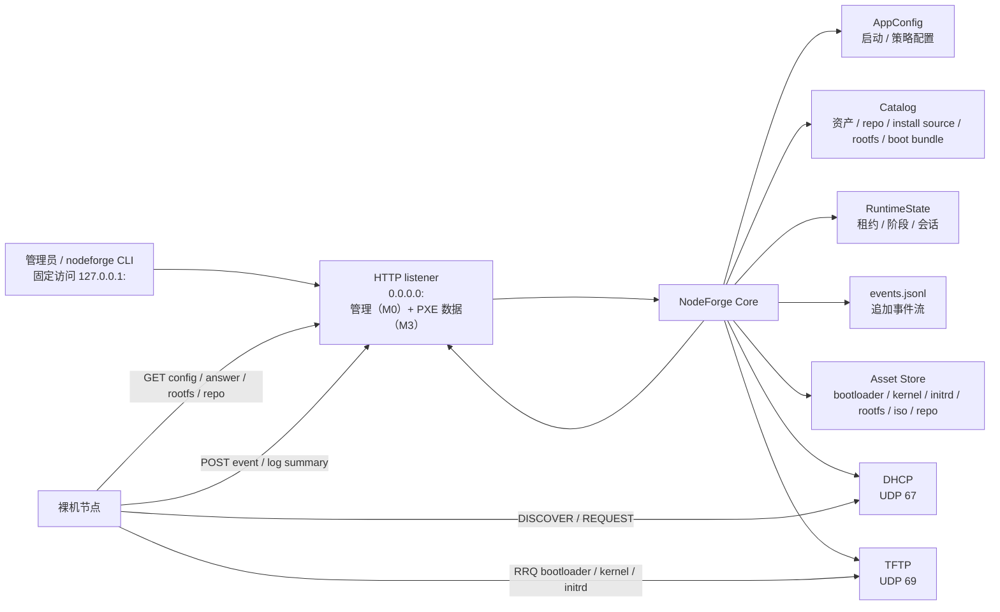
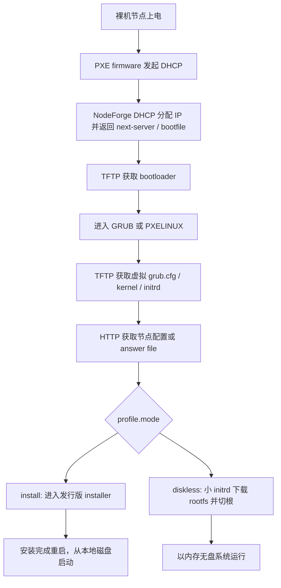
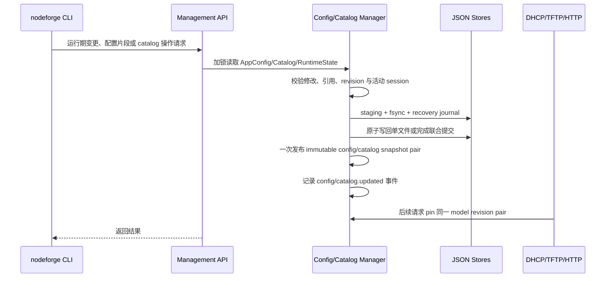

# NodeForge PXE 特化版概要设计

NodeForge 是一个面向小型 Linux 集群和实验室环境的轻量级 OS Provisioning 平台。当前阶段聚焦 PXE provisioning：用 Zig 实现内置 DHCP/TFTP/HTTP 服务，完成裸机节点发现、标准 PXE 引导、无人值守自动安装、内存无盘启动、rootfs/安装源/镜像分发和基础状态观测。

本文是概要设计收敛版，重点回答：

- NodeForge 第一阶段做什么，不做什么。
- 支持哪些发行版、启动方式和部署链路。
- DHCP/TFTP/HTTP、profile、asset、runtime state 如何协作。
- 自动安装和内存无盘启动如何闭环。
- CLI、输出格式、配置、事件和验收标准如何对齐。
- 哪些点已经决策，哪些点仍需详细设计验证。

具体 Zig API、报文编码细节、模板语法、文件锁、脚本执行沙箱等内容进入后续详细设计。

建议阅读顺序：

1. 第 1-3 章确认范围、支持矩阵和功能闭环。
2. 第 4-6 章理解架构、对象关系和协议服务。
3. 第 7-8 章理解自动安装与无盘两条主链路。
4. 第 9-14 章查看配置、CLI、实现、测试和目录约定。
5. 第 15-19 章查看实施阶段、验收标准、风险和最终决策。

## 1. 设计收敛结论

多轮讨论后的核心收敛如下：

| 主题 | 收敛结论 |
| --- | --- |
| 产品形态 | 单机单进程 PXE Boot Provisioning appliance，不做完整集群管理平台 |
| 内置服务 | Zig 实现 DHCP/TFTP/HTTP，HTTP 只保留一个 listener；PXE 数据路由对服务网开放，管理路由只接受 loopback，CLI 固定通过 `127.0.0.1` 管理同机服务 |
| PXE 链路 | MVP 支持 UEFI x86_64 和 UEFI aarch64；当前先在 Rocky Linux 9.7 ARM 环境开发验证，生产验收优先 x86_64；BIOS x86 后续补齐 |
| 发行版范围 | 只适配 Ubuntu Server 22.04 及之后版本和 RHEL 系；RHEL/CentOS 系优先 Rocky Linux，再兼容 RHEL、Alma、Fedora |
| 安装机制 | Ubuntu Server 使用 autoinstall / cloud-init NoCloud-Net；RHEL 系使用 kickstart，优先 Rocky Linux |
| 无盘机制 | 优先 `squashfs_overlay`，保留 `ram_rootfs` 作为轻量救援/测试模式 |
| 启动三件套 | diskless 的 kernel、小 initrd、rootfs 作为同一 boot bundle 管理，并校验 `distro`、`version`、`arch`、`kernel_release` |
| 基础数据关联 | 发行版、版本、架构、repo/mirror、install source、kernel、initrd、rootfs 和 boot bundle 必须有显式关系，不让 profile 直接散落引用裸路径 |
| 小 initrd | 只承载早期联网、下载配置、下载/校验 rootfs、挂载、切根、事件上报等通用能力 |
| overlay tmpfs | 大小限制是 diskless profile 配置项，例如 `overlay.tmpfs_size = "50%"` |
| 节点差异化 | profile 提供部署默认值，node 提供身份、IP、hostname、网络和模板变量等覆盖；IP 本身不触发部署动作 |
| 未知节点默认行为 | 默认进入等待/观察态；可显式配置安全 discovery 或临时无盘；未知节点永远不能直接自动安装 |
| CLI | M0 只提供状态、健康检查和本地 config/catalog 工具；M1+ 按对象来源和生命周期加入 daemon 驱动的导入/构建/发布、运行期高频、批量和观测 CLI/API；使用成熟 CLI 解析库并支持分级帮助 |
| 可观测性 | M2.5 统一服务日志、Event v2 和本机事件查询；M2.5.1 以 `boot_session_id` 串联同一次节点启动，并以 `daemon_instance_id` 显示进程边界；M4.3 为活动交付 session 增加持久化恢复，并要求 TFTP/HTTP 下载写入 node_id 或明确的关联失败原因；服务日志是诊断输出，events JSONL 是可查询审计，后续阶段只能复用同一 writer/注册表 |
| 输出 | 默认面向人类阅读，分组和表格化；机器消费显式使用 `--output json` |

## 2. 定位、边界与支持矩阵

### 2.1 项目定位

NodeForge 第一阶段是 PXE Boot Provisioning appliance，而不是完整集群管理平台。

核心目标：

- 在独立 PXE 管理网段或 PXE VLAN 中为裸机节点提供 DHCP 地址分配和 PXE 启动入口。
- 通过 TFTP 分发 bootloader、虚拟 bootloader 配置（按节点身份即时渲染）、kernel 和 initrd。
- M0 通过唯一 HTTP listener 提供健康检查和管理接口；M3 在同一 listener 分发无人值守安装配置、rootfs、ISO、repo、系统镜像和节点事件。
- 支持两条一等公民路径：
  - PXE 无人值守自动安装到本地磁盘。
  - 小 initrd + HTTP rootfs 的内存无盘启动。
- 提供 `nodeforge` CLI 查看和修改节点、profile、资产、租约、启动阶段、日志、事件和配置；MVP 命令面优先少而清晰。
- 以单机单进程为初始形态，使用内存结构体 + JSON/JSONL 文件作为配置和运行态存储。

### 2.2 当前版本明确不做

- 不接管企业网络中的全部 DHCP 地址分配。
- 不实现通用 DHCP 服务器的完整企业能力，例如 DHCPv6、DDNS、failover、多租户策略。NodeForge 是 DHCP 服务器，不是 relay agent；跨网段场景由网络基础设施（路由器/交换机的 IP Helper 或 `dhcrelay`）完成 relay 转发，NodeForge 仅作为服务器端按 RFC 2131 标准正确处理经 relay 转发的报文（解析 `giaddr` 定位 subnet、回复发到 `giaddr:67`），这是任何合规 DHCP 服务器的基本能力，不作为独立功能特性。
- 不把 TFTP 暴露为通用文件服务器；协议层可以较完整实现，产品默认只读并限制在 PXE 启动资产。
- 不依赖 dnsmasq、tftpd 或外部 DHCP/TFTP 作为运行时核心。
- 不做 Kubernetes、Slurm、Ansible 这类集群编排系统。
- 不在初始版本引入数据库。
- 不实现通用仓库管理平台；只读发布已导入 ISO 中的有效仓库和用户显式添加的额外仓库。
- 不要求用户手写 `dhcpd.conf`、`dnsmasq.conf` 或传统 `tftpd` 配置。
- 不为 Debian、openSUSE/SLES、Arch 或桌面发行版设计专门路径。

### 2.3 支持矩阵

| 维度 | MVP | 后续可选 | 非目标 |
| --- | --- | --- | --- |
| PXE firmware | UEFI x86_64、UEFI aarch64 | BIOS x86 | iPXE 作为默认依赖 |
| Bootloader | `grubx64.efi`、`grubaa64.efi` | `pxelinux.0` | 自定义私有 bootloader |
| DHCP 模式 | Authoritative PXE DHCP | Proxy DHCP | 企业级通用 DHCP |
| 安装发行版 | Rocky Linux 9.7、Ubuntu Server 22.04 LTS，均支持 aarch64/x86_64 资产模型 | Ubuntu 后续 LTS、RHEL/Alma/Fedora | Debian/openSUSE/Arch |
| 无盘 rootfs | Ubuntu Server 或 Rocky Linux 优先的 RHEL 系 rootfs | 多版本能力表 | 桌面发行版无盘 |
| rootfs 模式 | `squashfs_overlay` | `ram_rootfs`、持久化 overlay | NFS root 作为 MVP 依赖 |
| 架构 | x86_64、aarch64；当前 ARM 开发验证，x86_64 生产优先 | aarch64 生产真机增强 | 其他架构 |

### 2.4 核心原则

- **标准 PXE 优先**：MVP 使用标准 PXE，不依赖 iPXE。
- **协议标准兼容**：DHCP/TFTP 报文必须符合标准协议，能被标准 PXE firmware、GRUB、PXELINUX、普通 TFTP client 和 Wireshark/tcpdump 识别。
- **协议通用，策略特化**：DHCP/TFTP 的 packet、option、状态机按通用协议设计；是否响应、返回什么 bootfile、允许读哪些文件由 NodeForge PXE 策略决定。
- **大文件走 HTTP**：TFTP 只发启动小文件；rootfs、ISO、repo、安装源和大镜像统一走 HTTP。
- **配置结构化**：不直接编辑 DHCP/TFTP 专用配置文件。NodeForge 把启动配置、策略配置、资产目录和运行态分开管理：`config.json` 表达站点级启动配置和少量策略默认值；导入、构建、发布得到的 repository、install source、rootfs、initrd、boot bundle 等进入 NodeForge 管理的 catalog；运行态进入 runtime/events。`nodeforged` 是 catalog 的唯一 writer。
- **启动加载与在线更新分层**：M0 中，`nodeforged` 启动时读取并校验 `config.json`，形成内存配置快照；站点结构性配置修改后重启生效，`config import` 只是离线原子写入。M1+ 才引入 DHCP discovery 策略和 catalog 变更的在线 API，由 `nodeforged` 原子更新内存快照并持久化。
- **端口固定**：DHCP 固定监听 `UDP 67`，TFTP 固定监听 `UDP 69`。这两个端口是源码常量，不提供配置项、CLI 参数或运行时覆盖参数。
- **发现安全**：未知节点身份可以从租约池获得临时 IP，并按 `dhcp.discovery.default_action` 进入等待、discovery 或显式允许的临时无盘；未知节点不能执行自动安装。MVP 以 MAC 为主要身份，保留 DHCP client id 和 SN 作为辅助信息。
- **HTTP 单监听简化**：MVP 只启动一个 HTTP listener，固定绑定 `0.0.0.0:<http.port>`。健康检查、管理 API 和 M3+ PXE 数据 API 复用同一 HTTP 实现、连接循环和路由入口。`server.server_ip` 表示 PXE 服务网对外地址，用于生成裸机可访问 URL、DHCP next-server、TFTP/HTTP 广告地址；它不作为 HTTP bind 地址。DHCPv4 Linux 部署必须设置 `server.bind_interface`，用于以 `SO_BINDTODEVICE` 约束 DHCP 广播；CLI 管理客户端写死访问 `127.0.0.1:<http.port>`，不做远程管理发现和多管理端点配置。
- **管理端口约定**：MVP 不引入独立 `management_port`。管理路由和 PXE HTTP 数据路由共用 `server.http_port`，默认 `8080`；listener 绑定所有 IPv4 接口，但 `/api/v1/management/` 仅接受 direct peer `127.0.0.1`，远端请求稳定返回 403。`nodeforge` CLI 固定连接 `127.0.0.1:<http.port>` 且不提供远程 endpoint，只支持管理同机 `nodeforged`。端口冲突时修改 `config.json` 后重启服务。
- **配置与 CLI 分工**：M0 不把所有配置字段拆成参数：server IP、端口、资产根目录等启动配置走 `config.json`；CLI 只做 status/check、config/catalog 校验与导出、离线 config import。M1+ 再为 ISO/repo/rootfs/initrd/boot bundle 提供由 daemon 写入 catalog 的导入/构建/发布命令，并为节点认领、批量导入、运行期策略、事件和日志加入 CLI/API。
- **CLI 使用成熟库**：命令解析、帮助信息、参数类型、默认值和错误提示使用固定版本的开源 CLI 库。MVP 固定使用支持 Zig 0.16.0 的 `zli v5.1.2`；命令、子命令、flag、位置参数和说明只在命令树中声明一次，解析与分级帮助从同一份声明生成。zli 只承载 CLI 语法和展示，不承载复杂业务配置模型。
- **CLI 帮助可达**：顶层、每个资源命令和每个子命令都必须支持 `-h/--help`，显示用途、参数和默认值；长示例保留在 README 和运维文档，不塞进帮助页。
- **日志与排障**：M0–M2 的 stderr/journal 行为在 M2.5 统一迁移为带时间、等级、scope 的标准库日志后端；`nodeforged --log-output auto|terminal|file|both` 控制本次输出目标，systemd 默认写入 `/opt/nodeforge/logs/nodeforged.log`，配置支持 `debug/info/warn/err` 和文件轮转，`nodeforged -d/--debug` 仅覆盖本次启动。M2.5 的 Event v2 是本地可查询审计契约，所有后续协议、installer、initrd 与 runner 复用同一注册表和 writer。服务日志、业务事件和 CLI 错误分别输出，且任何等级都不得记录密码、token、完整请求体或节点上传的大日志。
- **密码配置统一为明文事实**：NodeForge config 中所有声明为 password 的字段都接受普通明文字符串，并在 JSON 存储、`config import` 和 `config export` 中原样保留；不限于用户、root 和 IPMI，未来 repository/proxy/basic-auth 等密码字段也遵循同一规则。需要 crypt/hash 的 adapter 只在渲染或受控下发阶段转换，不得回写配置。token、session capability、SSH private key 和派生 password hash 不属于 password 配置字段。
- **输出可读优先**：面向人的默认输出必须分组、对齐、标注状态和时间；机器消费使用显式 `--output json`。

## 3. M0 实现状态

M0 项目骨架阶段已完成，并在 Rocky 9.7 aarch64 环境完成实机验证。

### 3.1 核心模块
- **配置管理**: `config/load.zig`、`config/validate.zig`、`config/store.zig` 支持配置的加载、校验和原子保存
- **目录管理**: `catalog/store.zig` 实现资产目录的管理和追踪，`catalog.zig` 提供配置与 catalog 的只读查询函数
- **HTTP 服务**: `http/server.zig` 通过 Zap/facil.io 提供单监听器 HTTP 服务和路由管理
- **管理接口**: `http/server.zig` 实现管理路由，`http/management.zig` 定义 CLI 的本机访问约定
- **状态管理**: `state/runtime.zig`、`state/events.zig` 提供运行态和事件持久化基础类型；M0 HTTP 服务尚未产生 DHCP/TFTP/节点业务事件
- **错误处理**: `observe/error.zig` 提供统一的错误响应格式
- **服务日志**: `observe/log.zig` 提供 info/debug 等级的服务日志门面
- **预检机制**: `preflight.zig` 实现唯一 HTTP 端口的可用性检查

### 3.2 代码质量
- 核心领域模型、对外入口和错误/日志协议均有文档注释；具体模块职责和公开接口见详细设计第 3 节
- 遵循统一的错误处理模式
- 实现了完整的配置和目录校验逻辑
- HTTP 请求处理确保内存安全

### 3.3 关键实现
- Zap/facil.io 接管 HTTP 报文解析、连接生命周期和 worker 调度；NodeForge 只维护业务路由
- preflight 先识别活跃 listener、再允许 `SO_REUSEADDR` 快速重启，避免重复监听与重启窗口冲突
- catalog 已填写的 SHA-256 字段会执行格式校验

### 3.4 已验证能力
- `nodeforged --check-config` 配置校验通过
- `nodeforge status` 状态查询功能正常
- `nodeforge config validate` 配置验证功能正常
- `nodeforge check` 服务健康检查功能正常
- Rocky Linux 9.7 aarch64 远程环境部署验证通过
- systemd 服务启动、停止、重启功能正常
- HTTP 管理接口和 API 路由响应正常

### 3.5 M0 CLI 边界

M0 只交付以下可执行命令：`status`、`check`、`config validate/export/import`、
`catalog validate/export`。其中 `status` 和 `check` 固定调用本机管理 API；config/catalog
命令直接操作本地 JSON 文件：`config import` 只校验 source config 自身后原子覆盖目标文件；
`config validate` 与 `catalog validate` 才校验 config/catalog 关系。import 不会热加载，必须重启
`nodeforged`。M0 不实现 DHCP/TFTP/资产/节点/rootfs/initrd/provision 的 CLI，也不实现
catalog 写入或运行期配置更新 API；这些能力按 M1+ 对应阶段设计和实现。

M0 参数规则是命令局部而非 persistent/global：`nodeforge` 根命令只有 `-v/--version`，
`-h/--help` 可用于每一级；叶子命令按实际需要提供 `-c/--config`、`-C/--catalog`、
`-o/--output`、`-d/--debug`。`nodeforged` 没有子命令，因此其根参数为
`-v/-c/-C/-d/-k/-K`（version/config/catalog/debug/check/check-config）。

M4.3 覆盖 M0 的静态版本输出范围：`nodeforge` 与 `nodeforged` 的顶层 `-v/--version` 都必须输出相同的
SemVer、构建时间、git commit 和 clean/dirty；仍不新增 `version` 子命令。

## 4. 功能对齐矩阵（M1+ 路线图）

下表描述完整 provisioning 产品闭环，不等同于当前已实现能力。第 2.5 节保留 M0 的历史交付边界；
当前实施状态为 M0-M3 已有验证记录，M4/M4.1 的 Rocky 9.7 与 Ubuntu 22.04 正向安装、登录和生命周期
已完成实机验证；M4.1 异常恢复与边界项继续按审计清单回归，Rocky 8.10 aarch64 因当前 VMware/
Apple-Silicon 环境不支持介质内核的 64 KiB page granule 而单独暂缓，M5-M7 待实现。各行能力按
第 15 节路线图交付，只有代码、测试和系统级验收均完成后才能标记为支持。

| 能力 | 配置对象 | 运行态对象 | 主要命令 | MVP 验收点 |
| --- | --- | --- | --- | --- |
| TFTP 启动资产 | `tftp`、`asset` | `tftp_session` | `runtime tftp-counters/tftp-sessions`、`assets list/show` | 节点能拉取 bootloader、虚拟 `grub.cfg`、kernel、initrd（M3.5 已在 r97n0 完成实机验证） |
| DHCP 地址分配 | `dhcp`、`node`、`policy` | `lease`、`unknown_client` | `config set policy.*=...`、`runtime dhcp-leases/dhcp-unknown` | 未知节点可获临时 lease，已登记节点拿正确 IP |
| PXE 启动入口 | `node`、`profile`、`asset` | `node_status`、`event` | `node show`、`assets list` | DHCP 返回正确 `next-server` 和 `bootfile` |
| HTTP 配置和资产 | `http`、`asset`、`profile` | `event` | `assets import`、`events list/follow` | initrd/installer 能获取配置并上报事件 |
| 基础数据关系 | `distro`、`repository`、`install_source`、`asset`、`rootfs`、`boot_bundle` | `event` | `catalog show/validate`、`assets show/validate` | 能展开 OS 版本、repo、kernel、initrd、rootfs 的引用关系 |
| 自动安装 | `profile.install` | `node_status`、`event` | `node render/show` | Ubuntu Server autoinstall 跑通，Rocky Linux 9.x kickstart 模板可渲染 |
| 目标系统基础配置（M4.1） | `profile.system`、`node.overrides.network` | `node_status`、deployment control、`event` | `node render/retry/show`、`profile show` | 公共系统配置跨安装/无盘复用；一次性 install generation 防止重复 PXE 擦盘，显式 retry/drift 可审计 |
| 本地启动盘配置 | `profile.install.storage`、`profile.install.bootloader` | `node_status`、`event` | `node render/show` | 可选择安装目标盘，创建 EFI/BIOS 引导分区并安装 bootloader |
| 无盘启动 | `profile.diskless`、`boot_bundle` | `node_status`、`event` | `node diskless-status/diskless-overlay` | 小 initrd 下载 rootfs 并切换到目标 rootfs |
| boot bundle 校验 | `asset`、`rootfs`、`profile` | `event` | `assets rootfs-validate/initrd-validate` | kernel/initrd/rootfs 的版本、架构、kernel ABI 一致 |
| 补充包和后处理 | `provisioning_bundle` | `node_status`、`event` | `provision bundle show/plan`、`provision status` | Kickstart、autoinstall、rootfs build、diskless 共用强类型步骤和清晰输出 |
| 配置与目录持久化 | `config.json`、`catalog.json` | M3.1 起为 `leases.json`、`node-status.json`、`events.jsonl`，M4.1 增加 `deployment-control.json`；`runtime.json` 仅兼容迁移 | `config validate/export/set/apply`、`assets import/*-build/*-publish` | 启动配置可重启加载；install generation 和导入/发布状态可审计恢复 |
| 观测输出 | `logging`、`events` | `node_status`、`event` | `node list/show/trace`、`events list/follow/types` | 输出分组、表格化，错误有摘要和下一步建议 |

## 5. 总体架构与数据流

### 5.1 单进程架构



初始实现为单进程多服务：

```text
nodeforged
  ├─ config manager
  ├─ catalog manager
  ├─ local management API
  ├─ DHCP UDP loop
  ├─ TFTP dispatcher
  ├─ HTTP server
  ├─ runtime state manager
  └─ event writer
```

服务之间共享内存配置，不通过生成传统 DHCP/TFTP 配置文件来驱动。

### 5.2 标准 PXE 引导链



bootfile 选择：

| 架构 | PXE arch option | bootfile | 阶段 |
| --- | --- | --- | --- |
| UEFI x86_64 | `7` / `9` | `grubx64.efi` | MVP |
| UEFI aarch64 | `11` | `grubaa64.efi` | MVP |
| BIOS x86 | `0` | `pxelinux.0` | 后续补齐 |

#### 5.2.1 HTTP 加速（`node.http_accel`，实验性）

> **实验性功能**：默认禁用（`false`）。在实测中，即使 kernel 走 TFTP，
> GRUB 为 initrd 建立 TCP 连接时仍可能触发 EFI 内存碎片化，导致后续
> kernel 加载失败（`out of memory`）。仅在确认目标 GRUB 构建和 EFI 固件
> 内存充裕时才可尝试启用。

**背景问题**：GRUB 的 TFTP 客户端不支持 RFC 7440 windowsize。即使服务端配置了
`tftp.windowsize=4`，GRUB 的 RRQ 包不含 windowsize option，服务端回退到
`windowsize=1`（stop-and-wait）。每个 DATA 块（通常 1468 字节）需等一个 ACK
往返，吞吐被 RTT 限制：`吞吐 = block_size / RTT ≈ 1468 / 0.7ms ≈ 2 MB/s`。
100+ MB 的 initrd.img 下载需 50+ 秒。

**解决方案**：节点级 `http_accel` 属性（**默认 `false`**，实验性）。启用时 GRUB 配置中的
initrd 路径渲染为 `(http,server:port)/boot/<path>` 设备记法，GRUB 通过
TCP HTTP 下载，利用 TCP 窗口控制达到接近线速的吞吐。HTTP 服务器在
`/boot/<path>` 路由从 `tftp.asset_root` 提供文件（catalog 白名单校验）。
kernel 始终走 TFTP（见下方 GRUB EFI 内存限制说明）。禁用时 kernel/initrd 均走 TFTP。

**配置粒度**：节点级而非全局，因为不同节点的 GRUB 构建可能不同（某些嵌入式
GRUB 可能不含 http 模块），需要逐节点控制。

**CLI 管理**：
- `node add <id> ... http_accel=true`：添加节点时显式启用（实验性）
- `node set <id> http_accel=true`：修改已有节点启用
- 默认 `false`，kernel/initrd 均走 TFTP

**安全模型**：`/boot/` 路由无需认证——GRUB 的 HTTP 请求无法携带 bearer token，
与 TFTP 一致。catalog 白名单确保只有注册的 asset path 可被提供。路径安全双重
校验（`validateRelativePath` + `openRegularFile`）。

**GRUB HTTP Range 兼容**：GRUB 下载完整文件后发送 `Range: bytes=<size>-` 做完整性
验证。服务端在此边界情况返回 206 + 0 字节而非 416，避免 GRUB 将 416 视为致命错误
而中止启动（详见 DETAILED_DESIGN §8.3.1）。

**GRUB EFI 内存限制**：GRUB 的 ARM64 Linux loader 在 `grub_file_open()` 获取文件大小后
立即调用 `grub_efi_allocate_pages()` 分配内核缓冲区。GRUB 的 TCP/HTTP 模块自身会占用大量
EFI 连续内存页（发送/接收缓冲、TCP 控制块等），导致剩余连续内存不足以分配 13 MB 内核
缓冲区，报出 `can not alloc kernel buffer` 或 `out of memory` 并关闭 TCP 连接。
tcpdump 可见 GRUB 在仅收到 ~43 KB 后发送 FIN+RST。即使 kernel 走 TFTP，GRUB 为
initrd 建立 TCP 连接时仍可能触发 EFI 内存碎片化，导致后续 kernel 加载失败（实测
`out of memory`）。因此 **kernel 始终走 TFTP**，且 `http_accel` 默认禁用。
仅作为实验性功能保留，在确认目标 GRUB 构建和 EFI 固件内存充裕时才可尝试启用。

**前置条件**：GRUB 二进制必须编译含 `http` 模块。验证方法：
`strings grubaa64.efi | grep net/http`。大多数发行版的 GRUB UEFI 构建默认包含。

**适用范围**：`http_accel` 仅对 GRUB UEFI 链路（`grubx64.efi`/`grubaa64.efi`）生效。
M6 的 BIOS PXELINUX 链路使用 `pxelinux.0`（只支持 TFTP，不支持 HTTP），
`http_accel` 对 PXELINUX 节点无效，kernel/initrd 始终通过 TFTP 传输。

**TFTP 微调（M4.3 RFC 收口）**：对 `http_accel=false` 或 BIOS PXELINUX 等仍走 TFTP 的场景，
`max_blksize`（默认 1468：1500 − 20 IP − 8 UDP − 4 TFTP）只作为服务端上限：客户端请求
`blksize=N` 时返回 `min(N, max_blksize)`；客户端未请求 `blksize` 时保持 RFC 1350 默认 512，
不得在 OACK 中主动增加该 option。RFC 2347 要求 OACK 只能包含客户端明确请求的 option，RFC 2348
要求服务端返回的 blksize 不大于客户端请求值。早期实测中的主动建议/放大策略虽然能提高部分 GRUB
版本的吞吐，但不具备跨 PXE 客户端兼容性，M4.3 删除该行为。

`max_blksize` 可通过配置文件 `tftp.max_blksize` 调整（默认 1468），适用于 jumbo frames
环境（如 `max_blksize=8192`）。

### 5.3 initrd 类型边界

文档中必须区分两类 initrd：

| 类型 | 用途 | 来源 | NodeForge 职责 |
| --- | --- | --- | --- |
| installer initrd | 自动安装进入发行版安装器 | Ubuntu Server / RHEL 系安装介质 | 分发、传入 answer URL、接收 hook/日志事件 |
| NodeForge 小 initrd | 无盘启动早期用户态 | NodeForge 构建 | 联网、拉取 boot config、下载/校验 rootfs、挂载、切根、上报事件 |

自动安装不要求把 NodeForge 逻辑塞进发行版 installer initrd。安装阶段状态可以通过 answer file hook、late command、post install 或 firstboot 上报。无盘启动则要求 NodeForge 小 initrd 具备完整早期启动逻辑。

### 5.4 kernel cmdline 规则

NodeForge 自有参数使用 `nodeforge.*` 前缀。cmdline 中只保留启动早期必须知道的稳定入口，复杂配置通过 HTTP boot config 获取。

```text
install:
nodeforge.mode=install nodeforge.node_id={{node_id}} nodeforge.config_url={{config_url}} nodeforge.event_url={{event_url}}

diskless:
nodeforge.mode=diskless nodeforge.node_id={{node_id}} nodeforge.config_url={{config_url}} nodeforge.event_url={{event_url}}
```

发行版安装参数由 adapter 追加，例如：

- Ubuntu Server：`autoinstall ds=nocloud-net;s={{answer_base_url}}/`
- RHEL 系：`inst.ks={{kickstart_url}} inst.repo={{repo_url}}`

## 6. 核心对象模型

NodeForge 的对象模型保持简单：配置对象描述“应该怎样”，运行态对象描述“现在怎样”。

本章描述 M1-M7（含 M4.1、M4.2 和 M4.3）的目标模型，不等同于当前代码 schema。历史 M0 边界以详细设计第 5 节为准；
当前代码已实现 M4.1 的 `profile.system` 和节点目标网络字段，但仍须以 fixture 与系统验收为准，不能因为
字段出现在目标模型中就宣称已完成系统级支持。

### 6.1 配置对象

| 对象 | 作用 |
| --- | --- |
| `server` | 服务名、绑定网卡、服务 IP、HTTP 端口、管理接口 |
| `dhcp` | PXE 子网、租约池、网关、DNS、租约时间、发现策略 |
| `tftp` | TFTP asset root、传输参数、只读访问策略 |
| `http` | HTTP asset root、Range、manifest、状态上报入口 |
| `node` | 节点身份、MAC/client id、静态 IP、架构、profile、标签、模板变量、带外管理 |
| `distro` | 操作系统族、版本、架构、安装 adapter、包管理器和支持矩阵 |
| `repository` | apt/yum/dnf 源、mirror、GPG key、组件/仓库名，绑定到 distro/version/arch |
| `install_source` | ISO、HTTP install tree、image 或 repo 安装入口，包含 installer kernel/initrd 关系 |
| `profile` | 启动/安装/无盘策略，按 `mode` 区分 `discovery`、`install`、`diskless` |
| `asset` | bootloader、kernel、initrd、rootfs、ISO、repo snapshot、script 等物理文件元信息 |
| `boot_bundle` | diskless 的 kernel、小 initrd、rootfs 一致性发布组合 |
| `rootfs` | rootfs 工作目录、构建规格、发布物、校验和版本 |
| `provisioning_bundle` | 自动安装、rootfs 构建和无盘启动共用的补充包、文件及后处理步骤 |
| `policy` | 未知节点发现、拒绝列表、安全默认值 |

概要结构：

```zig
const AppConfig = struct {
    server: ServerConfig,
    dhcp: DhcpConfig,
    tftp: TftpConfig,
    http: HttpConfig,
    logging: LoggingConfig,
    events: EventsConfig,
    policy: PolicyConfig,
};

const Catalog = struct {
    distros: []DistroConfig,
    profiles: []ProfileConfig,
    nodes: []NodeConfig,
    provisioning_bundles: []ProvisioningBundle,
    assets: []AssetConfig,
    repositories: []RepositoryConfig,
    install_sources: []InstallSourceConfig,
    rootfs: []RootfsConfig,
    boot_bundles: []BootBundleConfig,
};

// M4.7 后 AppConfig 只保存启动/站点策略；所有可由管理 API 变更的
// distro/profile/node/bundle/source/asset 由 Catalog manifest/entity store 拥有。

const NodeConfig = struct {
    id: []const u8,
    mac: ?MacAddress,
    client_id: ?[]const u8,
    serial_number: ?[]const u8,
    ip: ?Ipv4Address,
    arch: Arch,
    profile: []const u8,
    hostname: ?[]const u8,
    role: ?[]const u8,
    tags: [][]const u8,
    vars: JsonObject,
    overrides: NodeOverrideConfig,
    oob: ?OutOfBandConfig,
};

const NodeOverrideConfig = struct {
    network: ?NodeNetworkOverride,
    install_vars: JsonObject,
    diskless: ?NodeDisklessOverride,
};

const NodeNetworkOverride = struct {
    mode: NetworkMode,
    interface: ?[]const u8,
    match_mac: ?MacAddress,
    address: ?Ipv4Address,
    prefix_len: ?u8,
    netmask: ?Ipv4Address,
    gateway: ?Ipv4Address,
    dns: []Ipv4Address,
    search_domains: [][]const u8,
};

const NetworkMode = enum {
    dhcp,
    static,
};

const NodeDisklessOverride = struct {
    overlay_tmpfs_size: ?SizeExpr,
    debug: bool,
};

const OutOfBandConfig = struct {
    ipmi: ?IpmiConfig,
};

const IpmiConfig = struct {
    address: ?Ipv4Address,
    netmask: ?Ipv4Address,
    gateway: ?Ipv4Address,
    username: ?[]const u8,
    password: ?[]const u8,
};

const DistroConfig = struct {
    name: []const u8,
    family: DistroFamily,
    versions: []DistroVersionConfig,
};

const DistroVersionConfig = struct {
    version: []const u8,
    archs: []Arch,
    install_adapter: InstallAdapter,
    package_manager: PackageManager,
};

const RepositoryConfig = struct {
    name: []const u8,
    distro: []const u8,
    version: []const u8,
    arch: Arch,
    manager: PackageManager,
    base_url: []const u8,
    suites: [][]const u8,
    components: [][]const u8,
    repo_ids: [][]const u8,
    gpg_check: bool,
    gpg_key: ?AssetRef,
    roles: []RepositoryRole,
};

const InstallSourceConfig = struct {
    name: []const u8,
    distro: []const u8,
    version: []const u8,
    arch: Arch,
    kind: InstallSourceKind,
    source: AssetOrRepositoryRef,
    installer_kernel: AssetRef,
    installer_initrd: AssetRef,
    media_tree_url: ?[]const u8 = null, // 安装媒体树，不代表可用 package repository
    repositories: []RepositoryRef,
};

const ProfileMode = enum {
    discovery,
    install,
    diskless,
};

const ProfileConfig = struct {
    name: []const u8,
    mode: ProfileMode,
    distro: []const u8,
    version: []const u8,
    arch: Arch,
    boot: BootConfig,
    boot_source: BootSourceRef,
    kernel_args: ?[]const u8 = null,
    safety: ProfileSafetyConfig,
    system: TargetSystemConfig,
    install: ?InstallConfig,
    diskless: ?DisklessConfig,
};

const BootSourceRef = union(enum) {
    install_source: []const u8,
    boot_bundle: []const u8,
};

const ProfileSafetyConfig = struct {
    safe_for_unknown: bool,
    destructive: bool,
    persistent_writes: bool,
    // install profile 默认只执行一次；再次 PXE 需显式 rearm。
    reinstall_policy: enum { explicit, always } = .explicit,
};
```

`ProvisioningBundle` 的最小强类型步骤模型在 `DETAILED_DESIGN.md` 3.5 定义，概要设计只保留对象关系，不重复维护第二份字段定义。

`profile.mode` 决定运行路径，`install` 和 `diskless` 是 mode-specific 子配置。不要把 `install_profile`、`diskless_profile`、`initrd_profile` 拆成互相独立的一堆顶层表。

### 6.2 运行态对象

| 对象 | 作用 |
| --- | --- |
| `lease` | DHCP 租约、续租、释放、DECLINE、过期回收 |
| `unknown_client` | 未显式认领的节点自动获取租约后的运行态观察记录 |
| `node_facts` / inventory | discovery/initrd 回传的 SN、UUID、vendor/model 和可选 BMC 网络等非 secret 观察数据；M4.3 持久化到 `node-inventory.json` |
| `node_status` | 节点当前 PXE/安装/无盘阶段和最近错误 |
| `tftp_session` | 当前 TFTP 传输会话、block、重试、结果 |
| `event` | DHCP/TFTP/HTTP/install/diskless/config 事件流 |

运行态不是管理员长期配置，不应混进 profile JSON。M3.1 前的 `RuntimeState` 可落盘为 `runtime.json`；M3.1 的补充方案
改为独立 `leases.json` 和 `node-status.json`，旧文件仅用于兼容迁移。事件始终使用 `events.jsonl` 追加写。

### 6.3 Node 字段语义

Node 描述“这一台机器是谁，以及它相对 profile 有哪些安全差异”。常见字段语义如下：

| 字段 | 含义 | 典型用途 |
| --- | --- | --- |
| `id` | NodeForge 内部节点名 | `node-01`、`gpu-01`，用于 CLI 和 API |
| `mac` | 网卡 MAC 地址 | MVP 最主要的 PXE 身份匹配字段 |
| `client_id` | DHCP option 61 client identifier | 某些 PXE/OS DHCP 客户端会提供，比 MAC 更稳定或更符合站点策略 |
| `serial_number` | 管理员确认的机器序列号 SN | 与 inventory 中 observed SN 分离；不自动覆盖，差异在 `node show` 标记 |
| `ip` | 节点静态保留地址 | DHCP 给已认领节点返回固定 IP |
| `role` | 单值角色 | `compute`、`storage`、`login` 等，用于模板和筛选 |
| `tags` | 多值标签 | `rack:r1`、`env:lab`、`gpu`，用于分组、查询、批量操作和策略筛选 |
| `vars` | 节点模板变量 | 渲染 answer/rootfs firstboot 配置，例如 `rack_id`、`cluster_id` |
| `overrides` | 受控覆盖项 | 只允许覆盖 profile 声明可覆盖的系统内网络、安装变量、diskless overlay 等 |
| `oob` | 可选带外管理配置 | IPMI BMC 地址、掩码、网关、用户名和明文密码 |

`client_id` 不是 NodeForge 自己发明的业务 ID，而是 DHCP 协议中的客户端标识。它可以和 MAC 一起作为节点认领和匹配依据。MVP 主要使用 MAC，`serial_number` 作为资产辅助信息，不引入复杂的多身份匹配规则。

`tags` 只做分类和选择，不应直接改变安装行为。真正会影响部署内容的值应进入 `vars` 或 `overrides`，并由 profile 模板或校验规则显式引用。

`vars` 和 `overrides` 的边界：

- `vars` 是模板输入，只能被 answer/rootfs/firstboot 模板读取；它本身不改变 NodeForge 决策。
- `overrides` 是 NodeForge 认识并校验的覆盖项，例如静态网络、安装模板变量、diskless overlay size。
- 破坏性行为不能通过 `vars` 或 `overrides` 临时打开；擦盘、分区、bootloader 安装仍必须来自 install profile。

`overrides.network` 表达的是安装后系统内或无盘系统内的网络配置覆盖，不等同于 PXE bootstrap 配置。`node.ip` 是 DHCP 侧给 PXE 阶段使用的保留地址；`overrides.network` 用来渲染 autoinstall/kickstart 或无盘 overlay。M4.1 的 mode 只有 `dhcp`、`static`：静态模式必须同时提供 `address` 与 `prefix_len`，且 `address` 必须等于同一 MAC 的 `node.ip`；`gateway`、`dns`、`search_domains` 可选。M4.1 不接受 `netmask` 或 `inherit`，以免 adapter 对继承来源作出不同解释。

结构体中的 `dns: []Ipv4Address` 和 `search_domains: [][]const u8` 使用空列表表示未配置，不代表必填。DHCP 模式可接受 DHCP 下发结果；静态模式的空列表表示不配置对应项。任何模式都不得为了补默认值写入发行版公共 DNS、公共 NTP 或其他公网端点。

`oob` 是可选能力，不是 PXE MVP 的硬依赖。当前只预留 IPMI，不引入 Redfish。BMC 地址、掩码、网关和管理员
配置的凭据按现有全局 password 契约保存在 desired config；凭据不得由 facts 自动上报，也不得进入 inventory、
事件、日志或未脱敏的 `node show`。这只是在明确 desired OOB 与 observed inventory 的边界，不把 OOB 凭据
复制到新的 facts store。

discovery 环境或小 initrd 可以回传少量非 secret `node_facts`：机器 SN、product UUID、vendor/model 和可选
BMC 网络地址。M4.3 将其作为 observed inventory 持久化；管理员确认后才可写入 `node.serial_number` 或
`node.oob`。inventory 不收集、保存或展示 IPMI 用户名/密码；这些凭据只能来自管理员配置的 desired OOB，
也不得因 observed SN 相同而自动绑定或覆盖节点。不要扩展成完整硬件资产采集系统。

### 6.4 Profile 职责

Profile 描述“一类节点如何启动和部署”，node 描述“这一台机器是谁”。

公共字段：

- `mode`：`discovery`、`install`、`diskless`。
- `distro` / `version` / `arch`：发行版、版本、架构。
- `boot`：不同架构对应 bootloader，例如 UEFI x86_64 使用 `grubx64.efi`。
- `boot_source`：安装场景只引用 `install_source`，无盘场景只引用 `boot_bundle`。
- `kernel_args`：经过 token 级安全校验并 canonicalize 的追加参数；NodeForge 管理的 installer/config 参数不可覆盖。
- `safety`：是否允许未知节点使用、是否破坏性、是否写持久状态。

`system` 公共配置描述 locale/timezone/keyboard、离线连接策略、SSH/root、普通用户/password/sudo/key、
目标系统额外包和安全默认值；这些字段跨自动安装/无盘链路复用。节点专属持久网络放在
`node.overrides.network`。

`install` 子配置描述：

- APT fallback、answer/schema、分区、bootloader、安装器文件覆盖和 installer hook/event。安装源由
  `profile.boot_source.install_source` 引用；不得另建与 `profile.system` 冲突的用户、包、目标网络、SSH、
  localization 或安全默认值。

`diskless` 子配置描述：

- rootfs mode、overlay 大小、持久化策略、节点配置注入方式。kernel、小 initrd、rootfs 发布组合由 `profile.boot_source.boot_bundle` 引用。

节点可以覆盖 profile 的少量变量，例如 hostname、静态 IP、DNS/gateway、标签、角色、模板变量，以及 profile 明确允许的运行参数覆盖。破坏性行为仍由 install profile 明确声明，不能由节点变量、IP 租约或未知节点策略临时拼出来。

### 6.5 节点参数覆盖与未知节点默认行为

NodeForge 支持“每个节点单独配置部署参数”，但边界应按职责拆开：

| 层级 | 作用 | 示例 |
| --- | --- | --- |
| profile | 一类节点的部署默认值和能力边界 | Ubuntu 22.04 autoinstall、Rocky 9 kickstart、Ubuntu diskless rootfs |
| node | 单台机器的身份、网络和安全覆盖项 | identity、固定 IP、hostname、role、tags、template vars |
| node override | profile 允许覆盖的运行值 | 静态网络、安装模板变量、diskless overlay size 上限内覆盖、debug flag |
| discovery policy | 未录入节点的默认处置 | wait、discovery、diskless、deny |

设计上不建议“按 IP 单独配置完整部署参数”。IP 可以作为节点保留地址、临时租约或模板变量，但 IP 本身不能代表硬件身份，也不能单独触发擦盘安装。真正的部署决策必须落到“显式认领的 node + profile + node override”。

节点覆盖规则：

- profile 给出默认安装/无盘策略；node 只覆盖这台机器的差异。
- hostname、静态 IP、DNS、gateway、role、tags、answer/rootfs 模板变量属于安全覆盖。
- install 的擦盘、分区、bootloader 安装、安装源必须由 install profile 声明；node 可以提供目标磁盘选择变量，但必须是 profile 模板明确引用并通过校验的字段。
- diskless 的 `overlay.tmpfs_size` 可以有 profile 默认值；如允许节点覆盖，覆盖值必须在 profile 或全局策略允许范围内。
- 未知节点获得的临时 IP 只用于发现和观察，不会自动生成持久 node 配置。

未知节点默认动作由 `dhcp.discovery.default_action` 决定：

| `default_action` | 未知节点是否允许 | 行为 |
| --- | --- | --- |
| `wait` | 允许，推荐默认 | 分配临时 lease、记录 `unknown_client`、等待管理员认领；若配置了只读 discovery profile，可显示等待/诊断界面 |
| `discovery` | 允许 | 启动非破坏性 discovery profile，用于采集硬件信息和显示注册信息 |
| `diskless` | 显式允许后才可用 | 启动标记为 safe/ephemeral 的 diskless profile，不擦盘、不写持久状态、不执行危险 hook |
| `deny` | 允许 | 不给未知节点提供 PXE 启动入口；可按策略不响应或只记录事件 |
| `install` | 禁止 | 配置校验必须拒绝，未知节点不能直接自动安装 |

如果没有配置任何未知节点默认策略，NodeForge 应退化为 `wait`：记录未知身份和临时租约，等待管理员把 MAC/client id 等身份认领为具体 node，并绑定 profile。

safe/ephemeral profile 至少需要满足：`safety.safe_for_unknown = true`、`safety.destructive = false`、`safety.persistent_writes = false`，并且 hooks 不包含擦盘、格式化、固件修改或持久化凭据写入等危险动作。

### 6.6 基础数据关系、命名规则与 boot bundle

基础数据分两层：

| 层级 | 负责内容 | 不负责内容 |
| --- | --- | --- |
| `asset` | 物理文件路径、大小、SHA256、类型、来源 | 不表达“这套系统如何启动” |
| `distro` | 发行版支持矩阵、安装 adapter、包管理器 | 不保存具体文件路径 |
| `repository` | apt/yum/dnf 源、mirror、GPG key、组件/仓库名 | 不决定节点安装到哪里 |
| `install_source` | 安装介质或安装树，以及 installer kernel/initrd | 不表达磁盘分区和用户配置 |
| `rootfs` | 无盘 rootfs 构建规格和发布物 | 不单独决定启动 kernel |
| `boot_bundle` | diskless kernel、小 initrd、rootfs、repo 关系和一致性 | 不保存节点个性化参数 |
| `profile` | 引用上述语义对象，叠加部署策略 | 不直接散落引用一堆裸路径 |

ISO 导入规则保持简单且不做错误假设：

- ISO 导入只接受受管 staging 目录中的常规文件。daemon 在私有随机挂载点以
  `-o ro,nosuid,nodev,noexec,loop` 挂载 ISO9660/UDF；不执行介质内容、不接受任意宿主机路径，导入完成、
  失败或收到终止信号时均必须卸载并清理挂载点。
- 挂载树先复制到 NodeForge 管理的 staging/version 目录，再提取 installer kernel/initrd 并通过 HTTP
  只读发布；不得让 HTTP/TFTP 直接指向仍挂载的介质。
- Rocky/RHEL 系 DVD ISO 只有在 `.treeinfo` 和 `repodata/repomd.xml` 有效时才自动建立 yum/dnf repository。
- Ubuntu Server ISO 始终可作为 installer media；ISO 导入时始终发布受管媒体树，但只有存在可消费的
  `dists/`、`pool/` 和 APT metadata 时才创建 `RepositoryConfig`。不完整媒体通过 install source 的
  `media_tree_url` 支持 offline-install，不伪装成可用 APT repository。`user-data` 只向
  `apt.mirror-selection.primary` 写入 NodeForge 本地 URL，设置
  `apt.geoip: false`，并按 `install.apt.fallback` 决定严格失败或 ISO 离线回退；不得生成
  `archive.ubuntu.com` / `ports.ubuntu.com` / `security.ubuntu.com` 候选。
- NodeForge 不重建发行版仓库元数据；只发布已经有效的仓库内容或管理员明确提供的额外源。

查看配置时，NodeForge 不应只返回 kernel/initrd 路径，而应能展开关系：

```text
profile ubuntu-22.04-diskless
  distro        ubuntu 22.04 x86_64
  boot source   boot_bundle ubuntu-22.04-x86_64-5.15.0-xx-diskless-20260706
  kernel        asset kernel/ubuntu/22.04/x86_64/5.15.0-xx/vmlinuz sha256:...
  initrd        asset initrd/ubuntu/22.04/x86_64/5.15.0-xx/initrd-nodeforge.img sha256:...
  rootfs        rootfs ubuntu-22.04-x86_64-5.15.0-xx-diskless-20260706.squashfs sha256:...
  repo          apt ubuntu-22.04-main http://mirror.example/ubuntu
```

推荐命名规则：

| 对象 | 推荐命名 |
| --- | --- |
| distro version | `<distro>-<version>-<arch>`，例如 `ubuntu-22.04-x86_64` |
| install source | `<distro>-<version>-<arch>-<source-kind>`，例如 `ubuntu-22.04-x86_64-live-server` |
| repository | `<distro>-<version>-<arch>-<role>`，例如 `rocky-9.7-aarch64-baseos` |
| kernel asset | `kernel/<distro>/<version>/<arch>/<kernel_release>/vmlinuz` |
| installer initrd asset | `install/<distro>/<version>/<arch>/initrd` |
| NodeForge 小 initrd asset | `initrd/<distro>/<version>/<arch>/<kernel_release>/initrd-nodeforge.img` |
| rootfs artifact | `<distro>-<version>-<arch>-<kernel_release>-diskless-<build_id>.squashfs` |
| boot bundle | `<distro>-<version>-<arch>-<kernel_release>-diskless-<build_id>` |

kernel 文件名可以在 bundle 内简化为 `vmlinuz`，但元数据必须保存真实 `kernel_release`。`kernel_release` 应来自 `uname -r`、`/lib/modules/<kernel_release>` 目录名，或构建过程对 kernel 包的解析结果。对普通发行版内核，它通常对应源系统 `/boot/vmlinuz-<kernel_release>` 和 `/boot/initramfs-<kernel_release>.img`、`/boot/initrd.img-<kernel_release>` 这类文件；NodeForge 导入后会复制到 asset store，并以 manifest 中的 `kernel_release`、SHA256 和能力声明为准，不依赖运行时继续读取原始 `/boot` 路径。

需要区分两类 initrd：

- installer initrd：来自 ISO 或安装树，只负责进入发行版安装器。
- NodeForge 小 initrd：由 NodeForge 为 diskless 构建，必须匹配 diskless kernel 的 `kernel_release`，并包含早期网络、HTTP、校验、squashfs/overlayfs 等能力。

diskless 的 kernel、小 initrd 和 rootfs 应作为同一个启动发布组合管理。它们不要求来自同一个文件包，但必须满足：

- `distro`、`version`、`arch` 一致，例如同为 `ubuntu` / `22.04` / `x86_64`。
- rootfs 内的 `/lib/modules/<kernel-release>/` 必须匹配实际启动的 kernel release。
- 小 initrd 必须由同一个 kernel release 对应的模块集合生成，或只使用编进 kernel 的早期驱动。
- initrd 里下载 rootfs 前必须用到的网卡驱动、firmware 和文件系统能力，必须与这个 kernel ABI 兼容。
- asset manifest 记录 `distro`、`version`、`arch`、`kernel_release`、`sha256`、`size`、构建时间和构建来源。

boot bundle 目录可以采用：

```text
ubuntu-22.04-x86_64-5.15.0-xx/
  vmlinuz
  initrd-nodeforge.img
  rootfs.squashfs
  manifest.json
```

manifest 示例：

```json
{
  "name": "ubuntu-22.04-x86_64-5.15.0-xx-diskless-20260706",
  "distro": "ubuntu",
  "version": "22.04",
  "arch": "x86_64",
  "kernel_release": "5.15.0-xx-generic",
  "kernel": {
    "asset": "ubuntu-22.04-x86_64-5.15.0-xx-kernel",
    "path": "bundles/ubuntu-22.04-x86_64-5.15.0-xx/vmlinuz",
    "sha256": "..."
  },
  "initrd": {
    "asset": "ubuntu-22.04-x86_64-5.15.0-xx-nodeforge-initrd",
    "path": "bundles/ubuntu-22.04-x86_64-5.15.0-xx/initrd-nodeforge.img",
    "sha256": "..."
  },
  "rootfs": {
    "asset": "ubuntu-22.04-x86_64-5.15.0-xx-rootfs-20260706",
    "path": "bundles/ubuntu-22.04-x86_64-5.15.0-xx/rootfs.squashfs",
    "sha256": "...",
    "size": 0
  },
  "repositories": ["ubuntu-22.04-x86_64-main"],
  "build_id": "20260706"
}
```

## 7. 内置服务设计

### 7.1 TFTP：协议尽量完整，产品只读特化

TFTP 协议层可以较完整实现，但产品策略默认只开放 PXE 启动小文件读路径。

实现目标：

- 监听固定 `UDP 69`。
- 支持 `RRQ`、`DATA`、`ACK`、`ERROR`。
- 明确拒绝 `WRQ`，不实现上传路径。
- 只支持 PXE 所需的 `octet`，不实现 `netascii`。
- 支持 option 协商：`blksize`、`timeout`、`tsize`、`windowsize`（RFC 7440）。
  OACK 只回显客户端请求且服务端接受的 option；`blksize` 只能保持或向下限制，不能主动添加或放大。
- 路径沙箱，禁止目录穿越，只允许读取 asset manifest 中允许的启动资产。

PXE 路径中 TFTP 只发送：

- `grubx64.efi`
- `grubaa64.efi`
- `pxelinux.0`
- GRUB/PXELINUX 配置
- kernel
- installer initrd 或 NodeForge 小 initrd

TFTP 不发送 rootfs、ISO、repo 或大镜像。这些必须走 HTTP。

### 7.2 DHCP：PXE 特化但具备基础地址管理

NodeForge DHCP 不是“只返回 bootfile”的半成品。MVP 使用 authoritative 模式：在绑定的 PXE 管理网段内，提供标准 DHCP 地址分配、基础网络配置、租约生命周期和 PXE 启动入口。

实现目标：

- 监听固定 `UDP 67`。
- 处理 `DISCOVER`、`REQUEST`、`RELEASE`、`DECLINE`。
- 支持租约池、静态保留、续租、释放、过期回收、DECLINE 冲突隔离。
- 按 RFC 2131 标准处理 `giaddr`：当报文经由外部 relay agent（路由器 IP Helper 或 `dhcrelay`）转发到达时，`giaddr` 非零，服务器基于 `giaddr` 或 option 82 中的 RFC 3527 Link Selection 子选项定位目标 subnet；回复报文发送到 `giaddr:67` 而非广播。这是标准 DHCP 服务器行为，不作为独立功能特性。NodeForge 自身不实现 relay agent。
- 支持服务器端地址冲突检测（Ping Probe）：在发送 DHCPOFFER 前对候选 IP 发送 ICMP Echo Request，超时内未收到回复才正式分配；收到回复则标记该 IP 为 abandoned 并尝试下一个候选。参考 ISC DHCP `do_ping_check`/`lease_pinged`/`abandon_lease` 实现。
- 支持未知节点身份：从地址池分配临时租约，记录为 `unknown_client`，并按 `dhcp.discovery.default_action` 决定等待、discovery、显式安全无盘或拒绝。discovery 策略支持运行期在线切换。
- 返回基础网络选项：subnet mask、router、DNS、lease time，以及由同一 lease 推导的 T1 renewal（option 58）
  和 T2 rebinding（option 59，默认分别为 1/2 与 7/8）。
- 返回 PXE 启动选项：`next-server`、`bootfile`，必要时处理 option 60/93/97。
- 把租约变化、未知客户端观察记录和 PXE 事件写入运行态和 JSONL 事件。

`vendor/dhcp` 中的 ISC DHCP 代码作为协议行为参考和重构基础：

- 基于 ISC DHCP 的成熟实现重构 DHCP 服务器核心逻辑，包括 BOOTP/DHCP 报文编解码、option 解析、lease 状态机、`giaddr` 处理和冲突检测。
- 不直接链接 ISC DHCP 的 C 代码作为运行时依赖；Zig 实现放在 `src/dhcp/`。
- 参考的关键实现模式：
  - `locate_network()`（`server/dhcp.c`）：基于 `giaddr` 或 RFC 3527 Link Selection 子选项定位 subnet。
  - `do_relay4()`（`relay/dhcrelay.c`）：relay agent 的 `giaddr` 设置和跨网段转发逻辑，仅用于理解 relay agent 产生的报文格式和 `giaddr` 语义，NodeForge 不实现此逻辑。
  - `do_ping_check()`/`lease_pinged()`/`abandon_lease()`（`server/dhcpd.c`、`server/mdb.c`）：服务器端 ICMP 冲突检测和 lease abandon 流程。
  - `bootp()`（`server/bootp.c`）：BOOTREPLY 发送逻辑，`giaddr` 非零时发送到 relay agent。
- fixture 和测试沉淀参考结论，包括去标识化的真实 DHCPv4 fixture 和期望解析结果。

响应决策：

```text
收到 DHCP 请求
  -> 如果 MAC/client id 已绑定 node：
       使用节点绑定 IP、profile、node override 和对应 bootfile
  -> 如果节点身份未绑定：
       从 DHCP pool 自动分配临时 lease
       记录 unknown_client，供 CLI 查看
       按 dhcp.discovery.default_action 决定：
         wait: 不执行部署，必要时返回只读 discovery/等待界面
         discovery: 返回非破坏性 discovery profile
         diskless: 仅在 allow_unknown_diskless=true 且 profile safety 满足 safe/ephemeral 时返回无盘 bootfile
         deny: 不提供 PXE bootfile 或按策略拒绝
         install: 配置非法，启动前校验拒绝
```

### 7.3 HTTP：主要数据通道

HTTP 是 NodeForge 的主要数据通道，负责 TFTP 之后的所有大内容和状态交互。

职责：

- 分发安装 answer file、节点配置、rootfs、ISO、repo、系统镜像。
- 接收 initrd、installer hook、agent 的状态事件和日志摘要。
- 提供本机健康检查和运行态摘要。

M4.4 起 canonical 路由按节点交付、本机管理和静态制品三个平面分离：

| 路由 | 方法 | 用途 |
| --- | --- | --- |
| `/healthz` | GET | 健康检查 |
| `/api/v1/nodes/:id/boot-config` | GET | bootloader、installer 或小 initrd 使用的 typed BootConfig |
| `/api/v1/nodes/:id/install-config/kickstart` | GET | RHEL-family Kickstart |
| `/api/v1/nodes/:id/install-config/nocloud/{user-data,meta-data,vendor-data}` | GET | Ubuntu NoCloud seed 固定叶子 |
| `/api/v1/nodes/:id/events` | POST | 节点阶段事件上报 |
| `/api/v1/nodes/:id/logs` | POST | 可选，上传关键日志摘要 |
| `/api/v1/nodes/:id/installer-hooks/subiquity` | POST | direct peer + active session 的 installer webhook |
| `/api/v1/nodes/:id/facts` | POST | inventory facts |
| `/api/v1/nodes/:id/artifacts/rootfs/:name` | GET/HEAD | node-bound 无盘 rootfs（M5） |
| `/artifacts/boot/*` | GET/HEAD | 分发 bootloader/kernel/initrd |
| `/artifacts/images/:name` | GET/HEAD | 分发 ISO 或系统镜像 |
| `/artifacts/repositories/:name/*` | GET/HEAD | 分发安装源或软件仓库 |
| `/api/v1/management/runtime` | GET | 本机 CLI 使用的运行态摘要 |
| `/api/v1/management/operations/:id` | GET | 本机 CLI 查询 ISO/import/migration 长任务 |

大文件分发要求：

- `Content-Length`。
- `Range` 请求。
- SHA256 manifest。
- 可选 `ETag`。
- 并发连接上限作为内部常量；MVP 不设计限速策略。

M3 的节点侧 HTTP 认证结果必须绑定已认领 node、活动 `boot_session_id` 与 DHCP lease 的直连 peer IP；
`boot_session_id` 仅用于关联，不是 capability。首次 boot/install-config 以该绑定完成 bootstrap，随后 rootfs、
事件和日志摘要使用独立的 session capability，并只能置于 HTTP header。token 不得进入 URL、kernel cmdline、
日志或事件；M4.3 起将 active delivery session 的 capability 写入 mode 0600 的
resume snapshot。daemon 重启后通过 TTL、node/lease/config 校验的
session 可以恢复；恢复使用 session 自有的 immutable install plan，desired hostname/network 等变化只形成下一次
session 的 drift，不能让同一次安装的 answer 中途变化。恢复失败、过期或 superseded 才失效，且恢复绝不重新 arm
install generation，也不声称恢复已中断的 TFTP UDP transfer。`/artifacts/images`
与 `/artifacts/repositories` 可以只读公开，但只能发布 catalog allowlist 的资源；rootfs 和所有节点 API 必须经过
node-bound session 认证。M4.4 作为开发期 breaking cutover，直接删除重复 `/boot/config`、含糊 `/answer` 及全部旧
route，不依赖 HTTP redirect/alias。route/method/auth/cache、status/error envelope 和 golden DTO 是当前实现基线，
不是历史兼容冻结；M4.4 切换前必须结束并清理 M4.3 session/checkpoint，残留旧 schema 拒绝启动且不自动 rearm，
M4.4 新 session 只使用 canonical URL。
完整替换规则见详细设计 §9.13。

MVP 不拆分 management listener 和 PXE listener。管理路由与 M3+ PXE 数据路由逻辑分区，但共享同一个 HTTP listener；当前同一 socket 已提供 `/healthz`、管理路由和裸机可通过 `server.server_ip` 访问的数据路由。本 listener 固定绑定 `0.0.0.0:<http.port>`；`server.server_ip` 表示 PXE 服务网对外地址，用于生成裸机可访问 URL、DHCP next-server、TFTP/HTTP 广告地址，不作为 HTTP bind 地址。`/api/v1/management/` 在 route 入口按 direct peer 严格限制为 `127.0.0.1`，不能由 `X-Forwarded-For` 绕过；`nodeforge` CLI 固定连接该地址，不提供远程 endpoint。这样保留唯一 socket，同时不把 catalog 写入和 loop-mount 权限暴露到 PXE 网段。

HTTP 服务器基于 Zap/facil.io 的固定提交实现。Zap 负责 HTTP 报文解析、连接生命周期、并发调度和 fd-backed sendfile；M3 已接入受管静态资产和 Range 路由，在把已验证 descriptor 交给发送路径前解析单 Range/`If-Range`，并只使用受管 SHA256 ETag，不依赖 facil.io 的文件时间/长度 ETag。NodeForge 维护业务路由、管理 API 和统一错误信封。已评估的纯 Zig `http.zig`（karlseguin）在 Zig 0.16 上尚未充分测试且不承诺完整 HTTP/1.1 合规，因此不作为本 MVP 的直接依赖。

## 8. 核心能力 A：PXE 无人值守自动安装

### 8.1 安装流程

```text
PXE 启动
  -> DHCP 获取 IP / bootfile
  -> TFTP 获取 bootloader / kernel / installer initrd
  -> installer 通过 HTTP 获取 answer file
  -> 获取安装源或系统镜像
  -> 分区 / 格式化 / 安装系统 / 写入基础配置
  -> 执行 post-install / firstboot
  -> 上报事件
  -> 重启进入本地磁盘系统
```

### 8.2 install profile 需要表达什么

| 类别 | 需要表达的内容 |
| --- | --- |
| 安装入口 | distro、version、arch、installer、`boot_source.install_source`、cmdline |
| 磁盘与分区 | 目标磁盘、是否擦盘、GPT/MBR、UEFI/BIOS boot 分区、根分区、swap、文件系统、mount point、LVM/RAID 预留 |
| 启动盘与引导 | boot disk、boot mode、ESP/BIOS boot 分区、`/boot`、bootloader 安装目标、安装后本地磁盘启动策略 |
| 安装源 | ISO、HTTP repo、mirror、image、本地缓存、repo 优先级 |
| 软件 | 包组、基础包、额外包、排除包、弱依赖策略、更新仓库 |
| 网络 | 安装阶段 DHCP/静态 IP、hostname、DNS、gateway、route、bond/VLAN 预留 |
| 用户与访问 | 初始用户、SSH authorized_keys、sudo、密码策略、是否禁用密码登录 |
| 文件覆盖 | 写入 `/etc` 文件、模板变量、systemd unit、证书、软件源配置 |
| 脚本 hook | pre-install、post-install、firstboot、failure hook；支持内联脚本或引用 HTTP asset |
| 安全输入 | token、临时凭据；MVP 不引入 secret store，密码直接明文配置 |

NodeForge 配置中所有语义为 password 的字段均直接以明文配置和存储，例如 `111111` 或 `asdf1234`。
当前包括系统用户、root 与 IPMI；未来若增加 repository、proxy、HTTP basic-auth 或其他 password 字段，
也必须默认接受明文并由 config import/export 原样往返。发行版 adapter 在渲染 answer file 时按安装器要求
临时生成 hash；MVP 不设计额外密码状态、SecretRef、加密封装或轮换流程。

未显式认领的节点默认不能使用会擦盘的 install profile。必须先由管理员把发现到的节点身份认领为 node，并绑定 IP/profile。这个身份 MVP 以 MAC 为主，可用 DHCP client id 和 SN 辅助确认。这样做的原因是 PXE 管理网段里可能临时接入未知服务器、虚拟机或误插设备，默认自动擦盘安装风险太高。

### 8.3 启动盘与引导配置

PXE 自动安装必须具备本地启动盘配置能力。这里的“配置启动盘”指的是：在目标机器本地磁盘上创建可启动系统，而不是保证修改服务器固件的全局 boot order。

install profile 需要明确：

- `storage.boot_disk`：系统安装完成后应从哪块本地磁盘启动，例如 `/dev/sda`、`/dev/nvme0n1`，或通过稳定 ID 选择。
- `storage.boot_mode`：`uefi`、`bios` 或 `auto`。MVP 默认跟随 PXE 启动模式，优先 UEFI。
- `storage.partition_table`：UEFI 推荐 GPT；BIOS 可以使用 MBR 或 GPT + BIOS boot 分区。
- UEFI 场景：创建 ESP，挂载到 `/boot/efi`，安装 `grub-efi` 或发行版默认 UEFI bootloader。
- BIOS 场景：创建 BIOS boot 分区或 MBR boot code，安装 BIOS GRUB。
- `/boot`：是否单独分区由 profile 声明；MVP 可以默认不单独分区。
- `bootloader.install`：是否安装 bootloader；自动安装 profile 默认必须为 `true`。
- `bootloader.target`：bootloader 安装目标，通常为 `storage.boot_disk`。

NodeForge 可以通过 autoinstall/kickstart 渲染本地磁盘、分区和 bootloader 配置。它不应该假设所有服务器都能从操作系统安装器中可靠修改 BMC/BIOS/UEFI 的启动顺序。安装后“下一次从本地盘启动”可以采用以下策略：

- 首选：安装器按发行版标准安装 UEFI/BIOS bootloader，重启后由固件现有启动顺序进入本地盘。
- 可选增强：post-install 中使用 `efibootmgr` 调整 UEFI BootNext/BootOrder。已在 Rocky 9.7 aarch64 VMware EFI 虚拟机上验证：`efibootmgr -o` 修改 BootOrder 后重启持久化正常；`efibootmgr --bootnext` 设置一次性启动项有效；`efibootmgr -c`/`-B` 可创建/删除启动项（需有效 EFI 文件路径）。不同厂商固件对 BootOrder 修改的兼容性可能存在差异，MVP 默认 `set_firmware_boot_order = false` 避免阻塞自动安装。
- 可选增强：通过 IPMI 设置下一次启动设备，但这属于带外管理能力，不进入 MVP。

### 8.4 发行版 adapter

| 系统族 | 支持发行版 | 机制 | NodeForge 输出 |
| --- | --- | --- | --- |
| Ubuntu Server | Ubuntu Server 22.04 LTS 优先；之后的 LTS 按版本增加能力表 | autoinstall / cloud-init NoCloud-Net | `user-data` / `meta-data` |
| RHEL / CentOS 系 | Rocky Linux 优先，MVP 以 Rocky Linux 9.x 为主；后续兼容 RHEL / Alma / Fedora | kickstart | `ks.cfg` |

通用字段映射：

| 通用字段 | Ubuntu Server autoinstall | RHEL 系 kickstart |
| --- | --- | --- |
| locale / timezone / keyboard | `locale` / `timezone` / keyboard config | `lang` / `timezone` / `keyboard` |
| 分区 | `storage.config` | `clearpart` / `part` / `logvol` |
| 软件包 | `packages` | `%packages` |
| 用户/SSH | `identity` / `ssh` | `user` / `sshkey` |
| 目标系统网络 | Netplan v2 `network` | `network --bootproto=...` / NetworkManager |
| post-install | `late-commands` | `%post` |
| 安装源 | nocloud/repo URL | `inst.repo` / `url` |
| APT mirror 失败策略 | `install.apt.fallback` | 不适用 |

`profile.system.packages` 表示最终目标系统必须具备的额外包：自动安装在安装器原生 package 阶段安装，
无盘在 rootfs build 阶段安装。更复杂的 package group、tar.bz2、文件更新和脚本统一进入 provisioning bundle，
且不得与 `system.packages` 重复声明。

M4.1 将目标系统公共配置收敛为 `profile.system`，包括 localization、connectivity、SSH/root、普通用户/
password/sudo/逐账号 key、目标系统额外包和 security；节点专属静态网络放在
`node.overrides.network`。兼容默认值为 `locale=en_US.UTF-8`、`timezone=UTC`、`keyboard=us`、
`connectivity.mode=local-only`、OpenSSH/password authentication enabled、root login `yes`、root password
`asdf1234`、firewall disabled、Rocky SELinux disabled 和目标系统 DHCP。root password 允许在 profile 中
明文修改；配置文件和 config import/export 都保留明文，adapter 仅在安装器要求时临时转换为目标 hash。
locale/timezone 可自定义；Ubuntu 的 GeoIP 始终关闭，不能通过修改 timezone 间接恢复公网探测。

M4.1 将 M0-M4 审计发现的 answer 正确性缺口一并作为补丁交付：Ubuntu/Rocky 普通用户和 root 的明文
password 在 session 内统一派生标准 SHA-512 crypt `$6$`，Ubuntu 不再使用裸 SHA-256 hex，Kickstart 使用
`--iscrypted`；password 字段不接受“以 `$6$` 开头即预哈希透传”的双重语义。Ubuntu 不输出残缺 identity，
空用户只在绑定的 Subiquity 版本实测支持时通过 `autoinstall.user-data` 实现 root-only，否则部署前拒绝；
空 packages 保持 list。显式 storage/bootloader、
Rocky 必需 `rootpw`、sudo/groups、逐账号 SSH key、installer-context 事件和 answer schema 校验也属于 M4.1，
不能继续推迟到 M5。

NodeForge 管理端 bootstrap SSH 公钥按“显式 `server.ssh_authorized_public_key` →
`/root/.ssh/id_rsa.pub` → `/root/.ssh/id_ed25519.pub` → 加载/生成 state 中持久 Ed25519”的顺序确定。
最终 root keys 为 server public key + profile root keys，每个普通用户为 server public key + 该用户 profile keys，
按 key blob 去重且不串账号。generated private key 只保存在 NodeForge state 的受限目录，绝不进入
config/catalog/answer/BootConfig/rootfs/log/event；它是管理客户端 key，不是目标 sshd host key。

“关闭 `sestatus`”按“关闭 SELinux”解释，因为 `sestatus` 本身只是查询命令。Rocky 安装后执行 `sestatus`
应显示 disabled；Ubuntu 不使用 SELinux，因此不借此关闭 AppArmor。firewall disabled 在 Rocky 对应
firewalld disabled/masked，在 Ubuntu 对应 UFW inactive/disabled。

PXE bootstrap 与目标系统网络是两层配置：GRUB/kernel/initrd/ISO/answer/rootfs 获取仍先使用 DHCP；目标系统
可以持久 DHCP 或静态 IPv4。M4.1 静态模式要求目标地址等于同一 MAC 的 `node.ip` DHCP reservation，避免
安装器中途换地址导致本地 HTTP 链路断开。Ubuntu 按 MAC 生成 Netplan，Rocky 按 MAC/device 生成 Kickstart/
NetworkManager 配置，不依赖不稳定的 `ens*`/`enp*` 名称。

自动安装采用持久化的一次性 install generation。install profile 首次绑定会 arm 一次，进入
`install.started` 后 consumption 生效；成功、失败或已消费节点再次 PXE 默认进入 wait/local-disk handoff，
不会仅因 profile 仍绑定就再次擦盘。`nodeforge node retry <node>` 只 rearm 下一代并等待节点自行重启/PXE，
不倒退历史 node status、不调用 BMC。只有 profile 明确配置高风险 `reinstall_policy=always` 时才允许每次 PXE
重装；不提供持久的 node force-reinstall override。

安装完成时记录 applied config/target-system/install-plan digest。之后修改 network、用户、密码、包或安全策略
只形成 desired/applied drift，不自动重装；storage/bootloader/source 变化必须显式新 generation，目标系统在线
reconciliation 留给 M7。离线 `config validate` 不读取 runtime，只有 diff/apply/show 能结合 applied revision
提示影响。

`local-only` 保证 NodeForge 生成的 answer 不包含未声明公网源：Ubuntu 禁止 installer refresh、APT GeoIP、
update/upgrade 和默认 NTP，Rocky 不生成 mirrorlist/metalink/vendor NTP，两者只使用 NodeForge 本地 repo 和
server IP。它不是网络防火墙；绝对禁止互联网仍由部署 VLAN/出口 ACL 保证。OpenSSH 所需包和用户额外包必须
能从安装介质或本地 repository 获得，缺包不得回退公网。

MVP 首先在当前 Rocky Linux 9.7 aarch64 环境跑通 kickstart，再跑通 Ubuntu Server 22.04 LTS autoinstall；随后以 x86_64 完成首个生产验收。RHEL、Alma、Fedora 复用 Rocky 优先的 kickstart adapter。

Ubuntu Server 自动安装策略：

- 使用 Ubuntu Installer/Subiquity 的 `autoinstall`，不使用 Debian Installer 的 preseed。
- NodeForge 通过 HTTP 提供 cloud-init NoCloud-Net 数据源：`user-data` 和 `meta-data`。
- PXE 侧加载 Ubuntu live-server ISO 中的 kernel/initrd，cmdline 追加 `autoinstall ds=nocloud-net;s={{answer_base_url}}/`。
- `user-data` 中写入 `autoinstall: { version: 1, ... }`，由 NodeForge adapter 渲染 storage、identity、ssh、packages、late-commands 等字段。
- Ubuntu profile 通过 `install.apt.fallback` 选择 mirror 失败策略：默认 `offline-install`；
  要求本地 HTTP APT 必须成功的验收 profile 使用 `abort`；`continue-anyway` 仅作为 Subiquity
  schema 的完整透传值，不推荐生产使用。
- MVP 通过离线事实源工作流配置该字段：修改 JSON 后执行 `nodeforge config import <path>`、
  `nodeforge config validate` 并重启 daemon。当前不提供在线 `profile update` 命令。
- NodeForge 只支持 Ubuntu Server 22.04 LTS 及之后版本；不为 20.04 或更早版本做兼容。

NodeForge Ubuntu 版本支持分层：

| 层级 | 版本 | 策略 |
| --- | --- | --- |
| MVP 必测 | Ubuntu Server 22.04 LTS aarch64、x86_64 | ARM 开发闭环与 x86_64 生产闭环 |
| 后续目标 | Ubuntu Server 22.04 之后的 LTS | 按实际版本增加 installer/schema fixture |
| 非目标 | Ubuntu Server 20.04 LTS 及更早版本 | 不进入 NodeForge 支持矩阵，不实现 d-i/preseed |

RHEL / CentOS 系支持优先级：

| 层级 | 发行版 | 策略 |
| --- | --- | --- |
| MVP 模板优先 | Rocky Linux 9.x | kickstart adapter 和验证 fixture 优先覆盖；当前开发验证环境为 Rocky Linux 9.7 ARM VM |
| 兼容目标 | RHEL 9.x、AlmaLinux 9.x | 复用 Rocky Linux 9.x kickstart 模型，按差异补版本能力表 |
| 后续增强 | Fedora Server | 仅作为后续兼容增强，不作为生产初期目标 |

架构支持策略：

| 层级 | 架构 | 策略 |
| --- | --- | --- |
| MVP 支持 | x86_64、aarch64 / ARM64 | 协议、模型、bootloader 选择和资产命名从一开始同时支持 |
| 当前开发验证 | aarch64 / ARM64 | macOS 宿主机上的 Rocky Linux 9.7 ARM VM 优先验证构建和启动流程 |
| 生产初期优先 | x86_64 | 补齐 QEMU/真机 PXE、性能和发行版资产矩阵后优先验收 |

### 8.5 安装阶段状态

```text
pxe_seen
  -> bootfile_sent
  -> installer_started
  -> install_config_fetched
  -> install_started
  -> install_partitioning
  -> install_packages
  -> install_bootloader
  -> install_post
  -> install_rebooting
  -> installed
```

失败时进入 `failed`，记录 `stage`、`reason`、`last_event_at`、最近日志摘要、answer URL、install source 和 profile。

## 9. 核心能力 B：内存无盘系统

### 9.1 无盘启动流程

```text
PXE
  -> DHCP 获取 IP / bootfile
  -> TFTP 获取 bootloader / kernel / NodeForge 小 initrd
  -> 小 initrd 解析 nodeforge.* cmdline
  -> 小 initrd 通过 HTTP 获取 boot config
  -> HTTP 下载 rootfs
  -> 校验 SHA256
  -> 按 rootfs_mode 准备最终根文件系统
  -> switch_root / pivot_root
  -> rootfs 中的 /sbin/init 接管系统
```

### 9.2 小 initrd、rootfs、diskless profile 的关系

| 概念 | 作用 | 生命周期 |
| --- | --- | --- |
| 小 initrd | 早期用户态，负责联网、下载配置、下载 rootfs、校验、挂载、切根、上报事件 | kernel 启动后短暂存在，切根后不再是系统主体 |
| rootfs | 节点最终运行的完整 Linux 用户态系统 | 节点运行期的 `/` |
| `profile.diskless` | 把节点、boot bundle、rootfs_mode 和运行参数绑定起来 | `profile.mode = diskless` 时的子配置 |

rootfs 不包含小 initrd，小 initrd 也不应该包含完整 rootfs。把完整 rootfs 塞进 initrd 会变成“大 initrd”，会带来内存占用高、更新粗、调试困难等问题。

### 9.3 rootfs 运行方式

| 维度 | `ram_rootfs` | `squashfs_overlay` |
| --- | --- | --- |
| 基本形态 | rootfs 整体下载并解包/挂载到内存 | squashfs 只读 lowerdir + tmpfs upperdir |
| rootfs 格式 | tar/cpio/ext4 image 等 | `.squashfs` |
| 内存占用 | 高，需要完整 rootfs 和运行写入空间 | 较低，基础系统压缩保存，写入进入 tmpfs |
| 写入行为 | 写入内存 rootfs | 写入 tmpfs upperdir，重启丢失 |
| 更新方式 | 替换整个 rootfs | 替换 squashfs，适合版本化 |
| 适用场景 | 救援系统、小工具系统、测试 | 标准无盘节点、批量工作节点 |

MVP 优先实现 `squashfs_overlay`，保留 `ram_rootfs` 作为轻量模式。

### 9.4 squashfs + tmpfs overlay

`squashfs_overlay` 的最终根文件系统由两层合成：

```text
merged = lower(rootfs.squashfs, read-only) + upper(tmpfs, writable)
```

initrd 中的典型目录关系：

```text
/run/nodeforge/
  rootfs.squashfs
  lower/
  overlay/
    upper/
    work/
    merged/
```

挂载逻辑：

1. 下载 `rootfs.squashfs` 到 initrd 可访问的位置。
2. 校验 SHA256。
3. loop 挂载 squashfs 到 `lower/`。
4. 挂载 tmpfs，创建 `upper/`、`work/`、`merged/`。
5. 以 `lowerdir=lower,upperdir=upper,workdir=work` 挂载 overlay。
6. 准备 `/proc`、`/sys`、`/dev`、`/run`。
7. `switch_root` 到 `merged/`，执行 `/sbin/init`。

overlay tmpfs 大小限制必须是配置项：

```json
{
  "diskless": {
    "overlay": {
      "tmpfs_size": "50%",
      "tmpfs_mode": "0755",
      "high_write_paths": ["/var/log", "/tmp"]
    }
  }
}
```

`tmpfs_size` 支持百分比和明确容量，例如 `50%`、`8g`、`4096m`。配置校验必须拒绝空值、负值、无法解析的单位和明显危险的超大配置。小 initrd 从 HTTP boot config 读取该值，并转换成 `mount -t tmpfs -o size=...` 需要的参数。

### 9.5 rootfs 制作与定制

rootfs 是完整 Linux 根文件系统目录树，不是 initrd，也不是 ISO。

| 概念 | 形态 | 用途 |
| --- | --- | --- |
| rootfs 工作目录 | 可写目录树，例如 `work/rootfs/ubuntu-22.04/` | 本地安装软件、驱动、firmware、配置 |
| rootfs 发布物 | 只读版本化资产，例如 `ubuntu-22.04-x86_64-5.15.0-xx-diskless-20260706.squashfs` | HTTP 分发给无盘节点 |

rootfs 定制能力：

- 基础系统：发行版、版本、架构、基础包集合。
- 软件：额外包、包组、本地包、软件源、包缓存。
- 驱动：内核模块、`/lib/modules/<kernel-release>/`、firmware、`depmod`。
- 服务：systemd unit、SSH、nodeforge-agent、监控 agent。
- 文件覆盖：`/etc` 配置、证书、repo 配置、模板。
- 后处理脚本：`post_build` 用于清理、调整服务、安装驱动。
- 启动脚本：firstboot/boot hook 用于生成节点唯一状态。
- 清理：machine-id、SSH host key、日志、缓存、临时文件。

rootfs 可以通过 Ubuntu Server 的 `debootstrap/mmdebstrap`、cloud image 展开，或 RHEL 系的 `dnf --installroot`、安装树/镜像展开生成。NodeForge CLI 后续可以封装常见流程，但底层仍应尊重发行版工具。

### 9.6 小 initrd 制作要求

小 initrd 统一使用目标发行版的 `dracut` 定制构建。构建环境必须与 rootfs 同发行版、同版本、同架构、同 kernel release；NodeForge 提供 `95nodeforge` dracut module 和稳定的 build/validate 命令。initrd 必备能力：

- 早期网络：DHCP；静态 IP、VLAN、bonding 作为后续增强或详细设计确认项。
- HTTP 下载：支持超时、重试、错误码。
- 校验：SHA256 或等价能力。
- 文件系统：squashfs、loop、overlayfs、tmpfs。
- 工具：mount、mkdir、switch_root 或 pivot_root。
- 驱动：下载 rootfs 前必须用到的网卡驱动和 firmware。
- 事件上报：下载开始/完成、校验失败、挂载失败、切根成功。
- 调试：失败后进入 debug shell 或明确输出错误。

小 initrd 的变量面要尽量小，只接受以下稳定输入：

- kernel cmdline 中的 `nodeforge.mode`、`nodeforge.node_id`、`nodeforge.config_url`、`nodeforge.event_url`。
- HTTP boot config 中的 `rootfs_url`、`rootfs_sha256`、`rootfs_mode`、`overlay.tmpfs_size`、网络补充参数和调试开关。

不建议让 initrd 直接理解发行版名称、包组、用户创建/生命周期、分区、安装模板、角色脚本等高级概念。
M5 只允许它执行服务端已归一化的有限 target-system overlay 计划，例如为 rootfs 中已存在的账号写 shadow hash
和 `authorized_keys`；不得运行通用 useradd/usermod 或依据包名安装软件。initrd 的职责是把节点带到最终
rootfs；更多变量由 profile 渲染、rootfs build/firstboot 或 nodeforge-agent 处理。

### 9.7 驱动放置规则

- 下载 rootfs 前必须使用的网卡驱动、firmware、证书、网络工具，必须放进 kernel 或小 initrd。
- 切根后才需要的 GPU、RDMA、存储扩展、监控 agent 依赖模块，可以放在 rootfs。
- 如果同一驱动既影响早期联网又影响目标系统运行，应同时放入 initrd 和 rootfs，或编进 kernel。
- rootfs 中的 `/lib/modules/<kernel-release>/` 必须匹配实际启动 kernel。

### 9.8 无盘节点差异化

多台无盘节点通常共享同一个 rootfs asset。节点差异不应通过复制多份 rootfs 解决，而应在启动时注入：

- hostname、IP、DNS、标签、角色来自 node/profile 配置。
- 小 initrd 写入 `/run/nodeforge/boot.json`，保存 node id、profile、rootfs 版本、event URL。
- SSH host key、machine-id 在启动时生成，或从安全后端拉取。
- 节点独有小配置通过 HTTP config、模板变量或 firstboot 脚本下发。
- rootfs 中只保留通用系统和通用配置模板。

M5 复用 M4.1 的 `profile.system` 与 `node.overrides.network`，但严格区分构建期和启动期：locale 数据、
tzdata、keyboard 数据、OpenSSH、`system.packages` 和 `system.users` 账号骨架在 `rootfs_build` 阶段从
NodeForge 本地 repository/构建计划落地；hostname、locale/timezone/keyboard 选择、目标 DHCP/静态网络、
root/普通用户 password hash、sudo/key、firewall/SELinux 和 SSH 策略在下载 rootfs 后写入 overlay upper。
无盘启动阶段不得运行 apt/dnf/useradd/usermod，也不得为缺能力访问公网。

无盘 initrd 为获取 BootConfig/rootfs 始终先 DHCP；目标静态地址必须与该 MAC 的 DHCP reservation 相同。
initrd 不主动切换成另一个 IP，只生成 Netplan 或 NetworkManager 持久配置，由 `switch_root` 后的目标网络服务
接管相同地址。共享 rootfs 必须清除 SSH host private keys；MVP 在每个临时 overlay 生成实例 key，因此没有
持久 overlay 时重启后 fingerprint 会变化，不能用所有节点共享同一 host key 掩盖该限制。

M5 rootfs 下载器使用有界 connect/no-progress/attempt timeout、最多 5 次暂态网络退避和严格 4xx 分类；完整
SHA256 失败只允许从 0 重下一次，重复失败进入 quarantine。`diskless retry` 只解除失败隔离并等待下一次 PXE，
不远程重启、不改写历史状态。ISO 属于 M3/installer 链路，不复用 initrd rootfs retry 实现。

### 9.9 发布前校验

发布前至少校验：

- boot bundle 的 kernel、initrd、rootfs 均存在且 SHA256 正确。
- bundle 的 `distro`、`version`、`arch`、`kernel_release` 一致。
- rootfs 存在 `/sbin/init` 或等价 init 入口。
- rootfs 的 `/etc/fstab` 不依赖本地根分区。
- rootfs 已清理 machine-id、SSH host key，或明确标记为单节点专用。
- rootfs 包含 nodeforge-agent 或等价状态上报脚本。
- rootfs `/lib/modules/<kernel-release>/` 与 boot bundle 的 kernel 匹配，或明确允许跳过校验。
- initrd 能解析 `nodeforge.*` kernel cmdline。
- initrd 包含下载 rootfs 前必需驱动、firmware、HTTP 工具和校验工具。
- initrd 支持目标 `rootfs_mode` 所需的文件系统能力。
- rootfs manifest 声明已生成 locale、可用 timezone/keyboard、已安装 `system.packages`、已创建
  `system.users` 账号骨架/sudo membership 和 OpenSSH/Netplan/NetworkManager capability；
  profile 请求的系统能力缺失时拒绝发布 boot bundle。
- BootConfig 只下发 root/普通用户 password hash 和 public key，不含明文密码/private key；initrd manifest 必须声明
  `target-system-v1` 等 required feature，旧 initrd 不得静默忽略目标系统配置。
- M5 复用 M4.1 的 `$6$` PasswordHasher 和 ServerAdminKeyProvider；BootConfig 的 authorized keys 已完成
  server/profile 合并，只携带 public key，并声明 `sha512-crypt-v1`、`bootstrap-admin-key-v1` 能力。
- `local-only` rootfs 不保留发行版公网 mirror/metalink/vendor NTP 默认值，运行时不自动 update/upgrade。
- RHEL 系默认禁用 firewalld，并由 diskless kernel cmdline `selinux=0` + overlay 配置共同保证本次启动和目标
  配置均为 SELinux disabled；Ubuntu 默认禁用 UFW，不改变 AppArmor。

### 9.10 无盘阶段状态

```text
pxe_seen
  -> bootfile_sent
  -> initrd_started
  -> diskless_config_fetched
  -> rootfs_downloading
  -> rootfs_verified
  -> rootfs_mounted
  -> switch_root
  -> diskless_running
```

失败时记录 `stage`、`reason`、`rootfs`、`rootfs_sha256`、`last_event_at` 和最近 initrd 日志摘要。

## 10. 配置、持久化与校验

### 10.1 配置入口

| 入口 | 用途 |
| --- | --- |
| `<install-root>/config/config.json` | M4.7 后只含启动配置、站点默认值和 policy；离线重配生效 |
| `<install-root>/catalog/manifest.json` 与 entity files | daemon-owned distro/profile/node/bundle/source/asset 目录 |
| `nodeforge` CLI | 常用操作、批量变更、资产导入/构建/发布、查询和排障 |

`config.json` 是启动时加载的站点配置事实源。M0 中，server IP、端口、bind interface、资产根目录等修改后均需重启 `nodeforged` 生效；离线编辑或 `nodeforge config import` 都是正常工作流，但必须经过 `nodeforge config validate` 或 `nodeforged --check-config`。M1+ 才为 DHCP discovery 等运行期策略提供 CLI/API 在线切换与 daemon 原子写回。

M4.7 后 catalog 是 `manifest.json` + 按实体拆分文件。manifest 固定 layout schema、catalog revision、transaction id
和 entity digest；daemon 是唯一 writer，所有变更通过同一 journal/stage/fsync/rename/manifest-last 事务发布。旧
`catalog.json` 与旧 config 中的实体只作为一次性 migration input；缺文件、digest mismatch 或无法裁决的 mixed layout
fail closed。logical id 使用统一的小写 ASCII path-safe grammar，展示标题单独保存。

管理接口复用唯一 HTTP listener，但 `/api/v1/management/` 仅接受 direct peer `127.0.0.1`；`nodeforge` CLI 的管理客户端也固定请求该地址，不读取配置中的管理地址，也不支持远程管理地址参数。远程管理需要未来明确的 TLS、认证和授权设计，不能借用 PXE listener 绕过。MVP 不再并列设计 Unix socket、独立 RPC、第二个 HTTP listener 或独立 `management_port`，减少协议、端口和客户端实现分叉。

### 10.2 配置与 CLI 分工

按对象来源、生命周期和运行期需求切分：

| 类型 | 推荐入口 | 生效方式 | 示例 |
| --- | --- | --- | --- |
| 启动/站点配置 | `config.json` | M0 重启 `nodeforged` | server IP、bind interface、HTTP/管理共用端口、资产根目录、安全默认值 |
| 内置/静态能力 | 代码内置 + 可选配置覆盖 | 重启 `nodeforged` | distro 支持矩阵、adapter 能力表、默认模板 |
| 人工声明策略（M1+） | `config.json` 或 `config apply` | profile/provisioning bundle 修改需重启；DHCP discovery 策略支持在线切换 | profile、provisioning bundle、默认 discovery/diskless 策略 |
| 管理 catalog（M1+） | CLI 发起请求，`nodeforged` 导入、构建、扫描、发布 | `nodeforged` 写入 catalog 并更新内存视图，运行期可见 | asset、repository、install source、rootfs、initrd、boot bundle |
| 批量初始化（M1+） | CLI 导入清单，`nodeforged` 校验和落盘 | `nodeforged` 按对象写入 config/catalog/runtime，必要时提示重启 | 批量导入节点、资产 manifest、repository/install source 清单 |
| 运行期常变对象（M1+） | CLI/API 请求，`nodeforged` 执行 | 在线生效或写入 runtime/catalog 后由服务读取 | 节点认领、节点 profile 绑定、未知节点策略开关、租约/会话操作 |
| 观测排障 | CLI/API | 只读 | status、node status、events list/follow、leases list、journal 或本地文件日志 |

CLI 不应为每个配置字段都设计一个长参数。对于复杂对象，优先支持：

- `nodeforge config validate`
- M0: `nodeforge config export`、`nodeforge config import <path>`、`nodeforge catalog export`
- M1+: `nodeforge config diff`、`nodeforge config apply <file-or-patch>`、`nodeforge node import <file>`、`nodeforge assets import <file-or-dir>`、`nodeforge assets rootfs-package <workdir>`、`nodeforge assets initrd-build ...`、`nodeforge assets boot-bundle-publish ...`

这类命令以文件、清单或 patch 为输入，由核心校验器负责语义检查。

### 10.3 修改流程



关键约束：

- 站点结构性配置（server IP、端口、subnet、bind interface）修改后需重启生效；DHCP discovery 策略和 catalog 变更支持运行期在线切换。
- CLI/API 在线修改的对象包括：catalog 导入/构建/发布、节点认领、批量节点导入、DHCP discovery 策略切换（`default_action`/`default_profile`/`allow_unknown_diskless`）和运行态操作。
- CLI/API 修改 config/catalog 时由 `nodeforged` 的唯一 ModelTransactionCoordinator 串行提交，锁序固定为 model gate、ConfigRuntime writer、CatalogRuntime writer；服务通过引用计数 snapshot pair 读取。
- 单文件修改先准备全部分配，再写临时 JSON、fsync、rename，最后发布内存；跨 config/catalog/目录的修改必须写 recovery journal，启动在 listener 前恢复到可证明的 all-old 或 all-new。
- 写入失败返回明确错误；不得依赖“尽量回滚内存”。磁盘成功后内存发布所需资源必须预分配，联合事务不能以 split-brain 状态对外服务。
- profile、provisioning bundle 等人工声明策略，MVP 可以要求通过配置文件或 `config apply` 修改并重启服务生效。
- repository、install source、rootfs、initrd、boot bundle 等由导入/构建/发布产生的对象，不要求手写进 `config.json`；它们由 `nodeforged` 写入 catalog，并由服务在运行期间读取。
- 已绑定 socket 的参数，例如绑定网卡、server IP、HTTP/管理共用端口，MVP 可以提示需要重启 `nodeforged`。
- DHCP/TFTP 生产端口不能配置，不能通过 CLI 或启动参数修改。

### 10.4 配置校验

提交前至少校验：

- node id、MAC、client id、SN、IP、profile 名称格式。
- node `tags` 必须是稳定短字符串，推荐 `key:value` 或简单标签。
- node `vars` 必须是 JSON object；密码只能放入 schema 明确定义的 password 字段，不能藏在自由变量中。所有
  password 字段接受并保存明文，不得要求调用方预先提供 hash；需要 hash 的目标输出使用独立派生字段。
- `server.ssh_authorized_public_key` 只能是受支持的单行 OpenSSH public key；private-key header、换行、非法
  base64 或不支持算法拒绝。省略时 generated bootstrap key state 必须可创建/加载且权限正确。
- node `overrides.network.mode = static` 时必须有 `address` 和 `prefix_len`，且 `address == node.ip`；不接受 `netmask` 或 `inherit`。DNS、search domain 和 gateway 可选，但不得隐式补公网默认值。
- node `oob.ipmi.address/netmask/gateway` 必须是 IPv4 地址；`oob.ipmi.username/password` 是可选明文字段。
- 节点静态 IP 属于 PXE subnet，且不冲突。
- DHCP range 不与 server IP、router IP、静态 IP 冲突。
- distro/version/arch 必须存在于支持矩阵，profile、repo、install source、rootfs、boot bundle 引用的三元组必须一致。
- repository 的包管理器必须匹配 distro 能力，例如 Ubuntu 使用 apt，Rocky/RHEL/Alma/Fedora 使用 dnf/yum 兼容模型。
- install source 必须声明 installer kernel/initrd，并且它们必须存在于 asset manifest。
- `dhcp.discovery.default_action` 必须是 `wait`、`discovery`、`diskless` 或 `deny`；不能配置为 `install`。
- `wait` 是未知节点默认值；未配置 discovery 策略时必须退化为等待认领。
- discovery profile 存在时必须是非破坏性 profile。
- 未知节点启用默认 diskless 时，必须显式设置 `allow_unknown_diskless = true`，且目标 profile 的 `safety` 字段满足 safe/ephemeral 条件。
- profile 引用的 bootloader、kernel、initrd、rootfs、ISO/repo/image 存在于 asset manifest。
- profile 的 `boot_source` 必须符合 mode：install 只使用 `install_source`，diskless 只使用 `boot_bundle`。
- profile 的 `safety` 元数据必须与 mode 一致；install profile 的破坏性字段必须显式声明，discovery profile 必须非破坏性。
- 安装 profile 的擦盘策略必须显式声明。
- 安装 profile 的 `storage.boot_disk` 必须明确，且不能与非目标数据盘选择规则冲突。
- 自动安装 profile 必须声明 `storage.boot_mode`、`storage.partition_table` 和 `bootloader.install`。
- UEFI 安装必须声明 ESP 分区；BIOS + GPT 安装必须声明 BIOS boot 分区。
- hooks、files、overlays 必须存在，脚本阶段属于允许枚举。
- rootfs 发布物必须有大小、SHA256、版本和引用关系。
- boot bundle 引用的 kernel、NodeForge 小 initrd、rootfs 和 repository 必须具有一致的 `distro`、`version`、`arch` 和 `kernel_release`。
- rootfs 的 `/lib/modules/<kernel_release>` 必须与 boot bundle 的 kernel release 匹配，除非 rootfs manifest 显式声明无内核模块依赖。
- diskless profile 的 `rootfs_mode` 与 initrd 能力匹配。
- diskless profile 的 `overlay.tmpfs_size` 必须存在、可解析，并落在允许范围内。
- TFTP/HTTP 路径必须经过 normalize，禁止目录穿越。

### 10.5 配置持久化与格式

M4.7 后 `config.json` 是只读启动配置和人工站点 policy 的事实源；distro/profile/node/provisioning bundle 与所有
导入/构建资源属于 Catalog。config 与 catalog 都使用 JSON，但 catalog 以 manifest/entity files 和可恢复多文件事务
发布；完整有效性由 `validateConfigShape`、`validateCatalogShape`、`validateModel` 三层检查。config 在线 PATCH 禁止，
重配置走 setup/config apply 的离线 candidate、重启健康检查和失败回滚。

MVP 只读取和写出 JSON，不把 YAML 作为事实源；后续如果需要 YAML，只作为 `config import/export` 或 catalog 清单导入导出的人机格式，导入后仍转换为 JSON 事实源。M3.1 前的 `runtime.json` 属于运行态，M3.1 起其内容按恢复语义拆分为 `leases.json` 与 `node-status.json`，并保留旧文件作兼容迁移输入；`events.jsonl` 属于事件历史。M2.5 在不改变 schema_version 的前提下以默认值增加 `events` 和可选 `logging.file`，因此旧配置继续有效。交互式启动默认写 stderr，systemd 显式选择受限权限的轮转文件 `/opt/nodeforge/logs/nodeforged.log`；`--log-output both` 才同时写入 stderr/journal。

默认安装根为 `/opt/nodeforge`；M4.7 启动时通过显式 root 或 executable+marker/layout 发现并初始化 runtime `Paths`，
无法验证时 fail closed。其他路径全部从该实例派生，支持 `/srv/nf` 等自定义根。

### 10.6 日志分层

NodeForge 区分三类输出，避免把服务日志、业务事件和深度调试混成一锅粥：

| 类型 | 默认位置 | 内容 | 日常级别 |
| --- | --- | --- | --- |
| 服务日志 | 交互式 stderr；systemd 默认 `/opt/nodeforge/logs/nodeforged.log`；`both` 时也进入 journal | 启动、配置校验、监听、协议与 HTTP 请求摘要、错误摘要；时间使用主机本地时区并携带 RFC 3339 数字偏移 | `debug/info/warn/err` |
| 业务事件（M2.5+） | `/opt/nodeforge/logs/events.jsonl` 及轮转文件 | DHCP/TFTP/HTTP/install/diskless/provisioning 事件，便于 CLI 和采集工具处理 | Event v2 结构化字段 |
| CLI 错误 | 调用终端 stderr | 一行简短错误；`-d` 时附内部原因 | 不进入服务日志或事件 |

M0 服务端必须输出 HTTP access log 摘要，至少包含 method、path 和 status；M2.5 将其扩展为 socket
client IP、响应字节数、单调耗时和 `http.request` event。日常运行不记录完整请求体、不打印密钥/密码、
不信任 `X-Forwarded-For`，也不把节点上传的大日志直接写入服务日志；M3 的节点日志摘要经长度、类型和
身份校验后映射到受限 Event v2。

静态资产与 repository 的 GET、Range GET、HEAD 和 416 响应都必须写终态 access log 并产生
`http.request` event。M4.3 对生产包流量增加 route-class 等级覆盖；M4.4 canonical
`/artifacts/repositories/**` 成功 GET/HEAD/Range
在服务日志中为 debug，4xx/5xx 仍为 info/warn；Event 仍按保留策略记录，不能通过降低服务日志等级丢失审计。
HEAD 的 `bytes_sent` 为 0，同时记录 `object_bytes`；sendfile GET 在 handler 交给 facil.io 后记录
`response_state=queued`，不得把异步排队误报为客户端已经 ACK 全部字节。

M0 使用两个互补的 debug 开关：`config.json` 的 `logging.level` 控制常驻 daemon 日志等级；
`nodeforged -d/--debug` 只覆盖本次启动，适合 systemd 外的临时诊断，并沿用 `--log-output` 选择的目标。`nodeforge` 叶子命令的
`-d/--debug` 只影响该次命令的错误细节，不改变 daemon 等级。默认 CLI 错误格式为
`error: <类别>: <简短原因>: <路径>`；debug 时另起一行输出底层 error tag。

M2.5 后，`nodeforge events list/follow/types` 只读本机 events 文件和轮转文件；human view 复用 CLI
formatter，`list --output json` 输出 JSON array，`follow --output json` 输出 JSONL。服务日志不提供新的
远程采集或 NodeForge `logs tail` API：日常读取使用 journalctl 或已配置的本地文件。

### 10.7 最小配置示例

```json
{
  "server": {
    "name": "nodeforge-01",
    "bind_interface": "enp3s0",
    "server_ip": "192.168.50.1",
    "http_port": 8080
  },
  "logging": {
    "level": "info"
  },
  "events": {
    "max_size_mb": 100,
    "keep": 5
  },
  "dhcp": {
    "mode": "authoritative",
    "subnet": "192.168.50.0/24",
    "range": ["192.168.50.100", "192.168.50.200"],
    "router": "192.168.50.1",
    "dns": ["192.168.50.1"],
    "lease_seconds": 1800,
    "discovery": {
      "enabled": true,
      "default_action": "wait",
      "default_profile": "discovery-pxe",
      "allow_unknown_diskless": false,
      "auto_claim": false
    }
  },
  "tftp": {
    "asset_root": "<paths.boot_dir>",
    "max_blksize": 1468,
    "windowsize": 4,
    "max_concurrent_transfers": 4
  },
  "http": {
    "asset_root": "<paths.iso_dir>",
    "repository_root": "<paths.repos_dir>",
    "enable_range": true
  }
}
```

基础数据示例：

```json
{
  "distros": [
    {
      "name": "ubuntu",
      "family": "ubuntu",
      "versions": [
        {
          "version": "22.04",
          "archs": ["x86_64", "aarch64"],
          "install_adapter": "ubuntu_autoinstall",
          "package_manager": "apt"
        }
      ]
    }
  ],
  "repositories": [
    {
      "name": "ubuntu-22.04-x86_64-main",
      "distro": "ubuntu",
      "version": "22.04",
      "arch": "x86_64",
      "manager": "apt",
      "base_url": "http://mirror.example/ubuntu",
      "suites": ["jammy", "jammy-updates"],
      "components": ["main", "universe"],
      "repo_ids": [],
      "gpg_check": false,
      "gpg_key": null,
      "roles": ["install", "rootfs_build", "packages"]
    }
  ],
  "install_sources": [
    {
      "name": "ubuntu-22.04-x86_64-live-server",
      "distro": "ubuntu",
      "version": "22.04",
      "arch": "x86_64",
      "kind": "iso",
      "source": "ubuntu-22.04-live-server.iso",
      "installer_kernel": "ubuntu-22.04-x86_64-installer-kernel",
      "installer_initrd": "ubuntu-22.04-x86_64-installer-initrd",
      "repositories": ["ubuntu-22.04-x86_64-main"]
    }
  ]
}
```

Install profile 示例：

```json
{
  "name": "ubuntu-22.04-autoinstall",
  "mode": "install",
  "distro": "ubuntu",
  "version": "22.04",
  "arch": "x86_64",
  "boot": {
    "uefi_x86_64": "grubx64.efi",
    "bios_x86": "pxelinux.0"
  },
  "boot_source": {
    "install_source": "ubuntu-22.04-x86_64-live-server"
  },
  "kernel_args": "iommu=pt",
  "safety": {
    "safe_for_unknown": false,
    "destructive": true,
    "persistent_writes": true
  },
  "system": {
    "localization": {
      "locale": "en_US.UTF-8",
      "timezone": "Asia/Shanghai",
      "keyboard": "us"
    },
    "connectivity": { "mode": "local-only", "time_sync": false, "ntp_servers": [] },
    "ssh": {
      "enabled": true,
      "password_authentication": true,
      "root_login": "yes",
      "root_password": "asdf1234",
      "root_authorized_keys": []
    },
    "security": {
      "firewall": "disabled",
      "selinux": "disabled"
    }
  },
  "install": {
    "installer": "autoinstall",
    "answer_template": "ubuntu/22.04/user-data.tmpl",
    "apt": {
      "fallback": "abort"
    },
    "storage": {
      "wipe": true,
      "boot_disk": "/dev/sda",
      "install_disks": ["/dev/sda"],
      "boot_mode": "uefi",
      "partition_table": "gpt",
      "partitions": [
        {
          "mount": "/boot/efi",
          "size": "1g",
          "fs": "vfat",
          "flags": ["esp"]
        },
        {
          "mount": "/",
          "size": "80g",
          "fs": "ext4"
        },
        {
          "mount": "swap",
          "size": "8g"
        }
      ]
    },
    "bootloader": {
      "install": true,
      "target": "storage.boot_disk",
      "set_firmware_boot_order": false
    },
    "packages": {
      "groups": ["base"],
      "include": ["openssh-server", "curl", "vim"]
    },
    "users": [
      {
        "name": "admin",
        "groups": ["sudo"],
        "sudo": true,
        "password": "asdf1234",
        "ssh_authorized_keys": []
      }
    ],
    "hooks": {
      "post_install": ["scripts/install-post.sh"],
      "firstboot": ["scripts/firstboot.sh"]
    }
  }
}
```

Diskless profile 示例：

```json
{
  "name": "ubuntu-22.04-diskless",
  "mode": "diskless",
  "distro": "ubuntu",
  "version": "22.04",
  "arch": "x86_64",
  "boot": {
    "uefi_x86_64": "grubx64.efi"
  },
  "boot_source": {
    "boot_bundle": "ubuntu-22.04-x86_64-5.15.0-xx-diskless-20260706"
  },
  "kernel_args": "iommu=pt",
  "safety": {
    "safe_for_unknown": true,
    "destructive": false,
    "persistent_writes": false
  },
  "system": {
    "localization": { "locale": "en_US.UTF-8", "timezone": "UTC", "keyboard": "us" },
    "connectivity": { "mode": "local-only", "time_sync": false, "ntp_servers": [] },
    "ssh": {
      "enabled": true,
      "password_authentication": true,
      "root_login": "yes",
      "root_password": "asdf1234",
      "root_authorized_keys": ["ssh-ed25519 AAAA... admin@example"]
    },
    "security": {
      "firewall": "disabled",
      "selinux": "disabled"
    }
  },
  "diskless": {
    "rootfs_mode": "squashfs_overlay",
    "overlay": {
      "tmpfs_size": "50%",
      "tmpfs_mode": "0755",
      "high_write_paths": ["/var/log", "/tmp"]
    }
  }
}
```

## 11. CLI 与运维观测

CLI 是 NodeForge MVP 的主要运维界面。M0 仅提供状态、健康检查及本地 config/catalog 工具；M1+ 才逐步加入节点、资产、导入、构建、发布、预览、批量操作和运行期高频变更。无论阶段，CLI 都不应把 `config.json` 的每个字段拆成命令行参数，也不应要求管理员手写由扫描、导入、构建才能可靠得到的 catalog 对象。

### 11.1 CLI 实现原则

- 使用 vendored `zli v5.1.2`，不长期维护手写参数 parser、字符串命令分发或重复帮助文本。命令树是 CLI 语法的唯一事实源；新增 flag 时同时声明名称、类型、默认值和说明，自动进入解析和对应层级的帮助。
- 顶层、资源级和动作级都必须支持 `-h/--help`，例如 `nodeforge --help`、`nodeforge config --help`、`nodeforge config validate --help`。
- 帮助和版本只使用 `-h/--help`、`-v/--version` 参数，不设置 `help`、`version` 同名子命令；子命令仅表达业务动作。
- 每个帮助页面至少包含用途、参数、默认值和输出语义；长命令示例只维护在 README、运维手册和验收文档。对于 enum、格式约束或必须成组使用的参数，flag description 必须直接给出字段级 `e.g.` 值并说明关联参数，例如 `--distro rocky`、`--version 9.7`、`--arch aarch64`。
- 解析层只负责命令树、参数类型和帮助信息；配置语义、路径关系和安全规则仍由 core validator 负责。
- M1+ 对复杂对象优先接受文件、清单或 patch 输入，例如 `config apply <file>`、`node import <file>`、`asset import <path>`，避免设计几十个长参数。
- `-v/--version` 只在顶层命令使用；`-h/--help` 由 zli 自动提供给根、资源和动作层级。
- `--config`、`--catalog`、`--output` 是叶子命令的局部参数：仅在 handler 实际读取时声明，必须跟在该命令之后；不依赖 persistent flag 跨层传播。`--no-color`、`--yes` 等参数在出现真实命令需求前不预置。
- zli spinner 仅作为未来耗时交互命令的可选能力；当前命令不启动 spinner。后续启用时必须同时满足 TTY、human 输出和确有可感知等待时间，JSON、重定向、管道和 systemd 场景必须禁用。
- `nodeforge` CLI 调用管理 API 时固定连接 `127.0.0.1:<http.port>`；不提供管理地址配置项，只支持管理同机 `nodeforged`。服务端路由虽可从其他可达地址调用，但正式远程管理仍需另行设计鉴权、TLS 和审计。

### 11.2 CLI 与配置文件切分

| 放在配置文件 | 放在 CLI/API |
| --- | --- |
| server IP、HTTP 端口、资产根目录 | status/check |
| distro 支持矩阵、adapter 能力 | distro show/list/validate |
| profile、provisioning bundle、默认安全策略 | config validate/diff/apply，install/provision plan |
| repository、install source | `assets import/list/show/validate`（由 catalog 聚合展示 repository/install source） |
| rootfs、initrd、boot bundle | `assets rootfs-package/initrd-build/bundle-publish` 及 list/show/validate |
| asset 文件清单 | `assets import/list/show/validate` |
| 默认 DHCP 策略和安全边界 | 未知节点策略开关、节点认领、节点 profile 绑定 |
| 大批量节点初始清单 | node import、node list/show/status/update |

规则：

- CLI 的目标是减少日常操作成本，不是替代配置文件成为完整建模语言。
- 运行期会频繁调整、需要批量处理、需要立即反馈的能力，优先提供 CLI/API。
- 需要扫描文件、解析 ISO、读取 repo 元数据、计算 SHA256、构建 rootfs/initrd 的对象，优先通过 CLI/API 请求 `nodeforged` 生成 catalog，不要求手写。
- 人工声明的策略对象，例如 profile 和 provisioning bundle，可以用配置文件、配置片段或 patch 表达。
- 对常见运维习惯可以提供有明确删除版本的迁移别名或融合入口；M4.3 已结束旧 `dhcp/tftp/install/trace` 路径的兼容窗口，`status` 仍可聚合 server/node/runtime 常用摘要。
- 同类资源使用同一组动作名，不混用 `delete/remove`、`check/validate`、`get/show`。
- 默认输出面向人；机器消费必须显式使用 `--output json`。其他输出格式等有真实需求后再加。
- 命令局部参数只放在所属动作之后，例如 `nodeforge check --output json`、`nodeforge config validate --config ./config.json --catalog ./catalog.json`；根命令只接受 `-v/--version`。

### 11.3 命令格式规范

常规命令仍保持资源化风格：

```text
nodeforge <resource> [subresource] <action> [object] [options]
```

同时允许少量融合式高频入口，用于降低记忆成本：

```text
nodeforge status
nodeforge check
nodeforge apply <file>   # M1+，尚未实现
```

这些融合入口只是常用命令的快捷聚合，必须在帮助信息中说明等价关系或覆盖范围。

### 11.4 命令分组与阶段边界

M0 的实际命令面以 2.5 “M0 CLI 边界”为准。下表仅前两行是 M0 已实现命令；其余资源化
命令均为 M1+ 设计目标，不应作为 M0 可执行命令清单。

| 命令组 | 示例 | 用途 |
| --- | --- | --- |
| `nodeforge status/check`（M0） | `status`、`check` | 查看服务状态；执行健康检查并提供自动化退出码 |
| `nodeforge config ...`（M0 + M1+ 扩展） | M0: `config validate/export/import`；M1+: `config diff/apply` | 配置校验、导出、离线导入；后续再增加差异与配置片段应用 |
| `nodeforge node ...` | `node list/show/add/set/unset/remove/render/retry/trace` | 管理节点声明、聚合状态和部署生命周期；mutation 使用 typed `k=v` |
| `nodeforge assets ...` | `assets import/list/show/validate/key-*`，M5 增加 rootfs/initrd/bundle actions | 导入和管理 ISO、启动文件、构建产物与 bootstrap keys |
| `nodeforge config ...` | `config validate/export/import/set`，M6 增加完整 `diff/apply` | 配置校验、全量导入和 M4.3 allowlist 在线字段更新 |
| `nodeforge catalog ...` | `catalog validate/export/show/migrate`；M4.3 的 show/migrate 仅面向 install source | 查看发行版、repository、install source 和 bundle 关系；安全规划/执行旧 catalog 迁移 |
| `nodeforge runtime ...` | `runtime status/dhcp-leases/dhcp-unknown/tftp-counters/tftp-sessions` | 查看 DHCP/TFTP/服务运行态 |
| `nodeforge events ...` | `events list/follow/types` | 本机读取 Event v1/v2 历史、实时跟踪并发现注册事件类型 |
| `nodeforge profile ...` | M4.3: `profile list/show`；M6: `add/update/remove/validate` | M4.3 先发现/诊断当前 PXE profile，M6 再开放写管理 |
| `nodeforge provision ...` | `provision bundle-*/step-*/run-*`（M7） | 管理补充包、文件和后处理步骤 |

M4.3 起 `dhcp`、`tftp`、`install-source`、`asset`、`install`、`trace` 等旧顶层路径不再是可选入口；它们的
兼容窗口已经结束，只能使用上述 canonical resource-action 路径。`profile` 和 provisioning bundle 的完整定义
不强行拆成大量 flags；node 小范围 mutation 使用 typed `k=v`，大范围对象仍优先通过配置文件或 patch。

### 11.5 示例命令

```bash
nodeforge status
nodeforge config set policy.default_action=wait
nodeforge config set policy.default_action=diskless policy.allow_unknown_diskless=true
nodeforge runtime dhcp-unknown
nodeforge assets import /srv/iso/ubuntu-22.04.5-live-server-arm64.iso
nodeforge catalog show ubuntu-22.04-aarch64-iso
nodeforge catalog migrate --dry-run
nodeforge catalog migrate --apply --plan-digest 0123456789abcdef...

nodeforge node list
nodeforge node add node-01 mac=52:54:00:12:34:01 ip=192.168.50.101 arch=aarch64 profile=ubuntu-22.04-autoinstall
nodeforge node set node-01 tags=rack:r1,gpu vars.cluster_id=lab-a overrides.network.mode=static overrides.network.address=192.168.50.101 overrides.network.prefix_len=24
nodeforge node unset node-01 vars.cluster_id
nodeforge node show node-01
nodeforge node render node-01
nodeforge node trace node-01
nodeforge assets rootfs-package ubuntu-22.04 --format squashfs --version 20260706
nodeforge assets initrd-validate diskless/ubuntu/22.04/aarch64/5.15.0-xx/initrd-nodeforge.img
nodeforge node diskless-status node-01

nodeforge events list --node node-01
nodeforge events follow --type install.failed
nodeforge runtime dhcp-leases
nodeforge config validate
```

### 11.6 输出格式

默认输出要像运维工具，而不是像调试日志：

- 单资源详情用分组块，左侧字段对齐，重要状态使用 `OK`、`WARN`、`ERROR`、`PENDING` 这类短标签。
- 列表输出使用表格，列名稳定，时间使用 ISO 8601 或相对时间但不要混乱。
- 错误输出必须包含错误摘要、影响范围和下一步建议。
- 彩色输出只在 TTY 默认开启；`--no-color` 必须关闭颜色。
- 所有命令支持 `--output json`，字段名与内部 API 保持稳定。

#### 11.6.1 统一 formatter

CLI 使用独立展示层统一渲染 human 输出：handler 先构造 typed view，`cli/output.zig` 决定
分组、成功/错误样式和颜色策略，`cli/table.zig` 根据显式 column 定义计算宽度、对齐和截断。
formatter 不读取或修改 config/catalog/runtime，不调用 HTTP，也不猜测业务字段；JSON 直接从同一
事实模型序列化，绝不先渲染为表格再解析。

列表固定使用稳定表头和空列表消息，详情固定使用分组键值块。文本列左对齐，计数/大小/ID 等数值列右对齐；
实现按 Unicode display width 计算列宽并忽略 ANSI 序列。TTY 的 human 输出可以使用辅助颜色，
但非 TTY、`--output json` 或 `--no-color` 必须没有 ANSI 控制字符，颜色不能承载唯一语义。
窄终端按列优先级截断低价值 cell 并显示 `…`，不静默截断资源 ID 或状态。

所有 human 业务输出均必须通过此 formatter；表格在表头后输出与列宽对应的 `-` 分隔线。
唯一例外是自动 help/version、原始 JSON export、JSON 模式以及一行错误/debug 诊断，它们各自保持
稳定的机器或错误契约。handler 不得自行使用 tab、手算空格或 ASCII 表格边框。

这是 M1.5 的公共 CLI 基础设施；M2+ 的 list/show/status/plan 命令必须复用它，不能在 handler
中以 `\t` 或手算空格拼接多列表格。服务日志、HTTP error envelope、JSON export 和 `events.jsonl`
不经过 formatter，继续保持各自的机器接口契约。

`nodeforge node status` 示例：

```text
Node node-02

Summary
  State      OK rootfs_mounted
  Mode       diskless
  Profile    ubuntu-22.04-diskless
  Address    192.168.50.102
  Last event 2026-07-06T10:21:08Z rootfs verified sha256 ok

Boot path
  DHCP       OK acked
  TFTP       OK grubx64.efi, diskless/ubuntu/22.04/x86_64/5.15.0-xx/initrd-nodeforge.img
  Rootfs     OK ubuntu-22.04-x86_64-5.15.0-xx-diskless-20260706.squashfs
  Overlay    OK tmpfs size 50%

Error
  None
```

列表输出示例：

```text
ID       MAC                IP              MODE      STAGE             PROFILE
node-01  52:54:00:12:34:01  192.168.50.101  install   install_packages  ubuntu-22.04-autoinstall
node-02  52:54:00:12:34:02  192.168.50.102  diskless  rootfs_mounted    ubuntu-22.04-diskless
```

### 11.7 events.jsonl

`events.jsonl` 是追加型 JSON Lines 审计流；M2.5 起由 daemon 内唯一 writer 写入 Event v2。每行具有
`v`、RFC 3339 UTC `ts`、`type`、人类摘要 `message` 和字符串 key/value `fields`，例如：

```json
{"v":2,"ts":"2026-07-11T08:30:00Z","type":"dhcp.ack","message":"DISCOVER -> ACK","fields":[{"key":"mac","value":"52:54:00:aa:bb:cc"},{"key":"ip","value":"192.168.27.10"},{"key":"xid","value":"0x1234abcd"},{"key":"kind","value":"discover"}]}
```

活动文件按大小轮转为 `events.jsonl.N`；读取器兼容 M2 产生的 v1 `unix:<seconds>` 记录，忽略活动文件
末尾的崩溃半行。`nodeforge events list/follow/types` 是唯一的 NodeForge 查询入口：list 扫描保留文件，
follow 采用轮转感知的 `tail -F` 语义。事件类型、字段限制、写入顺序和节点上报 DTO 由详细设计 §7.5
统一规定；M3–M7 不得直接 append 原始客户端 JSON 或建立新的事件格式。

## 12. 安全设计

- M0 的 HTTP listener 固定绑定 `0.0.0.0:<http.port>`；M3.6 起管理路由仅接受 `127.0.0.1` direct peer；CLI 固定连接该地址，只支持管理同机 `nodeforged`。
- 不建议在办公网或已有生产 DHCP 网络上直接开启 authoritative 模式。
- DHCP/TFTP 固定标准端口，需要 root 权限或 Linux capability；启动后可降权。
- 管理 API 复用唯一 HTTP listener，但 M3.6 在 route 入口限制为 `127.0.0.1` direct peer；远端管理需要未来明确的 TLS、认证和授权设计。
- TFTP 只读，路径沙箱，禁止目录穿越。
- HTTP asset 路径基于 manifest 和 root 目录映射，不直接暴露任意文件。
- discovery profile 默认不执行擦盘、格式化或自动安装。
- 节点状态上报使用 boot token 或一次性 token。
- 安装事件 token 属于短期会话数据，不与明文系统/IPMI 密码混为一类。
- IPMI 用户名和密码只存在管理员配置的 desired OOB 域，不进入自动 inventory、事件或日志；普通查询默认脱敏。

## 13. Zig 实现策略

模块边界遵循“少模块、清边界、按需拆文件”。MVP 初始结构不提前铺开所有未来子目录。

实现约束：

- 只支持 IPv4；不定义 IPv6 配置字段，不监听 DHCPv6，不在 initrd 中加入 IPv6 分支。
- 一个 HTTP 实现只启动一个 listener，绑定 `0.0.0.0:http.port`；管理路由只接受 `127.0.0.1` direct peer，CLI 管理客户端固定连接同一地址；不设置独立 `management_port`；`server.server_ip` 用于对外 URL、DHCP next-server、TFTP/HTTP 广告地址。
- HTTP 服务器基于 Zap/facil.io 的固定提交实现；Zap 负责 HTTP 报文解析、连接生命周期、并发调度和 fd-backed sendfile。M3 已接入受管静态资产和 Range 路由，在交给发送路径前自行解析单 Range/`If-Range`，并只发出受管 SHA256 ETag，避免采用 facil.io 的文件时间/长度 ETag。NodeForge 维护业务路由、管理 API 和统一错误信封。纯 Zig `http.zig` 的 Zig 0.16 分支尚未充分测试且不承诺完整 HTTP/1.1 合规，因此不作为本 MVP 的直接依赖。
- M0 的 `nodeforged --check` 在启动前检查配置/catalog 和唯一 HTTP 端口；正常启动不以预检替代实际 bind，仍由 Zap `listen()` 处理竞态和端口冲突。UDP 67/69、权限、资产目录、TFTP、DHCP resolver、repository 和 state 检查随对应阶段补齐。
- M3 把每个节点请求归一化为 server-side `AuthenticatedNodeSession`，再决定 node、profile、mode、状态更新与 Event fields；URL、body、`X-Forwarded-For` 和客户端 event type 绝不直接成为事实。`node_status` 是持久 runtime 投影，Event v2 是审计。M4.3 起活动 delivery session 将身份、TTL 和 capability 持久化到 mode 0600 checkpoint，daemon 重启后可恢复旧回调；resume 不得创建或恢复 install `armed_generation`，trace 仍用 `daemon_instance_id` 显示进程边界。
- M3.1 作为 M3 runtime 持久化的补充方案：DHCP lease 由专属 worker 至多每秒 checkpoint 至 `leases.json`，HTTP
  `node_status` 独立同步保存至 `node-status.json`；两者不共享 I/O 锁，旧 `runtime.json` 只作迁移输入。每个协议
  事件仍经唯一 EventWriter 立即追加；有序停机要求 checkpoint worker flush-and-stop 后再写服务终态。不得在每个
  DHCP 报文上同步 `fsync` 整份 runtime 文件，以免阻塞 UDP 收包。
- M4.7 `nodeforge setup` 根据 install root 生成完整 hardening unit，并负责 daemon-reload/enable/start/health-check/
  rollback；普通管理 CLI 不提供通用 `systemctl` wrapper。安装 bundle 必须同时含 `nodeforge` 与 `nodeforged`。
- M3 的 `nodeforged --check` 同时验证 `mount`/`umount` 可用、私有挂载根可创建，且服务具有
  `CAP_SYS_ADMIN`；ISO 导入自动发布本地 HTTP yum/dnf/apt 基础源并绑定 repository。repo GPG 检查默认关闭，只有显式启用才校验 key。
- rootfs HTTP 下载支持 Range/If-Range 断点续传和最终 SHA256 校验。
- DHCP/TFTP 使用独立 UDP event loop，HTTP 使用固定 worker pool，配置使用不可变快照，状态使用单 writer。
- 开发时先用标准 `tftp` 客户端验证 TFTP 协议闭环，再接 DHCP/PXE；里程碑仍按 DHCP 地址入口、TFTP 启动闭环编号。

`boot.resolver` 是唯一 PXE 决策入口，返回 `wait/deny/discovery/install/diskless` 等明确决策。协议服务不直接理解 profile 内部细节，也不直接修改配置。

代码结构、模块依赖方向、核心调用路径、复杂度预算和注释/代码文档要求详见 `DETAILED_DESIGN.md` 第 2 章。

## 14. 测试策略

### 13.1 单元测试

- DHCP packet encode/decode。
- DHCP option 解析，包含 option 60/82/93/97。
- `giaddr` 非零时的 subnet 定位和回复路由。
- 服务器端 ICMP Ping Probe 冲突检测和 lease abandon 流程。
- 租约池分配、续租、释放、DECLINE、过期回收。
- TFTP RRQ/DATA/ACK/ERROR 和 option 协商。
- TFTP 路径 normalize 和目录穿越防护。
- profile 渲染、cmdline 模板和 asset 引用校验。
- boot bundle 的 `distro`、`version`、`arch`、`kernel_release` 一致性校验。
- rootfs/initrd manifest 校验。

### 13.2 集成测试

- 使用虚拟网卡或网络命名空间验证 DHCP 流程。
- 使用标准 TFTP client 拉取启动文件。
- 使用 HTTP client 验证 Range、hash、answer file 和状态接口。
- 用 QEMU 验证 UEFI PXE 路径，后续补 BIOS。
- 用 QEMU 验证至少一个 Ubuntu Server autoinstall 流程。
- 用 QEMU 验证至少一个 `squashfs_overlay` diskless boot 流程。

### 13.3 回归 fixture

- BIOS PXE DISCOVER。
- UEFI x86_64 PXE DISCOVER。
- UEFI aarch64 PXE DISCOVER。
- 不同 vendor class 的 DHCP 请求。
- 标准 PXE bootloader 配置请求。
- 未知节点身份自动获得临时租约，并按 `dhcp.discovery.default_action` 默认进入等待认领。
- TFTP 文件不存在、block 重传、option 协商。
- 安装阶段事件和无盘阶段事件。

## 15. 目录布局

默认安装根为 `/opt/nodeforge`，也可由验证过的 executable+`.nodeforge-root` 布局或 `setup --install-root` 选择
自定义根。除 systemd unit 和 `/usr/bin` 软链接外，配置、运行态、日志、资产、部署产物和工作目录都放在该根下。

所有消费者使用进程启动时只初始化一次的 `Paths`；未初始化、重复初始化、marker/layout 不合法、symlink/权限不可信
都显式报错，不允许 lazy `/opt` 回退。

正常安装时 `nodeforged` 从 runtime Paths 读取 `config/config.json` 与 `catalog/`，systemd 不传 `--config`/
`--catalog`。覆盖参数只用于开发/迁移/排障，`--catalog` 指目录。

```text
/opt/nodeforge/
  bin/
    nodeforge
    nodeforged
  systemd/
    nodeforged.service
  config/
    config.json
  catalog/
    manifest.json
    distros.json
    profiles.json
    nodes.json
    provisioning_bundles.json
    repositories.json
    assets.json
    install_sources.json
    boot_bundles.json
  state/
    leases.json             # M3.1 DHCP lease snapshot
    node-status.json        # M3.1 node-status snapshot
    node-inventory.json     # M4.3 non-secret observed facts + generation/session arbitration
    boot-sessions.json      # M4.3 resumable delivery sessions（0600，含 token 与 owned install plan）
    operations.json         # M4.3 durable operation/idempotency index（0600，有界保留）
    model-transactions/     # M4.3 config/catalog/目录联合事务 recovery journal（0700）
    deployment-control.json # M4.1 install generation / applied revision
    provisioned/            # M7 节点已应用 provisioning 结果
    runtime.json            # legacy migration input
  logs/
    events.jsonl
    events.jsonl.1          # M2.5+ 轮转文件，最多保留 events.keep 个
    nodeforged.log          # M2.5+ systemd 默认服务日志；交互式启动按 --log-output 选择
  assets/
    iso/
    boot/                   # grub、kernel、installer initrd
    repos/                  # 受管 APT/DNF repository/media tree
    keys/                   # bootstrap SSH keys
    initrd/                 # M5 NodeForge 小 initrd
    rootfs/                 # M5 rootfs 发布物
    bundles/                # M5 boot bundle manifests
  run/
  work/
```

系统集成点：

- `/etc/systemd/system/nodeforged.service -> /opt/nodeforge/systemd/nodeforged.service`
- `/usr/bin/nodeforge -> /opt/nodeforge/bin/nodeforge`
- `/usr/bin/nodeforged -> /opt/nodeforge/bin/nodeforged`
- `ExecStart=/opt/nodeforge/bin/nodeforged --log-output file`
- `ExecStartPre=/opt/nodeforge/bin/nodeforged --check --log-output file`

仓库目录：

```text
NodeForge/
  build.zig
  build.zig.zon
  README.md
  config.example.json
  catalog.example.json
  docs/
    DESIGN.md
    DETAILED_DESIGN.md
    assets/
  src/
  tests/
  vendor/
    zli/
  packaging/
    systemd/
```

## 16. 分阶段路线图

主依赖链为 `M0 -> M1(TFTP) -> M2(DHCP/PXE) -> M3 -> M4 -> M4.1 -> M4.2 -> M4.3 -> M4.4 -> M5`；
M6、M7 都建立在 M4.4/M5 已跑通的基础上。TFTP 先用标准客户端形成独立闭环，再接入 DHCP 的 bootfile 决策。

| 阶段 | 名称 | 前置 | 核心结果 |
| --- | --- | --- | --- |
| M0 | 项目骨架、单 HTTP listener 和管理接口 | 无 | `nodeforged` / `nodeforge` 可启动，配置和端口可自检 |
| M1 | TFTP 闭环 | M0 | 标准 TFTP client 可下载 x86_64/aarch64 启动文件 |
| M2 | DHCP + PXE 闭环 | M0、M1 | 节点获得 lease 和正确 bootfile，并进入 bootloader |
| M3 | HTTP 资产、ISO 仓库和事件接口 | M0、资产模型 | 节点可获取配置/answer/rootfs/ISO repo，并上报事件 |
| M4 | PXE 无人值守安装与基础后处理 | M1-M3 | Rocky Linux 9.7 aarch64、Ubuntu Server 22.04 LTS 安装和 `install_post` 跑通 |
| M4.1 | 公共目标系统配置、安装生命周期与 M4 answer 纠错 | M4 | 公共系统配置、一次性 generation/retry/drift、`$6$`/bootstrap key、storage/schema/event 及 M1-M3 横切回归在 Ubuntu/Rocky 生效并供 M5+ 继承 |
| M4.2 | 部署链路健壮性、密钥可维护性与传输性能加固 | M4.1 | 部署错误传回 nodeforged、节点级不部署开关、ISO 导入主流 OS+覆盖语义、TFTP windowsize/并发/配置项、免密公钥配置化+CLI 导入、CLI 命令体系校准 |
| M4.3 | 安装源与节点模型收口、运行态热更新和可观测性完善 | M4.2 | family/distro 与 canonical logical id、ISO 幂等导入、config/catalog/目录联合迁移、完整 node/profile 视图、ModelSnapshotPair、inventory 仲裁、owned immutable install plan/session resume、传输归属、webhook 认证和构建溯源 |
| M4.4 | HTTP API URL 契约收口与路由平面分离 | M4.3 | 节点交付/本机管理/静态制品三平面，直接删除全部旧 URL，rootfs 绑定 node，集中 RouteSpec 和当前 DTO/error/operation 契约；不提供历史兼容层 |
| M5 | 内存无盘启动与基础后处理 | M1-M3、M4.1 公共系统配置、基础 runner、M4.2、M4.3、M4.4 | 小 initrd 进入 `squashfs_overlay`，复用目标系统配置并跑通 `rootfs_build`/`diskless_boot` |
| M6 | 支持矩阵增强 | M4.1、M4.2、M4.3、M4.4、M5 | x86_64 生产验证、RHEL 系差异、Ubuntu 后续 LTS、BIOS PXELINUX |
| M7 | 补充包和后处理增强 | M4.1、M4.2、M4.3、M4.4、M5 | 完善 tar.bz2、自定义脚本、CLI plan/status 和跨链路回归 |

M4.3 明确修订早期里程碑中的发行版身份、repository、重复导入、NodeFacts、CLI、ConfigRuntime、传输日志、
webhook proof、BootSession 重启和版本输出等过渡契约，并补充 logical-id grammar、config/catalog/目录联合事务、
model snapshot pair、inventory 写入仲裁和 session-owned immutable install plan。冲突不是“两种方案并存”：现行章节以 M4.3 为准，
历史规格保留原文并标注 superseded，数据变化必须显式迁移且冲突 fail closed。完整冲突矩阵、迁移和验收见
`DETAILED_DESIGN.md` §9.12 与
`docs/superpowers/specs/2026-07-15-m4_3-model-runtime-observability-design.md`。

M4.3 只提前已实现 PXE 部署的运维闭环（含只读 `profile list/show`），不提前 M5 rootfs/diskless、
M6 profile 写 CRUD/完整 diff/apply/PXELINUX 或
M7 provision/reconcile。由于它会改写发行版分派、配置所有权、session 认证和 CLI，完成标志必须包含在最终
M4.3 二进制上重新跑通 Rocky 9.7 与 Ubuntu 22.04 全安装，以及 Ubuntu 安装中 daemon restart-resume；早期
里程碑的成功记录只作回归基线。

M4.4 提供 M5–M7 从当前基线继续扩展的 HTTP 表面：节点交付 API 使用 `/api/v1/nodes/:id/**`，本机管理使用
`/api/v1/management/**`，静态制品使用 `/artifacts/**`；NoCloud 保留固定 leaf，不以 Accept 协商取代；敏感响应
用 node-bound auth/no-store/日志脱敏保护。当前 contract 同时覆盖 method/status/error、ETag/If-Match、idempotency、
collection/operation envelope 和 golden DTO。由于仍在开发阶段，M4.4 直接删除旧 URL，切换前显式清理 M4.3
session state；不保留旧 loader、alias、redirect、TTL 窗口或 route migration state。详见 `DETAILED_DESIGN.md`
§9.13 与 M4.4 专项设计。
专项规格为 `docs/superpowers/specs/2026-07-15-m4_4-http-api-url-contract-design.md`。

每个阶段的代码任务、CLI 命令、测试和验收标准详见 `DETAILED_DESIGN.md` 第 3-12 章。

## 17. MVP 验收标准

MVP 不以功能数量为标准，而以 PXE provisioning 闭环为标准。

必须满足：

- PXE 管理网段内未知 UEFI x86_64/aarch64 裸机能从 DHCP 租约池拿到临时 IP，并默认进入等待认领状态。
- 管理员显式配置后，未知节点可以进入非破坏性 discovery profile 或 safe/ephemeral diskless profile。
- 管理员能通过 `nodeforge config set policy.default_action=diskless policy.allow_unknown_diskless=true` 显式开启未知节点安全无盘，并能用同一 typed patch 收回。
- M4.3 的 `nodeforge catalog show <install-source>` 能展开 distro/repository/install source/kernel/initrd，
  `nodeforge profile list/show` 能发现当前 PXE 策略并展开 capability/source/effective system；M5/M6 在同一 DTO
  上增加 rootfs/boot bundle 和 profile 写管理，不只显示裸路径。
- 管理员能通过 `nodeforge node add` 为节点身份写入 IP/profile 绑定，并通过 typed `nodeforge node set` 修改绑定。
- 已登记节点能按静态保留或已有 lease 获取正确 IP。
- DHCP 支持续租、释放、DECLINE 冲突隔离和租约过期回收。
- DHCP 返回正确 `next-server` 和 `bootfile`。
- 节点能按架构通过 TFTP 获取 `grubx64.efi` 或 `grubaa64.efi`。
- bootloader 能通过 TFTP 获取配置、kernel 和 initrd。
- initrd 或 installer hook 能通过 HTTP 获取配置并上报状态事件。
- 至少跑通 Rocky Linux 9.7 aarch64 kickstart 和 Ubuntu Server 22.04 LTS autoinstall，并能自定义 ext4/xfs 分区、补充包、网络、用户和后处理。
- M4.1 自动安装能自定义 locale/timezone/keyboard，默认启用 OpenSSH 和 root 密码登录，默认密码
  `asdf1234` 且允许明文修改；默认关闭发行版主机防火墙和 Rocky SELinux，并在
  `local-only` 下不生成公网 repo、GeoIP、installer refresh、update/upgrade 或 vendor NTP 请求。
- 自动安装目标系统支持 DHCP 和节点静态 IPv4；静态地址必须与同一 MAC 的 DHCP reservation 相同，重启后
  Ubuntu Netplan 或 Rocky NetworkManager 配置生效。
- install profile 默认只消费一次 generation；安装完成后固件继续 PXE 也不得自动再次擦盘，只有显式
  `install retry` rearm 后才允许下一次重装。retry 不重启节点，desired/applied drift 不自动触发重装。
- 自动安装能配置本地启动盘，至少支持 UEFI GPT + ESP + bootloader 安装。
- 至少提供 Rocky Linux 9.x kickstart profile 模板和渲染框架。
- `nodeforge node render <node>` 能预览渲染后的 answer file。
- 至少跑通一条内存无盘启动链路：NodeForge 小 initrd 通过 HTTP 下载 rootfs，校验后进入 `squashfs_overlay`。
- M4.1 的普通用户/password/sudo/逐账号 key 与 `system.packages` 在自动安装目标系统生效；同一配置由 M5
  无盘链路继承，不再定义 diskless 私有 users/packages 字段。
- 无盘 rootfs 在构建期包含 locale/timezone/keyboard/OpenSSH、账号骨架和额外包能力，启动期只向 overlay
  注入节点差异、password hash/key 和服务策略，不运行 useradd/apt/dnf，不访问未声明公网端点。
- 无盘 `squashfs_overlay` 的 overlay tmpfs 大小限制能通过 profile 配置控制，并在 initrd 挂载时生效。
- 至少能导入或打包一个 boot bundle，记录 kernel/initrd/rootfs 的 SHA256、版本和 profile 引用关系。
- 至少能校验一个 initrd/rootfs 组合，包括 rootfs init 入口、kernel modules 匹配和 initrd 早期网络/overlay 能力。
- `events.jsonl` 能以 Event v2 记录 DHCP、TFTP、HTTP、install、diskless、provisioning 关键事件，并兼容读取历史 v1。
- `nodeforge events list/follow/types` 能查看最近事件、安装/无盘错误摘要和注册事件类型；服务日志通过 journal 或可选本地文件查看。
- 配置文件校验通过后能被 `nodeforged` 启动加载；通过 CLI/API 应用的运行期变更需要写回 JSON 时保持原子性，重启后保持一致。
- discovery profile 默认不执行破坏性安装。
- `nodeforge check` 能验证唯一 HTTP listener、管理路由、TFTP、DHCP 配置、repository 和状态存储。
- `nodeforge provision bundle plan` 与 `provision status` 能按阶段展示后处理计划和结果。

## 18. 技术不确定点与详细设计待确认

这些不是当前概要设计的阻塞项，但进入实现前需要详细设计或 spike 验证：

| 主题 | 不确定点 | 当前处理 |
| --- | --- | --- |
| UEFI GRUB HTTP 能力 | 不同 GRUB 构建是否稳定支持 HTTP 拉 kernel/initrd | MVP 仍使用 TFTP 拉 kernel/initrd，HTTP 只承载大文件 |
| BIOS PXELINUX | BIOS 链路、菜单格式、TFTP 行为差异需要 QEMU 验证 | M6 补齐，MVP 聚焦 UEFI aarch64/x86_64 |
| Proxy DHCP | 与现有 DHCP 共存时 option 交互复杂 | 后续可选，不进入 MVP |
| Ubuntu autoinstall 版本差异 | Ubuntu Server 22.04 与后续 LTS 的 schema 和 live installer 参数差异 | MVP 必测 22.04，后续逐版本增加 fixture |
| RHEL 系 kickstart 差异 | Rocky Linux、RHEL、Alma、Fedora 的 boot 参数、repo、包组略有差异 | Rocky Linux 9.x 优先，再扩展 RHEL/Alma/Fedora 能力表 |
| ARM/aarch64 验证 | 当前开发宿主机是 macOS，验证环境是 Rocky Linux 9.7 ARM VM，和生产 x86_64 优先级不同 | aarch64 先作为开发验证目标；生产初期仍以 x86_64 为优先 |
| 安装阶段事件 | stock installer initrd 不一定能直接运行 nodeforge-init | 通过 answer file hook、late command、firstboot 上报 |
| 固件启动顺序 | 安装器能安装本地 bootloader，但不能保证所有机器自动修改 BIOS/UEFI boot order | MVP 配置本地启动盘和 bootloader；IPMI/efibootmgr 作为增强 |
| 小 initrd 工具链 | dracut module 的依赖和发行版差异 | 统一使用同发行版/版本/架构/kernel release 环境中的 dracut |
| 早期网络复杂配置 | initrd 静态 IP、VLAN、bonding 会增加 bootstrap 复杂度 | PXE/initrd bootstrap 保持 DHCP；M4.1 只交付目标系统持久静态 IPv4，多 NIC/VLAN/bonding 留 M6；明确不支持 IPv6 |
| M4.1 目标静态网络切换 | installer 下载期间切换地址可能中断本地 HTTP/session | 强制静态地址等于同一 MAC 的 `node.ip` reservation，并验证 Ubuntu Netplan、Rocky NetworkManager 重启后配置 |
| Ubuntu root SSH 默认值 | Subiquity/cloud-init 的 identity、root lock 与 sshd 配置可能相互覆盖 | 双 adapter fixture + 安装后 root 密码 SSH 实测；adapter 只临时生成 hash，事实源保留明文 |
| SHA-512 crypt 正确性与并发 | 自实现排列错误、非线程安全 `crypt(3)` 或每次 GET 新 salt 会产生无效/漂移 answer | `crypt_r`/经验证实现、已知向量与 OpenSSL/libxcrypt 交叉验证；同 session/config revision 缓存派生结果 |
| bootstrap admin key 生命周期 | `/root/.ssh` 不可读、generated key 损坏或误把 client key 当 host key | 固定降级顺序、原子 state 持久化、严格权限/指纹日志；private key 不下发，host key 独立生成 |
| local-only 外联回归 | 新 adapter、包或脚本可能重新引入公共 mirror/GeoIP/NTP | answer 静态检查、隔离 VLAN/出口 ACL 和抓包验收；M5-M7 finalizer 与 protected-domain 校验继承该策略 |
| Rocky 安全默认值 | Kickstart、目标文件和首次启动可能导致 firewalld/SELinux 状态不一致 | 同时检查 kickstart、目标文件、kernel cmdline 和安装后 `systemctl`/`sestatus` 结果 |
| Secure Boot | 自定义 kernel/initrd/bootloader 签名链需要额外设计 | 暂不进入 MVP |
| overlay 高写入路径 | `/var/log`、`/tmp`、容器运行目录如何单独挂载 | MVP 提供配置位，详细设计定义挂载策略 |
| 持久化 overlay | 无盘节点是否需要持久化写层 | MVP 默认不持久化，后续扩展 |
| secret 管理 | 安装 token、SSH key、repo 凭据的长期保存方式 | MVP 使用临时 token；所有 password 配置字段均明文存储，不引入 secret store；token/private key 不因该规则转为普通 password 字段 |
| 配置并发修改 | 多 CLI 同时修改时的锁、回滚、冲突提示 | 详细设计定义文件锁和 API 错误模型 |

## 19. 关键决策

| 问题 | 决策 |
| --- | --- |
| DHCP 是否完整实现 | 协议和基础地址管理标准兼容；不做企业级完整 DHCP |
| TFTP 是否完整实现 | 协议层尽量完整；产品默认只读 PXE 启动资产 |
| 大文件是否走 TFTP | 否，rootfs/ISO/repo/镜像统一走 HTTP |
| 是否依赖 dnsmasq/tftpd | 运行时不依赖，可作为测试参照 |
| 是否依赖 iPXE | 否，MVP 标准 PXE；iPXE 后续可选 |
| IP 协议范围 | 只支持 IPv4，不设计 IPv6 配置或协议分支 |
| 是否支持未知节点 | 是，默认分配临时租约并等待认领；可显式配置安全 discovery 或 safe/ephemeral 无盘；不允许未知安装 |
| 是否需要完整租约池 | 是，PXE authoritative 模式需要基础地址管理 |
| 发行版支持范围 | 只适配 Ubuntu Server 22.04+ 和 RHEL/CentOS 系；RHEL/CentOS 系优先 Rocky Linux |
| 配置是否上数据库 | 否，MVP 使用内存结构体 + `config.json` + `catalog.json`；M3.1 的 leases/node-status snapshots 与 events.jsonl 独立 |
| 配置文件格式 | MVP 的 config、catalog、runtime 事实源均为 JSON；YAML 后续最多作为导入/导出格式，不作为内部事实源 |
| 管理接口 | 复用唯一 HTTP listener；M3.6 起仅接受 `127.0.0.1` direct peer；CLI 固定访问该地址，只支持管理同机 `nodeforged` |
| HTTP URL 平面 | M4.4 分为 `/api/v1/nodes/:id/**` 节点交付、`/api/v1/management/**` 本机管理和 `/artifacts/**` 静态制品；集中 RouteSpec，不使用 redirect 迁移安装器 |
| DHCP/TFTP 端口是否可配 | 否，`UDP 67` 和 `UDP 69` 固定，除非改源码 |
| 是否做无盘系统 | 是，作为核心能力；rootfs 通过 HTTP 获取 |
| rootfs 推荐模式 | MVP 优先 `squashfs_overlay` |
| overlay tmpfs 大小是否可控 | 是，作为 diskless profile 配置项，并由 initrd 挂载时执行 |
| 小 initrd 是否承载发行版差异 | 否，只保留早期启动通用能力和少量稳定输入 |
| 小 initrd 如何构建 | 在同发行版/版本/架构/kernel release 环境中使用定制 dracut module |
| ISO 与仓库关系 | 先识别并发布 install media；repository 可为零。RHEL-family 仅在有效 repodata 时建立 DNF repository；Ubuntu 始终发布受管媒体树，但只有 APT metadata 可消费时建立 `RepositoryConfig`，否则由 media tree + `install.apt.fallback` 执行 offline-install |
| 发行版能力分派 | 真实 `distro` 只表示产品身份；adapter/package manager/boot 路由统一读取 family 与版本能力配置，集中媒体映射表之外禁止按 Rocky/Ubuntu 字符串分支 |
| repo GPG | 默认关闭，只有 repository 显式启用时才配置并校验 |
| 密码如何存储 | NodeForge config 中所有 password 字段均接受明文并明文存储、导入、导出；adapter 仅在目标格式需要时派生 hash，未来新增 password 字段默认继承该规则 |
| password 如何进入 answer | M4.1 起统一在 session 内派生 SHA-512 crypt `$6$`；不接受 password 前缀预哈希透传，Kickstart 也使用 `--iscrypted`，派生结果不回写事实源 |
| 默认管理公钥 | NodeForge bootstrap admin public key 始终与 root/各用户自己的 profile keys 合并；显式公钥优先，否则读 root key，最后生成并持久化 Ed25519；private key 只留服务端 state |
| 目标系统默认账号 | M4.1+ 默认安装并启用 OpenSSH、启用密码认证和 root 登录，root 默认明文密码 `asdf1234`；`system.users=[]` 不隐式创建普通用户，profile 可显式覆盖 |
| 目标系统安全默认值 | Ubuntu UFW、Rocky firewalld 默认关闭；Rocky SELinux 默认 disabled，Ubuntu AppArmor 不因该选项关闭 |
| 目标系统网络归属 | PXE/bootstrap 始终先走 DHCP；安装后/无盘系统由 `node.overrides.network` 配置 DHCP 或静态 IPv4，静态地址必须等于 `node.ip` reservation |
| 已安装节点再次 PXE | install generation 默认一次性且 `reinstall_policy=explicit`；已消费节点进入 wait/local-disk handoff，只有显式 `install retry` rearm 或高风险 `always` 才重装 |
| retry 是否重启节点 | 否；retry 只持久化下一代部署意图且幂等，不倒退 node_status、不调用 BMC，活动 install session 时拒绝 |
| lease 与 session | DHCP option 58/59 促进续租；bootstrap proof 要求有效 lease，已签发 capability 在 BootSession delivery TTL 内独立工作；M4.3 在 mode 0600 checkpoint 中持久化 active session 身份、capability 和 immutable install plan，使合法回调跨 daemon 重启恢复，但不恢复 install arm/TFTP UDP transfer |
| 热配置与长生命周期对象 | 短请求 pin 不可变 config/catalog ModelSnapshotPair；BootSession/store/队列深拷贝并拥有身份值和 normalized plan，不长期 pin 整个 snapshot；desired 更新只影响下一 session |
| 跨 config/catalog 迁移 | 统一 logical-id grammar；profile 引用、catalog 和目录通过 ModelTransactionCoordinator + fsynced journal 联合发布，启动前恢复 all-old/all-new，活动 session 引用禁止迁移 |
| HTTP 当前契约 | M4.4 直接实现最新 route/method/auth/cache、status/error envelope 和 golden DTO；mutation 使用 ETag/If-Match，长任务使用 Operation/Idempotency-Key；不保留旧 URL/session 兼容层，开发期变更同步更新设计与所有消费者 |
| 已部署配置变更 | 记录 desired/applied digest；配置变化不自动擦盘，storage/source 必须重装，目标系统 users/packages/network 等由 M7 按能力 reconcile |
| 后续阶段默认继承 | M5-M7 和新增 adapter/version 必须继承 M4.1–M4.4 的 locale/timezone/keyboard、local-only、SSH/root、普通用户/password/sudo/key、`system.packages`、防火墙、SELinux、网络、真实 distro、ConfigRuntime、session resume、传输归属和 canonical URL 语义；bundle/script 不得静默覆盖保护域 |
| CLI 命令形态 | 按变更频率和运行期需求与配置文件分工；复杂对象不拆成海量参数；M4.3 只提前现有 PXE 的 node/profile-read/config/assets/catalog/runtime 闭环，后续写功能留原里程碑；使用成熟 CLI 解析库并支持分级 `-h/--help` |
| CLI 默认输出 | 面向人类阅读，分组和表格化；机器消费显式使用 `--output json` |
| 如何补充软件和配置 | RPM/DEB 走额外标准仓库；其他只支持 tar.bz2；使用强类型步骤和 provisioning bundle 编排 |
| 后处理如何可视化 | 通过 CLI 的分阶段表格、执行计划和状态输出实现；不为此引入 Web UI、JSON Schema 或 DAG |

## 20. 最小可行结论

NodeForge 的核心不是"写一个 DHCP/TFTP/HTTP 服务器"，而是把裸机从上电带到可运行系统：

- DHCP 负责 PXE 管理网段内的地址分配、节点发现和启动入口。
- TFTP 负责把节点送进标准 PXE bootloader 和对应 initrd。 - HTTP 负责承载安装配置、rootfs、ISO/repo/镜像和状态交互。
- Profile 负责表达"这类节点如何安装或无盘启动"。
- Asset、boot bundle、rootfs、initrd 管理负责让启动内容可校验、可版本化、可发布。
- RuntimeState 和 events.jsonl 负责让过程可诊断、可追踪。

这样可以在较小实现面内完成 PXE 自动安装、无盘系统和补充后处理三条关键链路。
